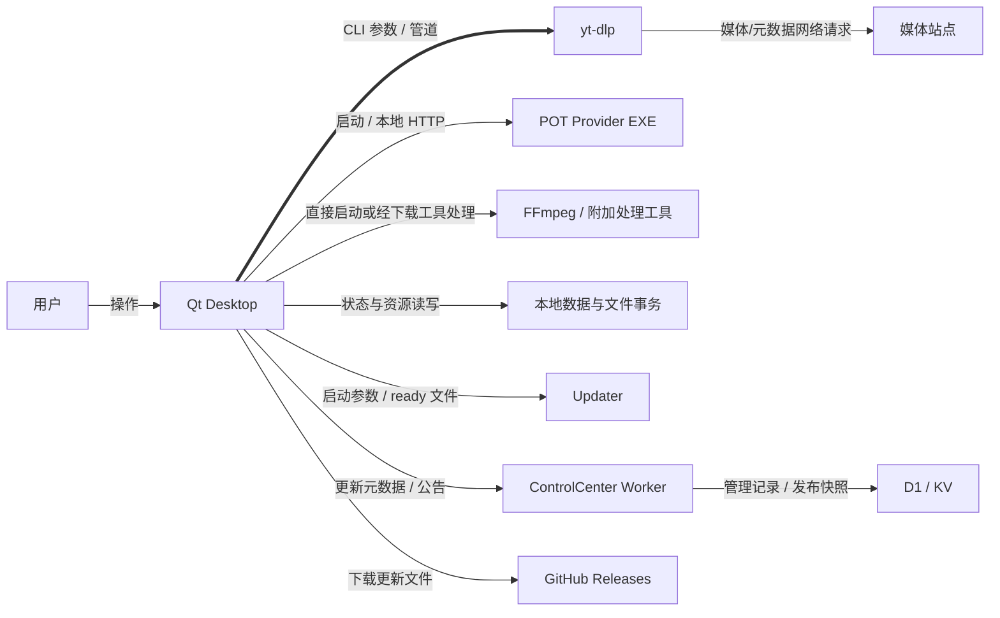

# 新版架构 V2 · 00 系统总览

> 证据层次：source/static。当前工作树，2026-09-19；不代表实机、打包或线上验收。

## 1. 系统是什么

[CONFIRMED] FluentYTDL 的桌面入口是根 [main.py::main](../../main.py#L289)，运行 PySide6/QFluentWidgets 界面。媒体解析和下载经 [yt_dlp_cli](../../src/fluentytdl/youtube/yt_dlp_cli.py#L1054) 与 [DownloadExecutor](../../src/fluentytdl/download/executor.py#L469) 启动外部工具，不是在 GUI 进程中调用 yt-dlp 的 Python 下载 API。声明的 console entry 与源码布局有差异，详见 [仓库地图](01-repository-map.md)。

[CONFIRMED] 同级 ControlCenter 是独立的 Vue 管理界面与 Cloudflare Worker；[公开路由](../../../FluentYTDL-ControlCenter/apps/worker/src/index.ts#L44) 提供公告和更新元数据，管理侧使用 D1，公开快照使用 KV。安装包字节仍由 GitHub Release 提供。它不是 Qt 前后端 IPC 的“后端”。

用途：L0 边界与主要进程关系；节点表示应用/执行体/资源组，实线表示标注的调用或数据交换，粗线为媒体 CLI 主路径。本图省略各种 fallback、WebView2 子进程及 UI 内部信号；依赖身份和权限详见 [08](08-dependency-model.md)、[11](11-security-boundaries.md)。不表示外部服务当前可达。

## 2. 应用与入口

| 应用/实体 | 真实入口与职责 | 边界和缘由 |
| --- | --- | --- |
| APP-DESKTOP | 根 main → QApplication → controller 注入 MainWindow | UI、解析调度、任务状态与用户交互在此进程；工作线程承载阻塞操作 |
| APP-YTDLP | CLI 子进程；解析与下载命令各自构造 | 可独立选择/更新 executable，代价是 argv、stdout、stderr、exit code 成为协议 |
| APP-POT | [POTManager.start_server](../../src/fluentytdl/youtube/pot_manager.py#L181) → Provider EXE | 独立本地 HTTP 服务；不是 Node 启动脚本，监听成功与可产 Token 不等价 |
| APP-WEBVIEW2 | [WebView2 provider](../../src/fluentytdl/auth/providers/webview2_provider.py) 子进程/队列 | 登录交互和浏览器运行时与 Qt 主进程隔离；父进程等待/取消需要显式协议 |
| APP-UPDATER | [独立 main](../../src/fluentytdl/core/updater.py#L1390)，spec 打包为 updater.exe | 在主程序退出和权限变换边界替换程序；启动失败有多种分支，不能概括必回滚 |
| APP-COMPONENT-WORKER | [run_worker](../../src/fluentytdl/core/updater_worker.py#L169) / 根 `--update-worker` | 组件下载/替换协议；与应用包升级、第三方自管路径分开 |
| APP-INSTALLER | [Inno](../../installer/FluentYTDL.iss) → [maintenance.ps1](../../installer/maintenance.ps1#L1) | 安装注册、进程停止、路径维护、卸载清理按 action/scope 分支 |
| APP-CONTROLCENTER | [Worker](../../../FluentYTDL-ControlCenter/apps/worker/src/index.ts)、[Admin main](../../../FluentYTDL-ControlCenter/apps/admin/src/main.ts) | 公读、管理写、内部同步有不同鉴权；D1/KV 不是同一个事务 |
| APP-RELEASE | [build.main](../../scripts/build.py#L1232)、[release_pipeline](../../scripts/release_pipeline.py) | 维护者构建/发布路径；不属于用户下载任务的子流程 |

表中存在性/入口为 [CONFIRMED]；“缘由”是基于代码边界的 [INFERRED] 工程解释，不声称还原了全部历史设计动机。

## 3. 核心业务链

[CONFIRMED] 视频、VR、频道、播放列表、字幕、封面六种解析/选择入口最终通过配置与任务创建进入调度。执行期是标准媒体、轻量提取、封面直链三通道；已进入产物执行的三路交付均接入 Staging。前置失败可能在创建事务前结束。见 [运行结构](03-runtime-architecture.md) 与 VS-02–07。

主要关系是：`用户选择 → options/请求上下文 → controller → manager/worker → 外部执行 → 产物发现/变换 → verify/commit → output/UI/DB`。其中“UI 收到状态”“数据库请求入队”“SQL 已提交”“文件已交付”是不同时间点。

## 4. 必须分开的六种身份

| 身份 | 代码落点 | 作用与限制 |
| --- | --- | --- |
| session | [FlowTrace/SESSION_ID](../../src/fluentytdl/observability/trace.py#L47) | 一次应用会话；不是持久任务 ID |
| flow | FlowTrace；解析入口先创建 | 解析/选择时尚无 task_id，也能关联上下文 |
| task | manager create_worker / DB 主键 | 可跨执行、跨启动保持稳定 |
| run | TaskTrace.new_run / worker trace | 一次执行结果；活 worker pause/resume 不自动换 run |
| attempt | TaskTrace.next_attempt | 自动重试及 after_fix 再尝试；仍在同 run 中 |
| transaction | [StagingArea.create](../../src/fluentytdl/download/staging.py#L739) | 完整 UUID 暂存目录与文件交付归属，不能拿短日志 ID 代替 |

“暂停后继续”可能是活线程恢复，也可能是已结束 worker 的重建；必须根据实际分支解释。身份对照与转换见 [06](06-state-machines.md)。

## 5. 当前实现约束，而非理想分层

- [CONFIRMED] UI 既有 Qt 信号也有直接 controller 调用；没有“全系统只经事件总线”的事实保证。
- [CONFIRMED] TaskDBWriter 有独立 daemon 线程，TaskDB 同时有共享连接、写锁与线程局部 batch；二者共同构成持久化路径。
- [CONFIRMED] Staging committed 是文件交付边界；正常 Python 收尾尽量保持成功不可逆，但强制线程终止不属于同等保证。
- [CONFIRMED] Cookie 真相源、账号缓存、受管 runfile、自管路径不属于同一种文件生命周期。
- [CONFIRMED] 日志公共链有脱敏，但 WebView2 自定义文件日志另有边界；不能声称所有日志经过统一脱敏和保留策略。
- [CONFIRMED] 静态库中有未找到生产调用的监控/质量接口；“类存在”不表示产品已经启用该能力。

依据分布于 [模块](02-module-map.md)、[资源](07-resource-model.md)、[并发](09-concurrency-model.md)、[安全](11-security-boundaries.md)。未证运行风险统一汇入 [13](13-known-risks.md)。

## 6. 新旧版本与阅读顺序

本书是**新版架构 V2**。旧 `docs/ARCHITECTURE_CN.md`、`ARCHITECTURE_EN.md` 保留历史正文并标为过时；它们和规则中的意图不能覆盖当前代码。

建议先读本章与 02，再选一条用户切片，回到 04–11 追状态、资源、并发和失败。需要实施修改时先用 [14 代码索引](14-code-index.md) 定位实际符号，再核对哈希和分支；不要把本书的日期快照当作未来永远成立的接口契约。
