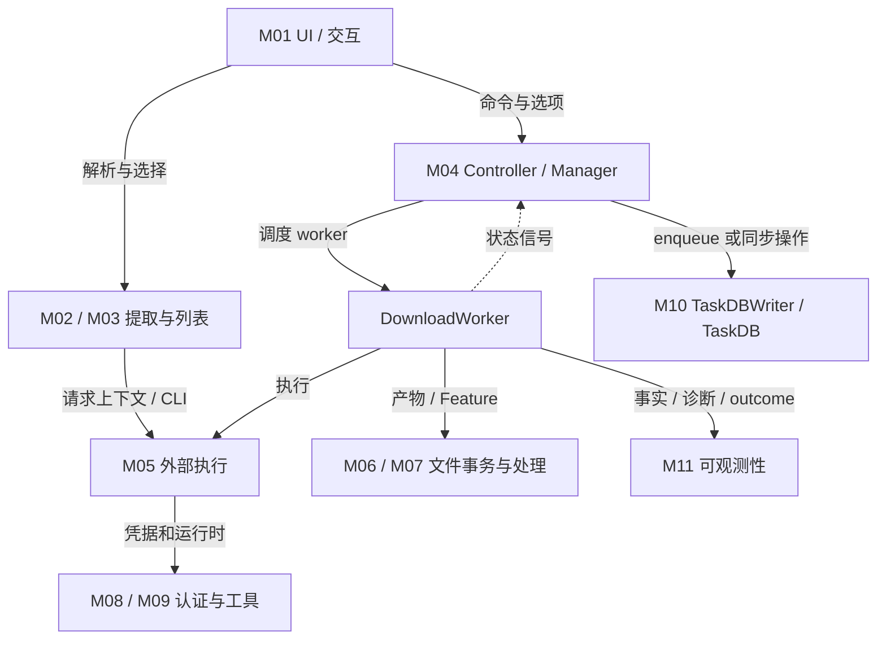

# 新版架构 V2 · 02 逻辑模块与组件职责

> 本章由 Lead 根据实际调用、写入和资源边界归纳。模块 ID 是文档分类，类/函数名称保持源码原名。证据为 source/static。

## 1. 逻辑关系

用途：职责与控制关系；范围：桌面核心，不是全部 import 图。节点为逻辑模块，实线标实际调用/数据依赖，虚线为信号。此图不宣称严格单向分层；真实 import 候选和人工判定见 [08](08-dependency-model.md)。

## 2. 组件档案

每项将 `Called by/Calls`、`Reads/Writes`、状态/资源/寿命与错误分别列出。除标记推断/未知处，组件存在与调用依据为 [CONFIRMED]；处理缘由为 [INFERRED]。

### M01 桌面编排与展示

- **符号/入口：** [main.main](../../main.py#L289)、[MainWindow](../../src/fluentytdl/ui/reimagined_main_window.py#L161)、各 parse/settings/task 页面。
- **调用关系：** main 注入 AppController；MainWindow 响应选择信号并直接 `handle_add_tasks`；任务返回通过 manager/worker 信号推动列表。`closeEvent` 可进入托盘策略或实际 shutdown，`quit_app` 走明确退出。
- **读写：** 配置、TaskRow、选择状态、窗口/对话框引用；真正任务写入经 controller/manager/DB 接口。
- **资源/寿命：** QApplication 进程寿命；子窗口按显示/关闭；主题监听、QTimer、clipboard 监听有自己的开始和停止点。
- **失败：** 展示结构化错误/通知不等于拥有 retry 判决权。关闭调用 shutdown 但不证明所有线程已排空。
- **缘由：** 命令入口集中便于协调批量动作；代价是 MainWindow 与 controller/UI 模型耦合较广，不能用“已解耦”一词替代真实调用图。关联 VS-01、02、08、09、11。

### M02 请求解析与选择

- **符号：** [DownloadConfigWindow.start_extraction](../../src/fluentytdl/ui/components/dialogs/download_config_window.py#L1354)、[InfoExtractWorker](../../src/fluentytdl/download/workers.py#L137)、[YoutubeService](../../src/fluentytdl/youtube/youtube_service.py#L177)。
- **调用：** 窗口按模式建 worker → service 建 opts/缓存 → CLI JSON → DTO/选择 UI → `downloadRequested`。解析与执行分别构建 options，不能默认同一个 dict 自动延续。
- **读写：** URL、cookie 模式、generation、SABR context、metadata/formats、flow、缓存；只有创建任务后才有 DB task。
- **资源/寿命：** 解析 QThread/CLI 及取消 watcher，窗口关闭需断开全局信号与取消提取。
- **失败：** stderr 进入异常和诊断；列表 authcheck 的恢复条件受错误上下文约束，不是任意认证失败都跳过检查。
- **缘由：** 把可选格式和身份上下文固定在选择前后边界；代价是缓存键、选项合并及快速路径必须分别保持语义。关联 VS-02–07、13。

### M03 大列表和详情调度

- **符号：** [PlaylistScheduler._pump](../../src/fluentytdl/ui/playlist_scheduler.py#L297)、[AsyncExtractManager](../../src/fluentytdl/download/extract_manager.py#L65)、[VideoTask](../../src/fluentytdl/models/video_task.py#L87)、playlist_model。
- **调用：** flat 列表先填轻量行；可见区/选择触发详情调度 → EntryDetailWorker → 信号更新模型。这里的任务 key/URL 不等于下载数据库主键。
- **读写：** metadata、ThumbnailState、DetailState、SelectionState、_active_tasks、pending/inflight；选择状态与抓取数据分开。
- **资源/寿命：** 解析容量、线程/请求、图片缓存、模型行随对话框/全局 loader 分别持有。
- **失败：** error/finished 回调释放容量；取消直接返回能否覆盖所有释放路径是独立风险，见 13。
- **缘由：** 降低首屏等待并避免全列表同时深解析；代价是部分数据、过期回调、去重和资源回收协议。关联 VS-04/05。

### M04 下载命令与任务调度

- **符号：** [AppController](../../src/fluentytdl/core/controller.py#L80)、[DownloadManager](../../src/fluentytdl/download/download_manager.py#L153)、[DownloadWorker](../../src/fluentytdl/download/workers.py#L597)。
- **调用：** UI/QuickAdd → controller → manager create/start/pump；worker `unified_status` → manager transition + DB queue；finished 释放调度引用并补槽。
- **读写：** pending deque、active_workers、isRunning、db_id、opts、run/attempt、有效 UI 状态；controller 负责删除与重建等编排。
- **资源/寿命：** 一个 worker 作为应用的一轮执行实体，活 pause/resume 可保留；已终止后重建保留 task ID。恢复壳不等于正在运行。
- **失败：** after_fix 可占用下载名额；shutdown 有超时强停；transition 入队不等于 SQL commit。
- **缘由：** 将用户任务与本轮执行分离，支持恢复和并发限制；代价是多个状态投影需要对账。关联 VS-08–11。

### M05 外部执行与输出协议

- **符号：** [DownloadExecutor.execute](../../src/fluentytdl/download/executor.py#L299)、[_execute_native](../../src/fluentytdl/download/executor.py#L356)、[yt_dlp_cli](../../src/fluentytdl/youtube/yt_dlp_cli.py#L1054)、output_parser。
- **调用：** service/worker → runtime resolver/env/argv → Popen/run → stdout/stderr → 输出解析/异常；快速通道自己构造 CLI，不都经过 Executor。
- **读写：** exe identity、options、Cookie runfile、进度、路径报告、stderr collector、返回码。
- **资源：** 子进程、管道、watcher、runfile、ProcessManager 注册；每次调用的关闭/取消语义需按入口核对。
- **失败：** 非零退出可按产物字节启发式恢复，不是媒体完整解码证明；进程有结果也不等于最终发布成功。
- **缘由：** 独立引擎易更新，代价是协议转换、状态传播和 Windows 进程所有权管理。关联 VS-02/06/07/10。

### M06 产物事务与最终交付

- **符号：** [StagingArea](../../src/fluentytdl/download/staging.py#L690)、Manifest、CommitPlan、finalize_failure/finalize_cancel、gc_orphans。
- **调用：** worker 建立 txn → 报告/扫描 → seal → Feature 变更 → verify → build_plan → commit → 输出；失败经 finalizer 仲裁。
- **读写：** payload/.parts、产物集合、phase、预留占位符、journal、published_paths、pending_cancel。
- **寿命/所有权：** 事务 UUID 拥有暂存文件；发布后目标文件与清理义务不同；GC 对 committing/rollback_failed 保守保留，不能把旧 sandbox 自动接入新任务。
- **失败：** 提交组并非一次 OS 原子写入；跨卷与补偿有独立条件；强停/断电保证未实测。
- **缘由：** 文件归属、同名避让、半提交可追溯性比单纯临时目录更重要；代价是额外状态和恢复复杂度。关联 VS-06/07/11。

### M07 可选媒体处理

- **符号：** [DownloadFeature/DownloadContext](../../src/fluentytdl/download/features.py#L23)、SponsorBlock、Metadata、Subtitle、Thumbnail、VR；processing 中的字幕、音轨、容器/嵌入辅助。
- **调用：** 标准 worker 固定 Feature 顺序调用 configure/start/postprocess；部分配置委托 yt-dlp postprocessor，另一些直接调用处理工具并更新 Staging 清单。快速通道不等于执行同一 Feature 栈。
- **读写：** opts、语言/格式意图、主媒体与附属产物、替换/丢弃原因、expected/actual tokens。
- **资源：** FFmpeg/嵌入工具、workfile 与产物临时替换；需要核实每个工具的取消和注册归属，不能只看 Executor.cancel。
- **失败：** VR FFmpeg 局部子进程与标准取消路径未见同一绑定；字幕缺失和媒体失败有不同终态/降级语义。
- **缘由：** 固定顺序限制后处理互相覆盖，manifest API 保持产物事实一致；代价是 Feature 不完全独立且受容器/语言/工具兼容约束。关联 VS-03/06/08。

### M08 认证与请求身份

- **符号：** AuthService、CookieSentinel、WebView2CookieProvider、[cookie_runfile](../../src/fluentytdl/auth/cookie_runfile.py#L58)、youtube_request。
- **调用：** UI 刷新 worker/启动后台 → 来源提取 → 验证后提交平台真相源；执行期按请求模式附加材料，受管路径复制 runfile。
- **读写：** 平台/账号选择、来源缓存、账户 SABR 标记、两平台真相源、meta、Cookie 模式/generation。
- **寿命：** 来源/账号材料跨启动；请求副本短期；认证根和配置根不同。
- **失败：** 验证失败保留旧材料；自管文件和识别异常会直通；轻量初始化清理窗口未完全包住。
- **缘由：** 保护仍有效材料并隔离请求身份和 CLI 回写；代价是多根路径、线程、进程和平台边界。关联 VS-12/13。

### M09 工具发现、POT 与组件

- **符号：** [resolve_runtime](../../src/fluentytdl/utils/ytdlp_runtime.py#L22)、DependencyManager、POTManager、CLI plugin sync。
- **调用：** UI/解析/执行共同解析真正 exe；POT spawn provider、探测/预热/恢复；组件管理按受管目标更新。
- **读写：** custom/local/PATH 选择、版本缓存、插件目录、进程/端口、warm/retry 状态。
- **失败：** 插件投放逐文件原子；POT Job 与按端口 shutdown 的所有权约束不同；监听不等于成功铸 token。
- **缘由：** 把工具身份与管理目标分开，避免覆盖用户自管文件；代价是实际 exe、插件搜索路径和版本展示必须统一追踪。关联 VS-14/17。

### M10 持久化与配置

- **符号：** [ConfigManager.save/set](../../src/fluentytdl/core/config_manager.py#L461)、[TaskDB](../../src/fluentytdl/storage/task_db.py#L40)、[TaskDBWriter](../../src/fluentytdl/storage/db_writer.py#L27)、paths。
- **调用：** 配置 set 同步 save 后发信号；任务 insert/delete 可同步，频繁更新投递 Queue；writer 合并后进入 TaskDB batch。
- **读写：** config dict/JSON、tasks schema、notifications、last_run/opts、queue/batch depth。
- **寿命：** TaskDB 共享连接；writer daemon；路径按开发/portable/installed/override；连接关闭与队列排空不是同一事实。
- **失败：** 配置吞写错、writer 单项异常吞掉、join(timeout) 未确认；不能写“有事务所以失败都回滚重试”。
- **缘由：** 减少高频写阻塞并保留恢复数据；代价是内存/队列/磁盘窗口和错误可见性。关联 VS-01/09/11。

### M11 诊断与可观测性

- **符号：** diagnostics engine/rules/catalog、[TaskTrace](../../src/fluentytdl/observability/trace.py#L101)、events/sinks/bundle、log viewer。
- **调用：** 外部输出→collector→diagnose→错误边界→结构化事件→多 sink/界面；run terminal 调 finish；导出 flush/cutoff/脱敏。
- **读写：** session/flow/task/run/attempt、主因/伴随事件、expected/actual、JSONL/raw dump、日志文件缓存。
- **失败：** best-effort 不让日志异常传播业务，但也意味着事件可能缺失；WebView2 自定义日志不在统一链。
- **缘由：** 将事件事实、失败诊断与结果统计分开；代价是必须约束发射边界并覆盖所有写日志入口。关联 VS-10/15。

### M12–M16 更新、公告、发布与支撑

| ID | 责任/调用关系/主要符号 | 状态、资源与生命期 | 失败与处理缘由 | 详细说明 |
| --- | --- | --- | --- | --- |
| M12 更新 | Update transport→ComponentUpdateManager→updater/worker；应用和组件分支不同 | channel、generation、下载归档、旧版备份、ready token、权限身份 | 父进程等待超时和无启动 PID 分支不能按普通成功/回滚概括；保留数据与替换程序解耦 | VS-16/17，12 |
| M13 公告/通知/i18n | AnnouncementService→store/fetch；NotificationCenter→TaskDB；I18nManager→QTranslator | 公告修订已通知/已确认；本地公告 DB 独立于 tasks；翻译器进程寿命 | 公告版本/语言/时间过滤，通知本地化与日志稳定 code 分开 | VS-18，04/07 |
| M14 构建/安装/发布 | build→component snapshot/spec/Inno→release pipeline；maintenance 按 action | 构建 run workspace、包载荷、安装注册、用户根目录 | 构建、发布字节、安装验收分级；维护脚本清理名单不等于全数据扫描 | VS-19/20，12 |
| M15 ControlCenter | Admin/内部同步→Worker→D1/KV；公读只读取快照 | D1 draft/published/history/state/租约；KV 投影 | 非跨存储事务；KV 成功后状态写错仍报失败；租约无续期 | VS-18/20，08/11/12 |
| M16 支撑/测试/第三方 | 模型映射、图片、日志文本、spatialmedia、插件；测试为验证入口 | 无独立产品边界的基础组件，第三方代码随宿主加载 | 不将测试存在、类存在或内嵌依赖当作实际能力已经接通 | 本节补充与14索引 |

### 容易遗漏的支撑关系

[CONFIRMED] [ImageLoader](../../src/fluentytdl/utils/image_loader.py#L76) 懒建共享 QNetworkAccessManager 和 50 MiB 的临时目录磁盘缓存；配置窗口在 [453 行](../../src/fluentytdl/ui/components/dialogs/download_config_window.py#L453) 注册全局 loader 信号，在 [1258 行](../../src/fluentytdl/ui/components/dialogs/download_config_window.py#L1258) 断开。图片请求不占下载并发槽，UI 窗口销毁不等于共享网络管理器结束。

[CONFIRMED] [I18nManager.setup_language](../../src/fluentytdl/core/i18n.py#L19) 在 QApplication 存在后安装 FluentTranslator/QTranslator，保留类级引用并替换旧 translator；[main](../../main.py#L379) 在窗口前调用。语言资源加载失败并不构成下载协议失败。

[CONFIRMED] [NotificationCenter](../../src/fluentytdl/notification/notification_center.py#L37) 使用 task_db；[AnnouncementService](../../src/fluentytdl/notification/announcement_service.py#L155) 另建 announcements.sqlite3。名字都含通知，持久化与已读语义却不同，不能合并成一个存储实体。

## 3. 候选代码与未接通能力

| 代码 | 本次搜索范围内事实 | 正确解读 |
| --- | --- | --- |
| [NetworkWatchdog](../../src/fluentytdl/core/network_watchdog.py#L15) | 在 `src` 与根 main 搜索仅见定义与模块内单例，未见业务 import/start | 有 QTimer/HEAD 检查实现，不证明应用默认后台联网监控 |
| [DiskMonitor](../../src/fluentytdl/core/disk_monitor.py#L18) | 同范围未见实例化调用 | 不能把 warning/critical 信号画成已接到下载暂停的真实边 |
| [QualityGuard.post_verify](../../src/fluentytdl/download/quality_guard.py#L136) / on_quality_warning / enqueue_quality | 定义与注释存在，未找到生产调用；preflight resolve 有实际入口 | 预检和下载后画质闭环是不同能力；“连续画质异常自动停队列”不能据类名宣布已实现 |

[UNKNOWN] 动态反射、外部注入或未来代码可能改变上述搜索结论。本次只描述当前受查源码，未将这些候选模块删除或修复。机器导入图包含条件/局部导入，完整边界见 [08](08-dependency-model.md)。

## 4. 所有权决策速查

| 要改变的事实 | 首要责任组件 | 不应误用的替代事实 |
| --- | --- | --- |
| 用户发起/移除/重建任务 | controller/manager | UI 行消失不等于进程已停或文件已删除 |
| 一次执行的结果 | worker terminal / TaskTrace | 子系统 warning、重试事件、进度 100% |
| 文件是否已交付 | Staging commit/已发布清单 | stdout 路径、文件恰好存在、数据库状态 |
| 请求认证模式 | request snapshot/opts/CLI 入口 | 当前设置值、当前账号选择本身 |
| SQLite 已持久化 | 实际 SQL transaction | transition 事件/DBWriter enqueue |
| 更新是否达到某条件 | updater 的具体 READY/survival/无 PID 分支 | 已下载、已解压、已 spawn，或单一返回码 |

这张表是定位入口，不是授权规则。实施任何修复前应同时查对应切片、资源表、失败链与风险台账。
