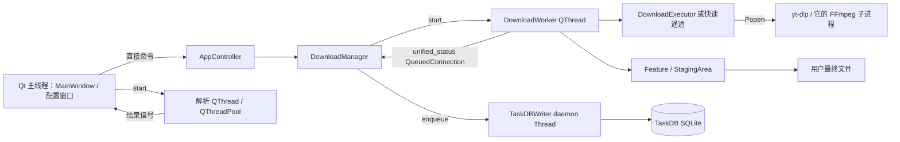

# 新版架构 V2 · 运行时架构

取证日期：2026-09-19。`[CONFIRMED/static]` 表示当前源码直接支持；`[INFERRED]` 表示静态推导；`[UNKNOWN]` 表示未验证。本章未启动产品、下载、构建或测试。图中的箭头是实际调用/消息关系，不保证每种环境执行成功。

## 运行容器与边界

[CONFIRMED/static] 主窗口由根 [`main.py::launch_main_window`，423 行](../../main.py#L423) 创建并注入 `app_controller`。`downloadRequested` 接主窗口槽，槽内直接调 `controller.handle_add_tasks`，并非所有 UI→backend 都是 signal：[窗口连接，708 行](../../src/fluentytdl/ui/reimagined_main_window.py#L708)、[直接调用，835 行](../../src/fluentytdl/ui/reimagined_main_window.py#L835)。跨线程结果信号与同线程控制命令必须在图中区别。

| 实体与 owner | 输入/触发 | 输出、副作用及资源 | 失败/退出边界 |
|---|---|---|---|
| `DownloadConfigWindow`（窗口自身） | URL、mode、vr_mode、playlist_flat、冻结的请求选项；构造/重新解析 | 解析 worker、列表 model/scheduler、选项与任务 tuple；拥有子窗口引用、计时器 | close 停 timer、请求取消、断共享信号；没有统一证明全部后台工作已 join。见 [`_stop_background_parsing`，1230 行](../../src/fluentytdl/ui/components/dialogs/download_config_window.py#L1230)。 |
| `AppController`（注入 MainWindow 的单例） | 已选择 tuple 或快速下载参数 | 标题避让、调用 `create_worker/start_worker`、任务删除/恢复；持有 quick/delete worker | 命令调用不是数据库/文件的全局事务。见 [95 行](../../src/fluentytdl/core/controller.py#L95)。 |
| `DownloadManager`（单例 QObject） | 添加/恢复/worker finished | active 列表、pending deque、并发槽、DB 写入桥 | 创建时恢复旧任务；shutdown 是收尾尝试。见 [168 行](../../src/fluentytdl/download/download_manager.py#L168)、[376 行](../../src/fluentytdl/download/download_manager.py#L376)。 |
| `DownloadWorker`（每次应用约定的 run） | URL、opts、cached_info、flow | TaskTrace、三个等待/取消控制、Executor、Feature、Staging；结果 Qt signal | `_run_outcome` 经 finally→`_finish_run`；强停线程不保证 finally。见 [618 行](../../src/fluentytdl/download/workers.py#L618)、[1753 行](../../src/fluentytdl/download/workers.py#L1753)。 |
| `DownloadExecutor`（每个标准 attempt） | 最终 opts、回调、cancel_check | argv/env、Cookie runfile、Popen、输出/诊断缓冲；返回路径或异常 | `wait` / `_terminate_proc` 释放 runfile；无法从这些点证明任意异常均释放。见 [356 行](../../src/fluentytdl/download/executor.py#L356)、[1090 行](../../src/fluentytdl/download/executor.py#L1090)。 |
| `StagingArea`（当前 worker 的事务） | download_dir、task_key、独立 staging_id | payload/.parts/.fytdl、Manifest、计划、journal、目标预留 | phase 决定取消/保留/成功；committed 不可翻为 failed。见 [739 行](../../src/fluentytdl/download/staging.py#L739)、[1517 行](../../src/fluentytdl/download/staging.py#L1517)。 |
| `TaskDBWriter`（全局后台 Thread） | `enqueue_status/result/metadata/quality/run_identity` | Queue→正常 `_collect` 至多 200 条批次→TaskDB；关闭 drain 不受此批次上限限制；后台线程实际启动 | 单项失败记警告；毒丸+join(3s)，不返回排空证明。见 [40 行](../../src/fluentytdl/storage/db_writer.py#L40)、[74 行](../../src/fluentytdl/storage/db_writer.py#L74)、[116 行](../../src/fluentytdl/storage/db_writer.py#L116)、[166 行](../../src/fluentytdl/storage/db_writer.py#L166)。 |

表中实体与调用为 [CONFIRMED/static]；资源释放的全路径完整性仍为 [UNKNOWN]。

## 六入口与三条最低执行路径

[CONFIRMED/static] [`start_extraction`，1354 行](../../src/fluentytdl/ui/components/dialogs/download_config_window.py#L1354) 优先判断频道 URL，再判断 VR，否则 InfoExtractWorker。Video/Playlist/Subtitle/Cover 是选择与选项维度，不意味着各有专属解析进程类型。下载分流仅在 [`DownloadWorker.run`，1159—1172 行](../../src/fluentytdl/download/workers.py#L1159)：

| 执行路径 | 实际最低执行 | 与其他路径差异 |
|---|---|---|
| 标准媒体（含视频、音频、VR、片段、列表中的单项） | Executor.execute→`_execute_native`→yt-dlp Popen | Feature 生命周期、attempt 重试循环、主媒体报告文件；强制 noplaylist=True。 |
| `skip_download` 轻量提取 | `_run_lightweight_extract`→yt-dlp Popen | 直接拼参数，不调用 Executor/Feature；字幕参数复用 helper；没有标准重试循环。 |
| `__fluentytdl_is_cover_direct` | `_run_cover_direct_download`→yt-dlp Popen，URL 是图片链接 | “直链”不等于 Python HTTP 客户端；无媒体/嵌入语义；不读旧 thumbnail 解析缓存。 |

证据：[Executor 始终 native，299 行](../../src/fluentytdl/download/executor.py#L299)、[轻量，1988 行](../../src/fluentytdl/download/workers.py#L1988)、[封面，2330 行](../../src/fluentytdl/download/workers.py#L2330)。三路最终都 `reconcile→seal→verify→build_plan→commit`；详见 [控制流](05-control-flow.md)、[VS-02](vertical-slices/VS-02-video.md) 至 [VS-08](vertical-slices/VS-08-quick-audio-section.md)。

## Feature 顺序与质量边界

[CONFIRMED/static] Worker 固定列表为 SponsorBlock→Metadata→Subtitle→Thumbnail→VR，先逐项 configure/on_download_start，下载完再逐项 on_post_process；这不是“所有处理工具只在下载后运行”，SponsorBlock/Metadata 主要配置 yt-dlp 自身处理器。[workers 678 行](../../src/fluentytdl/download/workers.py#L678)、[1256 行](../../src/fluentytdl/download/workers.py#L1256)、[1561 行](../../src/fluentytdl/download/workers.py#L1561)、[Feature 150 行](../../src/fluentytdl/download/features.py#L150)。

| Feature | 真实行为与缘由 |
|---|---|
| SponsorBlock | configure 根据全局设置写 remove/mark 类别；处理交给引擎。不能把 queued opts 当所有后处理偏好的永久快照。 |
| Metadata | configure 可附加 FFmpegMetadata；执行时间由 yt-dlp 处理器控制。 |
| Subtitle | 下载前纠正嵌入容器；下载后只读 Manifest 的本任务字幕，校验后以状态变更保留/drop，避免扫描共享目录误删别的任务文件。 |
| Thumbnail | 从同一 Manifest 配对并处理；嵌入与外部文件保留为不同事实。见 [328 行](../../src/fluentytdl/download/features.py#L328)。 |
| VR | 独立 FFmpeg 转换工作文件，登记 generated、rename/supersede、promote，再注入空间元数据；失败可警告并保留原媒体。见 [477 行](../../src/fluentytdl/download/features.py#L477)。 |

[CONFIRMED/static] 画质预检会调用 `resolve_format_with_guard` 并在提交任务前通过 QualityReportDialog 让用户决定继续。[窗口 4195 行](../../src/fluentytdl/ui/components/dialogs/download_config_window.py#L4195)、[1098 行](../../src/fluentytdl/ui/components/dialogs/download_config_window.py#L1098)。当前全 `src/fluentytdl` 调用检索未发现 `QualityGuard.post_verify()`、`QualityGuardManager.on_quality_warning/on_quality_ok()`、`enqueue_quality()` 的业务调用，不能把定义存在写成下载后画质核验/连续失败自动暂停已接通；[artifacts.py 83 行](../../src/fluentytdl/observability/artifacts.py#L83) 也显式说明实际高度缺 producer。

[INFERRED] 分层的收益是解析先服务选择、执行服务交付、Staging 服务文件安全；代价是 opts、信号、内存状态和 DB 存在多次交接。验收应沿纵切片证明交接，而不是依据“模块类名都有”认定闭环。
