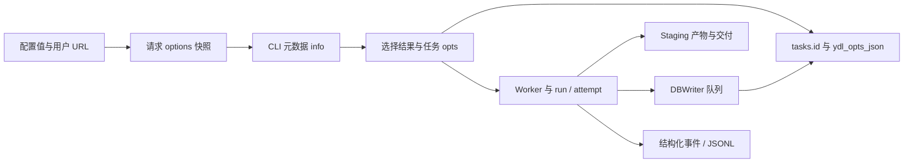
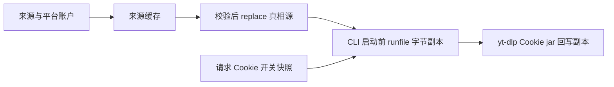

# 新版架构 V2：04 数据流与持久化契约

本章是 2026-09-19 工作区源码静态逆向，未读取实际配置、Cookie、任务 DB，未启动产品或测试。`[CONFIRMED]` 表示已读源码分支；`[INFERRED]` 表示机制的工程作用或风险推导；`[UNKNOWN]` 表示未获运行证据；`[RECOMMENDATION]` 表示未来建议。行号对应当前工作区，符号是稳定定位依据。

## 1. 同一用户操作产生不同寿命的数据

[CONFIRMED] 请求 Cookie 模式通过 `_snapshot_request` 冻结并 stamp 到解析结果，`create_worker` 创建/恢复任务并绑定 DB 身份；运行状态进入 DBWriter；产物交付不是 SQL 写入的一部分。[请求快照](../../src/fluentytdl/youtube/youtube_service.py#L144)、[DownloadManager.create_worker](../../src/fluentytdl/download/download_manager.py#L408)、[TaskDBWriter](../../src/fluentytdl/storage/db_writer.py#L45)。图是数据路线，不表示这些写入共享一个事务。

[INFERRED] “已经看到进度”“DB 请求已入队”“SQL 已提交”“文件已经交付”是四个不同时间点。把它们合并为一个 completed 标志会掩盖强停、磁盘错误和异步队列尾部丢失的问题。

## 2. 主要数据形状

| 数据 | 已确认字段/形状 | 所有者与用途 | 边界及缘由 |
|---|---|---|---|
| `ConfigManager.config` | `[CONFIRMED]` 字典，与 DEFAULT_CONFIG 合并；含 youtube_cookies_enabled、cookie_mode、工具路径、代理等键 | ConfigManager；set→save→configChanged | `[CONFIRMED]` save 直接 write_text，吞异常；`[INFERRED]` UI 可继续，但内存值/磁盘值可能不同。[config_manager.py](../../src/fluentytdl/core/config_manager.py#L461) |
| YouTube 请求元数据 | `[CONFIRMED]` `__fluentytdl_youtube_cookies_enabled`、`__fluentytdl_youtube_sabr_scope`，ContextVar 内还有 generation | YoutubeService 与 utils.youtube_request | `[CONFIRMED]` false 清 Cookie 参数及 SABR scope；内部键不应成为 yt-dlp CLI 参数。[youtube_request.py](../../src/fluentytdl/utils/youtube_request.py#L1) |
| 解析结果 `info` | `[CONFIRMED]` 可包含 entries；stamp_result 递归给 dict 条目写模式；缓存保存 deepcopy | YoutubeService 解析/缓存，UI 使用结果 | `[INFERRED]` 避免 UI 修改原对象污染之后的缓存命中。[stamp_result](../../src/fluentytdl/utils/youtube_request.py#L18)、[_parse_cache_put](../../src/fluentytdl/youtube/youtube_service.py#L1697) |
| `ydl_opts_json` | `[CONFIRMED]` 任意可 JSON 序列化任务 options 字典文本 | TaskDB.insert_task/update_task_opts | `[INFERRED]` 保留排队时设置用于恢复，但不是强类型、带显式 schema 版本的配置协议。[TaskDB.insert_task](../../src/fluentytdl/storage/task_db.py#L227)、[update_task_opts](../../src/fluentytdl/storage/task_db.py#L292) |
| `AuthStatus` | `[CONFIRMED]` valid、message、cookie_count、last_updated、account_hint | AuthService.last_status | `[INFERRED]` 是本地验证与提取反馈，不是在线服务端仍接受凭据的证明。[AuthStatus](../../src/fluentytdl/auth/auth_service.py#L192) |
| `WebView2Account` | `[CONFIRMED]` account_id、display_name、platform、profile_dir、cached_cookie_path、last_extracted_at、cookie_count、valid、is_default、notes、sabr_only、builtin_name | AuthService，accounts.json | `[INFERRED]` 平台和账户是凭据隔离键；display_name 不是安全身份。[WebView2Account](../../src/fluentytdl/auth/auth_service.py#L232) |
| `Event` | `[CONFIRMED]` kind、stage、session、flow、task、run、attempt、fields | observability；as_dict 扁平化、冲突字段改名加 `_`、值 JSON-safe | `[INFERRED]` 防业务字段覆盖身份造成跨任务串线。[Event.as_dict](../../src/fluentytdl/observability/events.py#L268) |
| 诊断包 manifest | `[CONFIRMED]` schema_version、selection、cutoff、privacy_version、files、missing、source_runtime、export_runtime、health；文件项含 size/source_size/sha256/truncated | export_bug_bundle | `[INFERRED]` 导出没有某条证据不等于该行为没有发生。[bundle.py](../../src/fluentytdl/observability/bundle.py#L87) |

## 3. SQL 模型与读写所有权

[CONFIRMED] `tasks` 初始列为 id INTEGER PRIMARY KEY AUTOINCREMENT，url，title，thumbnail_url，state，progress，status_text，output_path，file_size，duration，ydl_opts_json，created_at，updated_at。增量迁移追加 actual_height、target_height、quality_deviation、last_session_id、last_run_id、last_flow_id；索引为 `(updated_at DESC,id DESC)` 与 `(state,updated_at DESC,id DESC)`。[TaskDB._create_tables/_migrate_tables](../../src/fluentytdl/storage/task_db.py#L105)

[CONFIRMED] 同一数据库还创建 `notifications`：id、type、severity、title、message、timestamp、is_read、related_task_id、metadata_json。不能把这个旧/通用通知表与公告独立 SQLite 混为一张表。[notifications DDL](../../src/fluentytdl/storage/task_db.py#L126)

[CONFIRMED] 公告 `AnnouncementStore` 默认位于 `user_data_dir()/announcements.sqlite3`；revisions列为id、revision、notified、acknowledged，主键(id,revision)；snapshot列为固定id=1和body JSON文本。它保存“已通知/已确认”，并非任意UI阅读状态。[AnnouncementStore](../../src/fluentytdl/notification/announcement_service.py#L77)、[默认路径](../../src/fluentytdl/notification/announcement_service.py#L155)

[CONFIRMED] TaskDB 共享连接开启 WAL/synchronous=NORMAL/check_same_thread=False；写锁和 thread-local depth 保护事务。TaskDBWriter **确有独立 daemon Thread 和 Queue**。同步 insert/delete 与后台 update 共同使用 TaskDB，并不是“有 writer 就没有共享连接”。[TaskDB._init_db](../../src/fluentytdl/storage/task_db.py#L67)、[TaskDBWriter.__init__](../../src/fluentytdl/storage/db_writer.py#L40)

| Writer 操作 | tuple 有效载荷 | 目标 |
|---|---|---|
| `[CONFIRMED]` status | db_id, state, pct, msg | state/progress/status_text |
| `[CONFIRMED]` result | db_id, path, fsize | 最终路径与文件大小 |
| `[CONFIRMED]` metadata | db_id, title, thumb | 标题与缩略图等元数据 |
| `[CONFIRMED]` quality | db_id, actual_height, target_height, deviation | 用户期望与实际质量 |
| `[CONFIRMED]` run_identity | db_id, session_id, run_id, flow_id | 重启后定位前次执行 |

以上 tuple 来源为 [enqueue 方法](../../src/fluentytdl/storage/db_writer.py#L45)。`_collect` 最多取当时已排好的 200 项，不固定等待攒批；`_coalesce` 对 `(op,db_id)` 只保留最后一项，并保留最后出现位置，防 metadata/result 重排改变最终 output_path。[collect/coalesce](../../src/fluentytdl/storage/db_writer.py#L98)

[CONFIRMED] `_process_batch` 在外层异常时有回滚后逐条重试，但 `_process` 自己捕获并记录异常，因此单条失败不必传播到 batch。[batch](../../src/fluentytdl/storage/db_writer.py#L128)、[_process](../../src/fluentytdl/storage/db_writer.py#L166)。[INFERRED] 不应承诺“批内任一 SQL 失败必然整批回滚再成功重试”；具体 SQLite 错误可能形成部分列更新，需故障注入验证。

[CONFIRMED] flush_and_stop 投递 None 并 join(timeout)，既不拒绝后续 enqueue，也不返回 drain 成功标志；shutdown 只尝试等待 worker，再调用它。[flush_and_stop](../../src/fluentytdl/storage/db_writer.py#L74)、[DownloadManager.shutdown](../../src/fluentytdl/download/download_manager.py#L562)。[UNKNOWN] 超时后的实际未写数据量、后续生产者写入、数据库显式 close 未在本轮运行验证。

## 4. 请求身份的冻结不是 Cookie 字节的冻结

[CONFIRMED] 请求保存的是 Cookie 是否附加的模式；runfile 在实际调用时从当时托管真相源复制字节，不是排队时把 Cookie 内容存进任务。选中账户和真正执行请求所用凭据不应直接画等号。[请求上下文](../../src/fluentytdl/youtube/youtube_service.py#L144)、[cookie_runfile](../../src/fluentytdl/auth/cookie_runfile.py#L58)

[CONFIRMED] generation 增加与缓存清空发生于 youtube_cookies_enabled 改变；缓存 key 含模式、generation、Cookie fingerprint 等，put 持锁拒绝旧 generation。POT 状态不稳定或 entries 过大也不写缓存。[配置切换](../../src/fluentytdl/youtube/youtube_service.py#L235)、[cache key](../../src/fluentytdl/youtube/youtube_service.py#L1586)、[cache put](../../src/fluentytdl/youtube/youtube_service.py#L1697)

[INFERRED] generation 防旧请求在清空后迟到回填；它不自动解决所有账号切换、文件被外部修改和跨进程缓存一致性。`[UNKNOWN]` 所有账号切换入口与 cache invalidation 的完整覆盖应由独立复核确认。

## 5. 根目录、迁移与跨启动

| 资源根 | 当前路径规则 | 不能扩大为的保证 |
|---|---|---|
| `[CONFIRMED]` user_data_dir | 覆盖变量→frozen portable 标记的 exe 目录→frozen LocalAppData→开发项目根 | 返回路径不等于可写；不按管理员写权限探测切换根。[paths.py](../../src/fluentytdl/utils/paths.py#L81) |
| `[CONFIRMED]` tasks | 数据根/state/tasks/tasks.db | DB 不拥有下载媒体；恢复不是重新下载全部成品。[TaskDB._resolve_db_path](../../src/fluentytdl/storage/task_db.py#L92) |
| `[CONFIRMED]` 认证临时根 | TEMP/fluentytdl_auth，认证配置与来源缓存 | 不等于主配置根。[AuthService.__init__](../../src/fluentytdl/auth/auth_service.py#L310) |
| `[CONFIRMED]` 运行 bin/dle_user | 账户索引、分平台账户 profile 和 cached_cookie_path | 不能只迁移 LocalAppData 就声称账户完整迁移。[账户初始化](../../src/fluentytdl/auth/auth_service.py#L319) |
| `[CONFIRMED]` TEMP runfile | fluentytdl_ck_*.txt，每调用新文件，正常 finally 删除 | 非托管路径直通、识别失败也直通，年龄 GC 不是 owner 锁。[cookie_runfile.py](../../src/fluentytdl/auth/cookie_runfile.py#L37) |
| `[CONFIRMED]` 公告根文件 | user_data_dir/announcements.sqlite3 | 不能因 task DB 被清理就认为所有数据库被清理。[AnnouncementService](../../src/fluentytdl/notification/announcement_service.py#L159) |

[CONFIRMED] 任务恢复读取旧 task 行并复用任务 ID；运行中断审计依赖 last_session/run/flow，恢复后的新执行与仍活着的 worker 暂停恢复不同。GC 收集配置下载目录及各恢复任务目录，并有 runfile 启动清理。[恢复入口](../../src/fluentytdl/download/download_manager.py#L183)、[GC](../../src/fluentytdl/download/download_manager.py#L293)

## 6. 设计代价与后续证据

- `[INFERRED]` 异步写入和状态合并减少 UI 阻塞、写放大，代价是 SQL 提交晚于 UI 事件，且中间状态有意不持久化；审计必须依靠语义事件而不是反查 DB 当前行。
- `[INFERRED]` 灵活 JSON options 容纳六种模式和内部元数据，代价是跨版本字段兼容依赖恢复代码，不具备 DDL 那样显式列迁移。
- `[INFERRED]` 真相源与运行副本保护持久登录态，代价是临时目录短暂存在可用凭据，必须关注获取资源到 finally 保护区的窗口。
- `[RECOMMENDATION]` 后续只用隔离临时数据验证 writer 异常吞没、毒丸后入队、共享连接读隔离、请求模式 roundtrip、账号切换迟到结果；本章不把未执行测试写成通过。

详细切片：[认证](vertical-slices/VS-12-authentication.md)、[请求 Cookie 上下文](vertical-slices/VS-13-cookie-context.md)、[POT/runtime](vertical-slices/VS-14-pot-runtime.md)、[诊断](vertical-slices/VS-15-diagnostics.md)。
