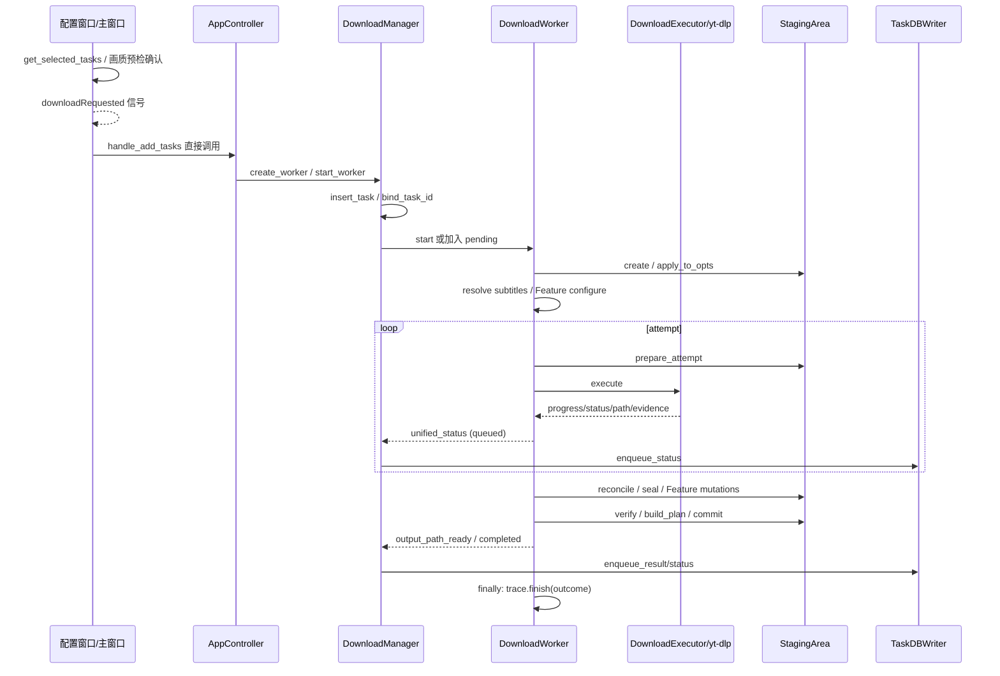

# 新版架构 V2 · 控制流与控制回环

本章为 2026-09-19 源码静态逆向；`[CONFIRMED/static]` 不代表运行验收。入口和状态 owner 见 [运行架构](03-runtime-architecture.md)、[状态模型](06-state-machines.md)。本章把命令、数据回调、等待唤醒分别记录。

## 用户意图到标准文件交付

[CONFIRMED/static] 路径从 [窗口 1088 行](../../src/fluentytdl/ui/components/dialogs/download_config_window.py#L1088)、[主窗口 835 行](../../src/fluentytdl/ui/reimagined_main_window.py#L835)、[controller 95 行](../../src/fluentytdl/core/controller.py#L95)、[manager 403 行](../../src/fluentytdl/download/download_manager.py#L403)、[worker 1143 行](../../src/fluentytdl/download/workers.py#L1143) 逐层可追。标准 Worker 在本轮开始时固定 COOKIE_MODE，但 SponsorBlock/Metadata/VR 的部分偏好仍读取运行时 config；不应推广成“所有配置都排队时冻结”。

## 回环登记表

下表各项 [CONFIRMED/static]，风险为 [INFERRED]。所有回环都列终结条件，避免把“有 cancel 方法”误认为它能唤醒所有等待。

| loop / owner | trigger / precondition | transition / side effects / resource | failure / exit / 风险 |
|---|---|---|---|
| `DownloadManager.pump` | start/finished/pump 请求；pending 非空、运行数小于配置上限 | 从 deque 选首个符合精确片段互斥者，start QThread；task_updated | 队列空/满/无可运行候选退出；start 异常被吞并继续，未形成独立终态诊断。[376 行](../../src/fluentytdl/download/download_manager.py#L376)。 |
| `DownloadWorker.run while True` | 标准媒体 opts/Feature 已就绪 | 每轮新 Executor、当前 attempt 路径文件；成功 break；失败按 RetryPolicy continue | never→DownloadFailed；after_fix→等待；取消→DownloadCancelled；未知异常外抛。[1330 行](../../src/fluentytdl/download/workers.py#L1330)。 |
| `_wait_if_paused` | on_progress；pause Event 未 set | 0.5s Event.wait，不产生新 run/attempt | resume set 放行；cancel set 触发异常；仅在调用点生效。[891 行](../../src/fluentytdl/download/workers.py#L891)。 |
| 自动退避 | 诊断 automatic 且预算未耗尽 | next_attempt；预算+1；cancel Event.wait(delay) | 取消立即打断；无暂停门，不能认为 pause 会冻结退避计时。[1421 行](../../src/fluentytdl/download/workers.py#L1421)。 |
| 错误修复等待 | after_fix 或重试耗尽 | is_suspended=True，新 suspend_event，无超时 wait；仍占 QThread 槽位 | resume_suspension 写 action/set；retry 清预算但 attempt+1；cancel() 没有 set 此 Event。[1475 行](../../src/fluentytdl/download/workers.py#L1475)、[759 行](../../src/fluentytdl/download/workers.py#L759)。 |
| 标准输出迭代 | Executor Popen stdout | 解析结构化进度、普通行、角色/嵌入证据，积累诊断；回调 Worker | cancel_check 在每条输出处理前；无输出靠外部 cancel 终止 proc；EOF→wait→rc 判定。[519 行](../../src/fluentytdl/download/executor.py#L519)。 |
| `section-part-progress` | download_sections 且有 parts_probe | daemon 线程每 0.75s 查 parts 字节，回调同一 on_progress | proc.poll 非空退出；回调异常没有同层 catch，且可能与输出线程并发更新进度。[1163 行](../../src/fluentytdl/download/executor.py#L1163)。 |
| 快速通道 stdout | lightweight 或 cover_direct Popen | 自行解析、只检查 is_cancelled；不走标准重试/暂停 loop | rc 非零直接 failed；rc 零仍需 Staging；用户再次开始由 controller 重建 worker。[2163 行](../../src/fluentytdl/download/workers.py#L2163)、[2413 行](../../src/fluentytdl/download/workers.py#L2413)。 |
| Channel tabs | target_tabs 非空 | ThreadPoolExecutor≤3、as_completed；每 tab loaded/unsupported/empty/failed/cancelled | 单 tab 异常不拖垮整批；cancel break 后仍要经过 executor context 退出，不能保证即时返回。[309 行](../../src/fluentytdl/download/workers.py#L309)。 |
| Playlist foreground/background | viewport / click / 400ms crawl tick | fg 优先→exec 队列→AsyncExtractManager；URL 映射 row；成功补 loaded | 详情错误自动重试一次，再 failed；stop_crawl 不取消已运行项；stop_all 另请求 cancel_all。[157 行](../../src/fluentytdl/ui/playlist_scheduler.py#L157)、[276 行](../../src/fluentytdl/ui/playlist_scheduler.py#L276)、[371 行](../../src/fluentytdl/ui/playlist_scheduler.py#L371)。 |
| TaskDBWriter `_run` | Queue 产生首项 | 正常 `_collect` 聚合至多200项、同(op,db_id)留最后一项，TaskDB batch；关闭 drain 不受200限制 | 毒丸后 drain 当前队列退出；join 超时不报未排空；单项异常只记 warning。[79 行](../../src/fluentytdl/storage/db_writer.py#L79)、[116 行](../../src/fluentytdl/storage/db_writer.py#L116)。 |
| Staging reserve/publish/compensate | verify/build_plan 完成、commit cancel gate 放行 | committing，整组命名预留，逐文件 WAL 发布，失败补偿 | 不在循环中重新检查取消；保留现场胜过外部删除；committed 是不可逆成功。[1283 行](../../src/fluentytdl/download/staging.py#L1283)。 |

## 跨章支撑回环导航

这些是独立资源 owner 的回环，不属于下载 Worker 的同一个 FSM。入口和实现存在为 [CONFIRMED/static]，成功率、退出延迟与实际触发为 [UNKNOWN]。

| owner / 回环 | 入口与退出边界 | 详细归属 |
|---|---|---|
| POTManager 启动健康探测、预热、恢复与重试 | `start_server`→健康轮询；`ensure_warm_async`→`_warm_worker`→失败调度重试；`wait_until_ready(timeout)` 有限等待；`try_recover` 分级恢复，`stop_server` 清资源，不能等同于每个HTTP等待都有用户取消门。[181行](../../src/fluentytdl/youtube/pot_manager.py#L181)、[416行](../../src/fluentytdl/youtube/pot_manager.py#L416)、[807行](../../src/fluentytdl/youtube/pot_manager.py#L807) | [VS-14 POT](vertical-slices/VS-14-pot-runtime.md)、[07资源](07-resource-model.md) |
| DownloaderWorker stall QTimer | start 后5分钟计时，每条progress重置；超时先报错再kill QProcess；finished/error停止timer。status不重置。[901行](../../src/fluentytdl/core/dependency_manager.py#L901)、[947行](../../src/fluentytdl/core/dependency_manager.py#L947) | [VS-17组件](vertical-slices/VS-17-component-update.md) |
| updater 新程序监护 | 获得新PID才进poll loop；READY身份/90s期限或survival15s决定commit/rollback；无PID另走commit分支。[1663行](../../src/fluentytdl/core/updater.py#L1663)、[1692行](../../src/fluentytdl/core/updater.py#L1692) | [VS-16应用更新](vertical-slices/VS-16-app-update.md)、[12部署](12-deployment.md) |
| Cookie runfile 年龄清理 | 启动触发sweep，按前缀/年龄有限枚举；不是实时owner存活监护。[sweep91行](../../src/fluentytdl/auth/cookie_runfile.py#L91) | [VS-13请求身份](vertical-slices/VS-13-cookie-context.md)、[07资源](07-resource-model.md) |
| trace文件与句柄维护 | sink 写入时维护有限LRU句柄/单文件轮转；`sweep_trace_dir`按保留规则枚举；两种机制与原始输出保留另有边界。[sink85行](../../src/fluentytdl/observability/sinks.py#L85)、[306行](../../src/fluentytdl/observability/sinks.py#L306) | [VS-15诊断](vertical-slices/VS-15-diagnostics.md)、[07资源](07-resource-model.md) |
| Staging orphan GC | restore时按下载根触发；跳过live/未达年龄者，仅明确committing/rollback_failed保留，其他状态尝试删除；枚举完成退出。[1744行](../../src/fluentytdl/download/staging.py#L1744) | [VS-11取消恢复](vertical-slices/VS-11-cancel-recovery.md)、[10错误恢复](10-error-recovery.md) |
| AnnouncementService / 云端scheduled | 桌面5s首检/15min周期，手动refresh共用抓取；stop置cancel并限时wait。云端15min cron独立派发sync和公告rebuild，不是桌面timer。[service155行](../../src/fluentytdl/notification/announcement_service.py#L155)、[Worker116行](../../../FluentYTDL-ControlCenter/apps/worker/src/index.ts#L116) | [VS-18公告](vertical-slices/VS-18-announcements.md) |

## 关键控制权交接

[CONFIRMED/static] `CleanLogger._emit` 节流的是展示更新，`force_update` 强制更新；Worker `_on_clean_update` 改内存并发 unified_status，manager 的 QueuedConnection 接受后排入后台 DB queue。中间状态可能在 DBWriter 同批被合并，所以 transition 事件序列与 DB 最终行不是逐事件镜像。[CleanLogger 116 行](../../src/fluentytdl/utils/clean_logger.py#L116)、[worker 717 行](../../src/fluentytdl/download/workers.py#L717)、[manager 455 行](../../src/fluentytdl/download/download_manager.py#L455)、[DBWriter 148 行](../../src/fluentytdl/storage/db_writer.py#L148)。

[CONFIRMED/static] Staging 提交后才发送最终 output_path，避免 UI 打开已被移动的 payload 路径；emit_actual 和 cleanup 的异常单独转为 signal。[worker 1615 行](../../src/fluentytdl/download/workers.py#L1615)、[1648 行](../../src/fluentytdl/download/workers.py#L1648)。[INFERRED] 此顺序减少假成功/假失败，但 DB 仍可能滞后文件，不是跨 SQLite 与文件系统原子提交。

[RECOMMENDATION] 验收按“输出静默→暂停”“after_fix→取消”“commit→关闭”“worker finished→queued slot→DB poison pill”交错点做故障注入。原因是单一路径成功无法证明等待唤醒、队列释放、事务不可逆点和退出顺序一致。
