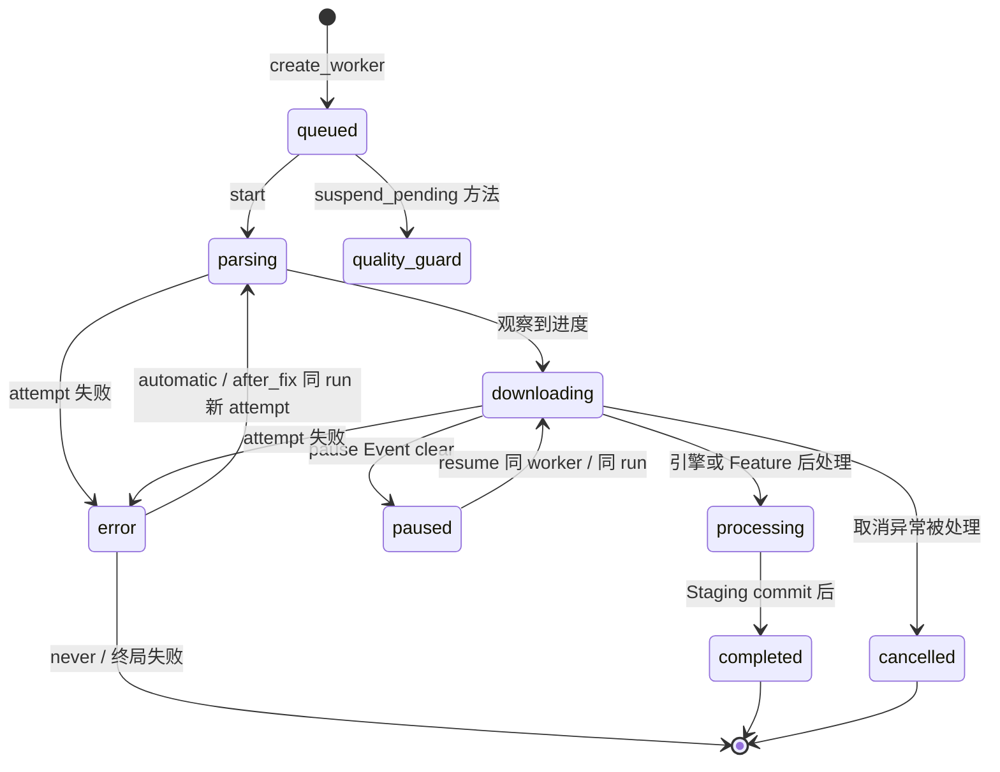
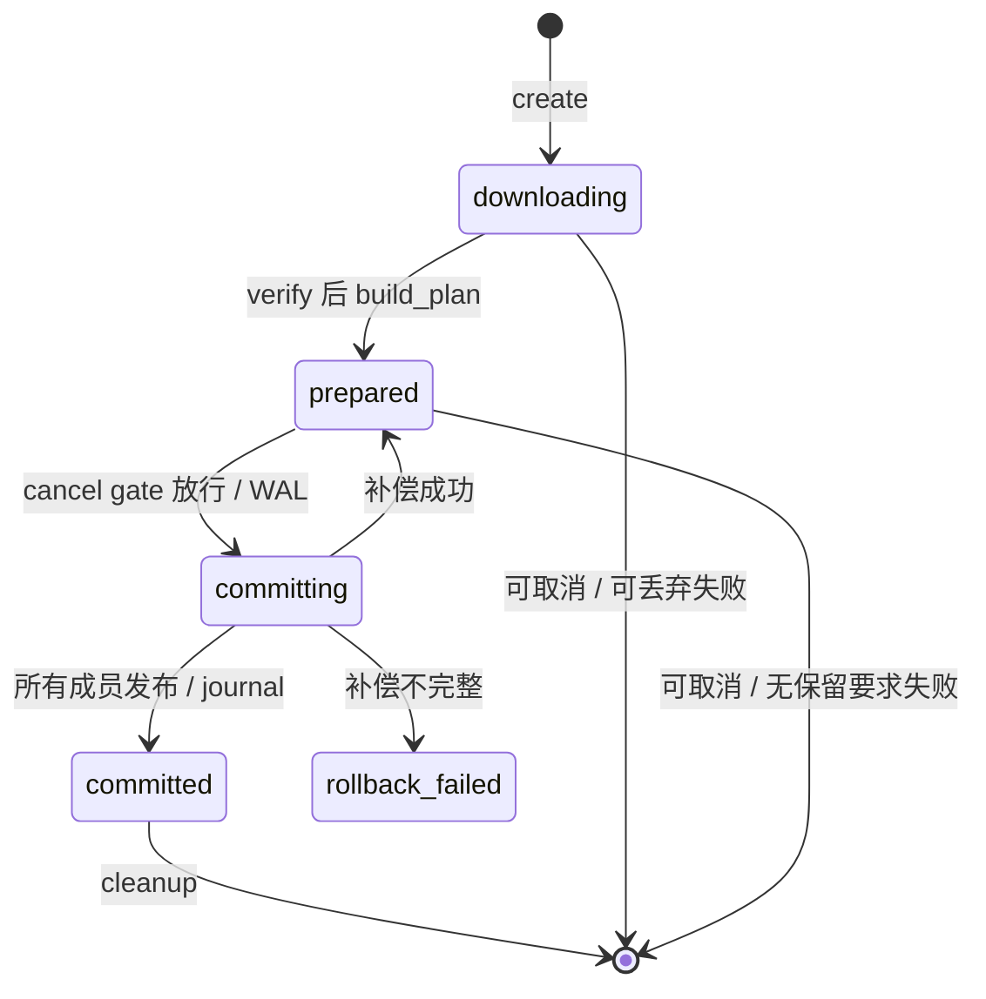

# 新版架构 V2 · 状态空间、身份与转换所有权

2026-09-19，source/static 取证。`[CONFIRMED/static]` 是代码事实；`[INFERRED]` 是影响推断。这里存在多个分散状态空间，不能合成一个“下载状态机”并宣称实现有严格转换表。

## 状态空间与身份

| 空间 | 实际字段/实体 | owner / 存续范围 | 与其他状态的关系 |
|---|---|---|---|
| 解析窗口 | `WindowState.LOADING/CONTENT/ERROR_COOKIE/ERROR_NETWORK/ERROR_GENERIC` | DownloadConfigWindow 当前窗口 | 还没有 task 时也存在；不是 DB tasks.state。[枚举 152 行](../../src/fluentytdl/ui/components/dialogs/download_config_window.py#L152)。 |
| 下载展示 | `_final_state`、`progress_val`、`status_text`、`effective_state` | Worker/CleanLogger；UI 读取 | effective_state 将多数活线程阶段折叠为 running，paused 特判；不是原持久字符串。[717 行](../../src/fluentytdl/download/workers.py#L717)。 |
| 持久任务 | `tasks.state`：completed/error/cancelled；queued/downloading/parsing/processing/running/paused/quality_guard | manager+TaskDBWriter，恢复路径亦直接更新 TaskDB | 两组用于分页/恢复，error 是数据库“终态分组”却允许同 run error→parsing。[task_db 28 行](../../src/fluentytdl/storage/task_db.py#L28)。 |
| 控制等待 | `_pause_event`、`_cancel_event`、`is_cancelled`、`is_suspended/suspend_event/suspend_action` | DownloadWorker | 三套字段共同控制，不由一个 enum 驱动。 |
| run 结果 | `_run_outcome`、`TaskTrace._outcome_emitted` | run 收口/TaskTrace | 正常 finally 唯一收口；活暂停没有 finish；强制线程终止例外。[1108 行](../../src/fluentytdl/download/workers.py#L1108)。 |
| 产物事务 | `_phase` = downloading/prepared/committing/committed/rollback_failed | StagingArea | 文件交付结果独立于 UI 和 DB。[phase 定义 140 行](../../src/fluentytdl/download/staging.py#L140)。 |
| 列表详情 | `_loaded/_failed/_running` 集合、三个 deque、URL↔row | PlaylistScheduler + manager active 表 | 集合并非严格互斥 enum；重试/重置/迟到信号需共同核对。[50 行](../../src/fluentytdl/ui/playlist_scheduler.py#L50)。 |

表中均 [CONFIRMED/static]。`session→flow→task→run→attempt` 是观测关系；`staging_id` 是另一个文件所有权身份，不能拿日志短 ID 作目录身份。task 由 DB 主键确定，flow 在解析期已存在，run 在 TaskTrace 建立时生成，真正 started 才 enqueue last_run 身份；attempt 在同 run 自动重试和 after_fix 重试均递增。[trace 119 行](../../src/fluentytdl/observability/trace.py#L119)、[manager 424 行](../../src/fluentytdl/download/download_manager.py#L424)、[worker 1488 行](../../src/fluentytdl/download/workers.py#L1488)。

## 下载控制的常见路径图（非穷尽合法边表）

[CONFIRMED/static] 上图来自 [Worker run，1330 行](../../src/fluentytdl/download/workers.py#L1330)、[pause/resume，765 行](../../src/fluentytdl/download/workers.py#L765)、[manager suspend_pending，538 行](../../src/fluentytdl/download/download_manager.py#L538)。图里 quality_guard 是方法可执行的边；当前未发现质量 manager 的业务调用，因此不能宣称正常下载会自动触发此边。

| 触发/前置条件 | owner / 变化 | 副作用、失败与退出 |
|---|---|---|
| live pause，cancel 尚未 set | Worker 清 pause Event，展示 paused | 保留线程/Executor/Staging/槽位；下一进度检查点等待。resume 只 set 同 Event，不 mint run/attempt。 |
| 已结束 worker 的继续/重试 | Controller 创建新 worker，restore_db_id 复用 | 新 TaskTrace/new run；原 opts 重用；不能保证沿用旧 txn 字节。[controller 477 行](../../src/fluentytdl/core/controller.py#L477)。 |
| automatic failure | Worker error→parsing，预算+1、attempt+1 | 保留 run、Staging；新 Executor 与 final.<attempt>.txt；取消 Event 可打断退避。 |
| after_fix failure | is_suspended=True，展示 error 但 QThread 仍活着 | 等待用户动作，仍占槽；retry 保留 run、attempt+1、预算重置；cancel 方法缺 suspension 唤醒。 |
| completed/cancelled 后迟到状态 | `_emit_transition` 拒绝并 signal | 只封两个 source；未知状态放行，因此不是严格 FSM。[manager 22—76 行](../../src/fluentytdl/download/download_manager.py#L22)。 |
| 重启前 active/queued | 恢复器先补旧 run audit，再把记录改 paused | 不自动下载；skip_download 变 error 且不建立恢复壳；error 按保留期恢复。[174 行](../../src/fluentytdl/download/download_manager.py#L174)。 |

以上 [CONFIRMED/static]；观测“每 run 一 outcome”只在正常收口和启动审计机制的范围内描述，不是分布式 exactly-once/断电持久性保证。

## 文件事务状态图

[CONFIRMED/static] [`build_plan`，1276 行](../../src/fluentytdl/download/staging.py#L1276)、[`commit`，1283 行](../../src/fluentytdl/download/staging.py#L1283)、[`_compensate`，1427 行](../../src/fluentytdl/download/staging.py#L1427)、[`finalize_failure/cancel`，1517 行](../../src/fluentytdl/download/staging.py#L1517) 决定上述边。取消 gate 后不重新取消发布：committing/rollback_failed 仅记录 pending，committed 取消 no_op。VerifyBlocked/CommitFailed 可以保留 prepared 现场；图中的退出不是“所有 prepared 异常都删除”。

[INFERRED] 严格维护事务 phase 而让 UI 使用较粗状态，是为了保护文件不被表示层动作误删；代价是出现“已请求取消但仍完成提交”的窗口，UI/日志需要说明其理由。

## 已确认差异与未闭合转换

- [CONFIRMED/static] `restore_state` 恢复 `_last_transition_state`，但 `_emit_transition` 初次发现新 `_transition_run` 又清掉基线：[worker 742 行](../../src/fluentytdl/download/workers.py#L742)、[manager 48 行](../../src/fluentytdl/download/download_manager.py#L48)。[INFERRED] 首迁移 from 可能是 `-`，不能依据注释宣称保留了旧态。
- [CONFIRMED/static] 标准成功后的后处理块受 `if not self.is_cancelled` 控制，而 finally 对未设置 outcome 默认 failed：[1528 行](../../src/fluentytdl/download/workers.py#L1528)、[1123 行](../../src/fluentytdl/download/workers.py#L1123)。[INFERRED] Executor 返回与该分支之间取消的交错需验证，不能假定每个取消必落 cancelled。
- [CONFIRMED/static] `effective_state` 对已 finished 且没有已识别 final state 回落 completed：[738 行](../../src/fluentytdl/download/workers.py#L738)。[INFERRED] 不能用该展示回落作文件交付证明。
- [UNKNOWN] 强制退出、Qt 排队信号尚未消费、DB 队列尚未提交时，上述三个状态层的实际一致性仍需受控 Windows 故障注入。
