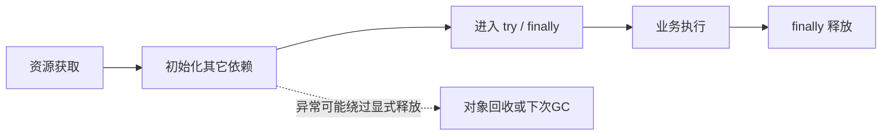

# 新版架构 V2：07 资源所有权与生命周期

2026-09-19 静态逆向；未运行应用、测试、下载或真实凭据处理。`[CONFIRMED]` 为代码事实，`[INFERRED]` 为推导风险/作用，`[UNKNOWN]` 为未验证保证，`[RECOMMENDATION]` 为建议。只写“调用了 close/stop”不能替代“资源已释放”的确认。

## 1. 所有权总表

| 资源 | 创建/持有/使用者 | 正常释放 | 异常、取消、重启与边界 |
|---|---|---|---|
| `[CONFIRMED]` TaskDB connection | TaskDB 单例；共享连接+写锁，测试 db_path 另建实例 | 本轮未定位生产 close 方法 | `[UNKNOWN]` 连接显式关闭契约；WAL不保证进程退出前队列已提交。[TaskDB._init_db](../../src/fluentytdl/storage/task_db.py#L67) |
| `[CONFIRMED]` DBWriter Queue/daemon thread | 模块级 db_writer；_run 消费，主线程及 worker 投递 | 毒丸→drain→退出，调用者 join(timeout) | `[CONFIRMED]` 无停止状态阻止后续 enqueue，无排空成功返回；线程超时仍可能存活。[db_writer.py](../../src/fluentytdl/storage/db_writer.py#L40) |
| `[CONFIRMED]` 请求 ContextVar | _snapshot_request set token；调用栈读 | finally reset | `[INFERRED]` 避免嵌套/后续请求继承错误模式；跨线程显式 options 是另一契约。[snapshot](../../src/fluentytdl/youtube/youtube_service.py#L144) |
| `[CONFIRMED]` 解析缓存 | YoutubeService OrderedDict+Lock，deepcopy 内容 | TTL/LRU/配置变化清空 | generation 拒绝旧写入；进程结束不持久化。[cache put](../../src/fluentytdl/youtube/youtube_service.py#L1697) |
| `[CONFIRMED]` Cookie 真相源+meta | Sentinel 校验后 replace .txt，再写 meta | 长期保留，新值通过校验后覆盖 | 刷新失败留旧字节；txt/meta不是共同原子事务。[commit](../../src/fluentytdl/auth/cookie_sentinel.py#L382) |
| `[CONFIRMED]` Cookie runfile | mkstemp→close(fd)→copyfile；CLI 持文件路径 | with/ExitStack close→remove | 托管识别失败直通；GC仅年龄与前缀；轻量路径保护窗口见下。[cookie_runfile](../../src/fluentytdl/auth/cookie_runfile.py#L58) |
| `[CONFIRMED]` WebView2 Process/Queue | Provider.extract_cookies 创建 daemon Process 与 multiprocessing.Queue | 父进程 finally 对存活进程 terminate→join(5)→必要时 kill；子端 put→close→join_thread | 未见父端 queue.close/process.close 或 kill后再次join；不是已证永久泄漏。[provider](../../src/fluentytdl/auth/providers/webview2_provider.py#L553) |
| `[CONFIRMED]` WebView2 profile | AuthService 账户提供 profile_dir；pywebview 持久 profile | 登录完成保留，账户删除/卸载另管 | 含登录数据，不能作为普通缓存任意清理；其旁路日志另列。[AuthService](../../src/fluentytdl/auth/auth_service.py#L569) |
| `[CONFIRMED]` POT Provider EXE | POTManager Popen、port、Lock、warm Event/thread；独立 EXE HTTP 服务 | stop_server terminate→wait(2)→kill fallback→清引用/port | 未证明 kill 后等待完成；atexit 不能覆盖所有强杀。[POTManager](../../src/fluentytdl/youtube/pot_manager.py#L330) |
| `[CONFIRMED]` POT Windows Job | 每进程匿名 Job，KILL_ON_JOB_CLOSE，分配 provider | 句柄随进程结束由 OS 回收；stop_server未显式关闭该Job | 建立/关联失败只警告；OpenProcess临时句柄未见显式close；需核查包装对象寿命。[Job](../../src/fluentytdl/youtube/pot_manager.py#L70)、[Assign](../../src/fluentytdl/youtube/pot_manager.py#L260) |
| `[CONFIRMED]` POT 插件临时文件 | 部署锁内 NamedTemporaryFile 同目录写、fsync、verify、replace | finally unlink tmp | 单文件原子；不是文件集合事务，也不是跨进程锁。[插件部署](../../src/fluentytdl/youtube/yt_dlp_cli.py#L242) |
| `[CONFIRMED]` JSONL handles | sinks OrderedDict LRU，锁保护，最多8个 | 淘汰时close；flush_sinks仅flush | active登记避开日志GC；本轮未证明全局显式close时点。[LRU](../../src/fluentytdl/observability/sinks.py#L72) |
| `[CONFIRMED]` 日志后台工作 | LogJobs 为每次历史读取/导出创建 non-daemon Thread；维护为 daemon thread | 读取用Event取消；维护随进程结束 | export不读同一个cancel，未见线程join；关闭窗口不等于取消导出。[LogJobs](../../src/fluentytdl/ui/components/common/log_jobs.py#L21) |
| `[CONFIRMED]` 诊断ZIP临时文件 | export_bug_bundle 唯一tmp、ZipFile上下文 | 完成替换目标，异常finally删tmp | 部分证据写manifest；导出成品不在常规日志GC范围。[bundle](../../src/fluentytdl/observability/bundle.py#L87) |
| `[CONFIRMED]` Announcement SQLite | connect每调用新sqlite3.connect；各方法with connection | with结束是事务提交/回滚；代码无显式close | `[UNKNOWN]` 对象回收与实际句柄占用时长；不将with写成close。[AnnouncementStore](../../src/fluentytdl/notification/announcement_service.py#L77) |

### 下载与界面核心资源补表

| 资源 | 创建与持有 owner | 释放、失败与取消 | 跨启动边界与处理缘由 |
|---|---|---|---|
| `[CONFIRMED]` StagingArea 与事务目录 | 每轮 worker 创建独立 UUID `staging_id`；area 持有 payload/parts/work/internal/control 子目录及 journal。[create](../../src/fluentytdl/download/staging.py#L739) | committed 后 cleanup；失败/取消统一交 finalize_failure/finalize_cancel 按 phase 裁决，committing/rollback_failed 保留现场，已 committed 取消不撤销成品。[cleanup](../../src/fluentytdl/download/staging.py#L878)、[裁决](../../src/fluentytdl/download/staging.py#L1517) | journal/目录可跨启动，内存对象不延续；启动 GC 跳过 live ID 和未到年龄者，识别 committing 时仅清有指纹证明的零字节占位符并留沙盒；rollback_failed 保留，其余含未知/坏 journal 可进入删除分支。[gc_orphans](../../src/fluentytdl/download/staging.py#L1744)。`[INFERRED]` 独立 ID 防同任务重试把旧事务误当活动事务；不能承诺所有未知现场都保留。 |
| `[CONFIRMED]` Manifest 与 CommitPlan | StagingArea 持有 Manifest 事实/意图；build_plan 生成 frozen CommitPlan 成员与统一目标组名；Manifest 本身不执行文件操作。[Manifest](../../src/fluentytdl/download/staging.py#L322)、[CommitPlan](../../src/fluentytdl/download/staging.py#L294)、[build_plan](../../src/fluentytdl/download/staging.py#L1227) | 随本轮 area/调用引用释放；失败裁决依赖 area phase，不能通过丢弃 Python 对象代替文件补偿 | 内存 plan 不是可跨启动续做的事务；可恢复证据来自 journal/文件，重启裁决见 [VS-11](vertical-slices/VS-11-cancel-recovery.md)。`[INFERRED]` 分离记录与物理操作集中路径验证和提交决策，代价是调用者必须维护记录与文件实际状态一致。 |
| `[CONFIRMED]` 目标文件占位符与进程内路径预留 | commit 写 committing journal 后 `_reserve_group` 以 O_CREAT/O_EXCL 创建同组占位符；area 持有指纹，模块集合预留目标路径。[commit](../../src/fluentytdl/download/staging.py#L1283)、[reserve](../../src/fluentytdl/download/staging.py#L1327) | 成功发布后释放内存预留；失败走 compensate，移除占位符前检查归属；无法回滚保留现场。[compensate](../../src/fluentytdl/download/staging.py#L1427)、[remove](../../src/fluentytdl/download/staging.py#L1493) | 内存集合随进程消失，磁盘占位符/journal 可遗留；GC 依赖指纹与零长度而非仅文件名。`[INFERRED]` 原子占位避免并发覆盖及同组附件错配，代价是崩溃恢复必须区分自己的空文件和用户文件。 |
| `[CONFIRMED]` DownloadExecutor、yt-dlp Popen/stdout 与 Cookie ExitStack | 每轮 worker/executor 持有进程引用，stdout 循环消费进度与结果；解析 CLI 另有 stdout/stderr PIPE 与 cancel watcher。[executor](../../src/fluentytdl/download/executor.py#L356)、[解析进程](../../src/fluentytdl/youtube/yt_dlp_cli.py#L1124) | executor 正常路径 wait→清 `_proc`→释放 runfile，取消调用 terminate；解析端只由主调用 communicate，watcher 轮询退出/取消并在 finally join(1s)。[收尾](../../src/fluentytdl/download/executor.py#L683)、[terminate](../../src/fluentytdl/download/executor.py#L1131)、[watcher](../../src/fluentytdl/youtube/yt_dlp_cli.py#L1136) | 进程/管道对象无跨启动恢复；任务记录、Staging 与 trace 是独立证据。`[UNKNOWN]` 不能由 wait/清引用推出所有管道句柄均显式关闭；`[INFERRED]` 单一输出消费方避免竞争读取和缺失结果。 |
| `[CONFIRMED]` DownloadWorker QThread 与 Event | DownloadManager 创建/登记 worker；worker 持 pause/cancel Event，after_fix 另建 suspend Event。[worker](../../src/fluentytdl/download/workers.py#L597)、[start_worker](../../src/fluentytdl/download/download_manager.py#L507) | pause/resume 控制 pause Event；cancel 同时唤醒 pause 等待并终止执行器，但不设置单独 suspend Event；其需 resume_suspension 唤醒。[控制方法](../../src/fluentytdl/download/workers.py#L759)、[suspend 等待](../../src/fluentytdl/download/workers.py#L1475) | Event/QThread 不持久化；启动依据 DB 重建可恢复任务。manager 移除活动引用不等于线程已退出，shutdown 两次限时 wait 也非完成保证（见 §3）。`[INFERRED]` 协作取消避免直接中断文件提交；独立等待门同时增加退出检查点。 |
| `[CONFIRMED]` 图片 QNetworkAccessManager 与磁盘缓存 | `_get_global_manager` 懒建模块全局 QNAM，挂 QNetworkDiskCache，TEMP/fluentytdl_thumb_cache，50 MiB 上限；初始化时先 trim。[创建](../../src/fluentytdl/utils/image_loader.py#L76)、[trim](../../src/fluentytdl/utils/image_loader.py#L37) | 下载配置窗口关闭断开自身图片信号；不是销毁共享 manager 或清空磁盘缓存。[连接](../../src/fluentytdl/ui/components/dialogs/download_config_window.py#L453)、[断开](../../src/fluentytdl/ui/components/dialogs/download_config_window.py#L1258) | 磁盘缓存可跨进程保留至 trim/缓存淘汰；Qt 对象为进程内资源。`[INFERRED]` 全局复用减少重复请求与缓存实例，要求窗口级断开连接以防迟到结果影响已关闭界面；`[UNKNOWN]` 本轮未验证每种 reply 异常的实际回收时长。 |

## 2. 获取、使用、释放之间的显式保护区

[CONFIRMED] 轻量 `_run_lightweight_extract` 在 workers.py 2052–2057 创建 ExitStack 并取得 Cookie runfile，2069 建 staging，2137 准备 env，到2162才进入有2325 close的 try/finally。[获取](../../src/fluentytdl/download/workers.py#L2052)、[初始化](../../src/fluentytdl/download/workers.py#L2069)、[try](../../src/fluentytdl/download/workers.py#L2162)、[close](../../src/fluentytdl/download/workers.py#L2325)

[INFERRED] staging/env 初始化抛错会越过该显式 close 路线；异常引用和生成器回收会影响残留时长。`[UNKNOWN]` 本轮没有故障注入，因此不声称永久泄漏或真实凭据已经残留。`[RECOMMENDATION]` 审核资源时记录“首次获取→进入保护区”的区间，而不仅检索 finally。

## 3. 线程结束与数据提交的不同确认点

[CONFIRMED] DownloadManager.shutdown stop_all→逐 worker wait(grace_ms)→超时 terminate→wait(500)→DBWriter.flush_and_stop(3秒)。第二次 wait 未判断结果；writer join未判断is_alive。[shutdown](../../src/fluentytdl/download/download_manager.py#L562)

[INFERRED] 此顺序只是收尾尝试，不能证明所有外部进程、QThread、SQL、Staging提交均已完成。若worker仍能发状态，毒丸后生产者与drain结束可能交错。daemon writer会随进程终止，其未提交队列没有独立WAL。

[CONFIRMED] Writer合并批次最多200，但 `_drain_remaining` 收集剩余项后一次 `_process_batch`，不沿用_collect的200项上限。[drain](../../src/fluentytdl/storage/db_writer.py#L116)。[INFERRED] 正常批次的写锁占用上限不能直接套用退出排空路径。

[RECOMMENDATION] 未来退出契约需明确停生产者、终止/等待消费者、确认队列已提交、释放连接这四步的返回状态；不能用固定sleep替代完成确认。这里只揭示现有边界，不修改业务。

## 4. 进程所有权有三套不同策略

1. `[CONFIRMED]` ProcessManager 对已注册PID清理；按名兜底仍检查ppid==本进程。[cleanup](../../src/fluentytdl/core/process_manager.py#L106)、[按名父进程限定](../../src/fluentytdl/core/process_manager.py#L194)。`[UNKNOWN]` 所有子进程是否都注册、PID重用如何处理尚未全量验证。
2. `[CONFIRMED]` POT启动时向默认端口范围全部POST /shutdown，不检查PID/nonce；随后探测空闲端口，再spawn。[orphan清理](../../src/fluentytdl/youtube/pot_manager.py#L151)。`[INFERRED]` 可能停止另一实例的活跃服务，且探测到spawn之间端口可能被抢占；匿名Job只解决各自子进程寿命，不解决HTTP端口所有权。
3. `[CONFIRMED]` 工具更新worker有psutil时按目标文件路径寻找占用进程；无psutil时执行taskkill /F /IM name，未限定父PID。[kill_locking_processes](../../src/fluentytdl/core/updater_worker.py#L52)。`[INFERRED]` 这一降级可能影响其他软件同名进程，不能用ProcessManager的安全范围替其背书。

## 5. 更新备份不是所有分支都等待 READY

[CONFIRMED] 正常监护分ready与survival：ready需PID+nonce，survival是兼容旧版的存活宽限。`_commit_update` 删除旧exe/_internal、tmp、归档、ready文件，失败仅记录并保留残余。[decide_watch_outcome](../../src/fluentytdl/core/updater.py#L1125)、[commit](../../src/fluentytdl/core/updater.py#L1180)

[CONFIRMED] **新版自动启动失败**（launch_mode none或无PID）分支仍直接 `_commit_update`，提示手动启动，执行updater自更新，返回1；没有READY验证。[启动失败分支](../../src/fluentytdl/core/updater.py#L1663)。旧进程等待超时也只是警告继续更新。[等待超时](../../src/fluentytdl/core/updater.py#L1488)

[INFERRED] “回滚素材只在新版证明能跑后删除”与当前所有分支不一致。未来设计理由必须同时写出兼容/人工恢复选择的代价：自动启动失败后旧版本素材可能已被清除。

[CONFIRMED] 回滚由有权限的updater恢复旧exe/_internal并删除同批updater.exe.new；成功构建的.new用于updater自身替换，不能作为普通残留清理。[rollback](../../src/fluentytdl/core/updater.py#L1334)、[自更新](../../src/fluentytdl/core/updater.py#L1281)

## 6. 清理清单的安全与遗漏边界

[CONFIRMED] 公共log retention只遍历已解析日志根的已知文件，不跟随symlink/junction，跳过bundles，跳过active文件；trace14天、其它已知日志7天，总量预算200MiB。[sweep_logs](../../src/fluentytdl/utils/log_runtime.py#L184)。`[INFERRED]` 保护用户未知文件和活动句柄的代价是不能承诺日志目录或全部日志绝对低于200MiB。

[CONFIRMED] WebView2 profile内webview_subprocess.log由本地函数直接append，不在上述根内，也不经过公共日志retention。[旁路日志](../../src/fluentytdl/auth/providers/webview2_provider.py#L109)。`[RECOMMENDATION]` 需独立资源条目管理其隐私与大小。

[CONFIRMED] 公告默认生成数据根的announcements.sqlite3；[maintenance.ps1根清单](../../installer/maintenance.ps1#L205)列出config、tasks及state等，但没有这个根文件；[AnnouncementService默认路径](../../src/fluentytdl/notification/announcement_service.py#L159)固定创建端。`[INFERRED]` 存在卸载清单差异；`[UNKNOWN]` 本轮未执行卸载，不能宣称实际残留已发生。

[RECOMMENDATION] 资源验收按正常、初始化失败、运行失败、取消、硬退出、下次启动六列逐一验证；只用隔离数据、合成凭据和受控子进程，不把静态阅读当作句柄泄漏/多实例/断电测试。

## 7. 跨章资源导航

本章是资源入口；状态转换、控制回环和用户完整路径分别在下表展开。`[CONFIRMED]` 表示导航指向本轮已记录的静态链路，不等于已做运行验收。

| 需要回答的问题 | 详细章节 |
|---|---|
| 下载任务/Event/执行器由谁控制，文件事务阶段与 UI 状态为何不同 | [06 状态机](06-state-machines.md)、[09 并发模型](09-concurrency-model.md)、[VS-11 取消与恢复](vertical-slices/VS-11-cancel-recovery.md) |
| 请求快照、Cookie 真相源/runfile、账户 profile 如何流转与失效 | [04 数据流](04-data-flow.md)、[VS-12 认证](vertical-slices/VS-12-authentication.md)、[VS-13 Cookie 上下文](vertical-slices/VS-13-cookie-context.md) |
| POT 端口、Provider EXE、Job、插件文件如何启动、探测、清理和重建 | [VS-14 POT runtime](vertical-slices/VS-14-pot-runtime.md)、[05 控制流](05-control-flow.md) |
| 更新包、备份、updater、新旧进程与 READY 如何交接 | [12 构建与部署](12-deployment.md)、[05 控制流](05-control-flow.md)；启动失败仍提交的边界见本章 §5 |
| trace/JSONL、导出线程、日志 GC 与诊断 ZIP 谁持有，脱敏覆盖到哪里 | [VS-15 诊断](vertical-slices/VS-15-diagnostics.md)、[11 安全边界](11-security-boundaries.md) |
| 启动 GC、日志维护与多实例资源清理为何不能用同一规则 | [05 控制流](05-control-flow.md)、[VS-11 取消与恢复](vertical-slices/VS-11-cancel-recovery.md)、本章 §4/§6 |
