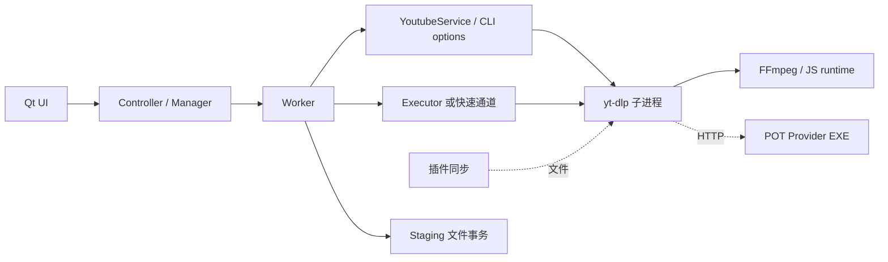

# 新版架构 V2 · 七类依赖与跨边界契约

证据：2026-09-19 当前工作树 source/static；没有执行导入应用、构建、测试或联网。`[CONFIRMED]` 为源码关系，`[INFERRED]` 为作用解释，`[UNKNOWN]` 为未证，`[RECOMMENDATION]` 为后续工作。此章是关键依赖图，不宣称全仓调用图或所有环路已穷尽。

## 1. 七类依赖不能合并成 import 图

| 类别 | 生产者 → 消费者 | 契约及缘由 |
|---|---|---|
| 编译/打包 | [CONFIRMED] pyproject/uv.lock/build-environment → PyInstaller spec → 冻结 app/updater | [pyproject，L5](../../pyproject.toml#L5)、[build_environment，L40](../../scripts/build_environment.py#L40)、[updater.spec，L22](../../scripts/updater.spec#L22)。精确构建环境减少机器差异；隐藏导入、7zip、locale 数据仍需显式收集。 |
| 运行 | [CONFIRMED] YoutubeService/Executor → yt-dlp.exe → FFmpeg/JS/POT 插件 | [run_dump_single_json，L1054](../../src/fluentytdl/youtube/yt_dlp_cli.py#L1054)、[Executor Popen，L469](../../src/fluentytdl/download/executor.py#L469)。Python 包解析成功不能证明子进程工具存在或插件可发现。 |
| 控制 | [CONFIRMED] 配置窗 signal → MainWindow.add_tasks → controller → manager.pump；更新 apply_requested → 窗口退出 → main 拉 updater | [主窗口，L708](../../src/fluentytdl/ui/reimagined_main_window.py#L708)、[L835](../../src/fluentytdl/ui/reimagined_main_window.py#L835)、[L307](../../src/fluentytdl/ui/reimagined_main_window.py#L307)、[main，L527](../../main.py#L527)。直接方法和 Qt 信号是混合控制链。 |
| 数据 | [CONFIRMED] options → CLI argv；输出行/文件扫描 → Manifest；更新 release → normalized manifest；D1 published → KV → 本地公告 SQLite | [ydl_opts_to_cli_args，L682](../../src/fluentytdl/youtube/yt_dlp_cli.py#L682)、[StagingArea.reconcile，L982](../../src/fluentytdl/download/staging.py#L982)、[CheckSession.manifest，L325](../../src/fluentytdl/core/update_transport.py#L325)、[AnnouncementStore，L77](../../src/fluentytdl/notification/announcement_service.py#L77)。转换有字段丢失/默认值和时效约束。 |
| 资源 | [CONFIRMED] Worker 拥有 Staging；POTManager 拥有 Popen/Job；TaskDBWriter 拥有 Queue/Thread；updater 拥有备份/进程句柄 | [staging create，L739](../../src/fluentytdl/download/staging.py#L739)、[POT init，L46](../../src/fluentytdl/youtube/pot_manager.py#L46)、[writer，L40](../../src/fluentytdl/storage/db_writer.py#L40)、[updater finally，L1729](../../src/fluentytdl/core/updater.py#L1729)。谁调用不必然等于谁可清理。 |
| 外部 | [CONFIRMED] 视频站/媒体 CDN、GitHub releases、Cloudflare KV/D1/Access、Windows WebView2/UAC/Job/Registry | [ControlCenter routes，L41](../../../FluentYTDL-ControlCenter/apps/worker/src/index.ts#L41)、[webview2_runtime.py](../../src/fluentytdl/auth/webview2_runtime.py)、[maintenance，L66](../../installer/maintenance.ps1#L66)。权限、连接和服务时效各有失败，不统称“网络问题”。 |
| 隐式 | [CONFIRMED] 导入期单例、env 数据根/ready token、`__fluentytdl_` options、updater PE 能力、固定端口与文件命名 | [main，L53–69](../../main.py#L53)、[manager.__init__，L168](../../src/fluentytdl/download/download_manager.py#L168)、[updater 参数能力，L586](../../src/fluentytdl/core/component_update_manager.py#L586)。这些边不一定被 AST import 图捕获，修改一端需同步消费者。 |

## 2. 下载运行依赖

用途：识别运行宿主和配置传递。范围：关键调用关系，不是全量函数图；实线箭头为调用/启动，虚线为文件投放或 HTTP 使用。

[CONFIRMED] GUI 主路径没有实例化 yt-dlp Python API；仓内 POT 插件确实导入 yt_dlp 的 provider/networking API，但插件投放到外部 yt-dlp 可发现位置：[插件代码](../../src/fluentytdl/yt_dlp_plugins_ext/yt_dlp_plugins/extractor/getpot_bgutil.py#L8)、[sync_pot_plugins_to_ytdlp，L273](../../src/fluentytdl/youtube/yt_dlp_cli.py#L273)。因此“发现 yt_dlp import”不能据此推翻 CLI 边界。

[CONFIRMED] 当前 POT 由 [POTManager.start_server，L204](../../src/fluentytdl/youtube/pot_manager.py#L204) 直接执行 provider EXE；Node/其它 JS runtime 候选属于 yt-dlp 的另一依赖，不是当前 POT 启动器。版本身份由 [resolve_runtime，L22](../../src/fluentytdl/utils/ytdlp_runtime.py#L22) 解析有效 custom、local/PATH、frozen legacy 等分支。组件安装目标由 [DependencyManager.get_exe_path，L191](../../src/fluentytdl/core/dependency_manager.py#L191) 单独决定，不写入自管/PATH executable。

[INFERRED] 引擎独立升级降低桌面发行频率，但扩张协议面：argv/env、插件目录、JSON/stderr/退出码、语言过滤与 URL 时效都需兼容。`uv.lock` 不能锁住用户自定义 executable 的行为。

## 3. 真实跨层依赖与“分层规则”的差别

[CONFIRMED] 主窗口直接调用 controller 编排；core/component_update_manager 通过函数级导入下载 manager 检查活跃任务，异常时按无任务继续：[request_app_core_update，L467–491](../../src/fluentytdl/core/component_update_manager.py#L467)。lazy import 减少导入期循环，并没有消除运行依赖。

[CONFIRMED] `DownloadManager` 构造时恢复任务；`TaskDBWriter` 全局实例构造即启动后台线程：[download_manager，L168](../../src/fluentytdl/download/download_manager.py#L168)、[db_writer，L40](../../src/fluentytdl/storage/db_writer.py#L40)。[RECOMMENDATION] 静态调查仅 AST 解析，避免为获取符号列表 import 产品模块而误触 DB/线程。

[CONFIRMED] 本轮 [AST 依赖候选](evidence/dependency-candidates.json) 记录 215 个 src 模块、903 条导入边和 5 组 SCC 候选；它包含函数内、条件和类型导入，不包含 Qt signal 边。人工回查如下：

| SCC 候选 | 导入发生条件/实际符号 | 裁决 |
|---|---|---|
| diagnostics.catalog ↔ models | [catalog L13](../../src/fluentytdl/diagnostics/catalog.py#L13) 顶层读取 FALLBACK_CODE；[models 属性，L178–196](../../src/fluentytdl/diagnostics/models.py#L178) 在 user_title/user_message/recovery_hint 内 lazy import catalog | [CONFIRMED] 运行取文案时回边，不等于两端初始化互相读取尚未定义符号。[INFERRED] 为数据模型延后 UI 文案依赖。 |
| auth_service ↔ cookie_sentinel ↔ webview2_provider | [sentinel L31](../../src/fluentytdl/auth/cookie_sentinel.py#L31) 顶层导 auth_service；[auth_service L567/L779](../../src/fluentytdl/auth/auth_service.py#L567) 在方法内导 provider/sentinel；[provider L686](../../src/fluentytdl/auth/providers/webview2_provider.py#L686) 回读认证状态 | [CONFIRMED] 顶层与函数内边混合。初始化和账户切换调用顺序需另验，不能由 SCC 判启动必失败。 |
| download.features ↔ workers | [workers L46](../../src/fluentytdl/download/workers.py#L46) 导 Feature；[features L18–20](../../src/fluentytdl/download/features.py#L18) 仅 TYPE_CHECKING 导 Worker | [CONFIRMED] 反向静态导入仅用于类型检查，非普通运行 import 环；DownloadContext 持 worker 的运行对象关系仍存在。 |
| controller ↔ quick_add_worker | [controller L194](../../src/fluentytdl/core/controller.py#L194) 函数内导 QuickAddWorker；[quick_add_worker L17–18](../../src/fluentytdl/core/quick_add_worker.py#L17) TYPE_CHECKING 导 AppController | [CONFIRMED] 类型回边与 lazy 正边，不能画成启动互相加载死锁。 |
| spatialmedia.mpeg 包及 box/container/mpeg4_container/sa3d/sv3d | [包重导出，L1–7](../../src/fluentytdl/utils/spatialmedia/mpeg/__init__.py#L1)、[container，L24](../../src/fluentytdl/utils/spatialmedia/mpeg/container.py#L24) 等通过 `from . import ...` 导兄弟模块 | [CONFIRMED] 内嵌第三方包的重导出与包相对导入；候选解析会加入包级边。[UNKNOWN] 未运行导入序列，不将包级 SCC 等同于真实循环失败。 |

[CONFIRMED] 规范的 utils 不导 observability 不是全仓已满足事实：[startup_info，L245](../../src/fluentytdl/utils/startup_info.py#L245)、[_install_observability_sinks，L307](../../src/fluentytdl/utils/startup_info.py#L307) 与 [config snapshot，L329](../../src/fluentytdl/utils/startup_info.py#L329) 在函数内导入 observability；[image_loader，L19](../../src/fluentytdl/utils/image_loader.py#L19) 顶层依赖 config_manager。[INFERRED] startup_info 更接近启动装配器，image_loader 包含配置化网络职责，因此物理 utils 目录并非全部无依赖基础层；这不是自动认可任何新逆向依赖的理由。

[UNKNOWN] AST 集合未穷尽动态导入、运行时 monkey patch、Qt 全部 signal 的线程亲和性；不能写“严格无环分层”。[RECOMMENDATION] 对 singletons、signal connect、callback registration 补边，保留类型边/导入期边/函数运行边标签，再讨论分层修正。

## 4. 更新与公告的不同网络边

[CONFIRMED] CheckSession 用锁串行共享请求会话，每次检查最多换源一次；Cloudflare 失败可换 GitHub，GitHub 仅限流类错误允许换 Cloudflare，取消不换源：[CheckSession._request，L252–297](../../src/fluentytdl/core/update_transport.py#L252)。换源改变元数据请求路径，下载 URL 仍验证/生成 GitHub release 资产；不是通用二进制代理。

[CONFIRMED] 公告读取直连 Cloudflare public endpoint，失败回退本地仍需 validate 的 snapshot；它不走 GitHub 公告 fallback：[AnnouncementFetch.run，L130](../../src/fluentytdl/notification/announcement_service.py#L130)。通知列表与持久确认分离，二者不能通过一个“清空消息”操作表达。

[INFERRED] 对外依赖降级是有方向、有次数、有时效的控制策略，不是“换源直到成功”。代价是同批检查中后续组件共享已经切换或失败的会话状态，必须保留 check_id 排查。

## 5. 依赖修改的受影响面

| 修改点 | 必须同时核对的消费者 | 验证限制 |
|---|---|---|
| [RECOMMENDATION] options 内部键/Cookie 开关 | UI 生产、DB 序列化、恢复 worker、标准/轻量/直链分支、retry merge | 单路径单测不证明匿名请求全覆盖。 |
| [RECOMMENDATION] app-core 载荷列表 | build whitelist、manifest hash、updater 解压/替换、自更新 .new、维护 helper | 压缩成功不证明旧 updater 可消费。 |
| [RECOMMENDATION] data root | main 参数、paths、DB/log、ready 文件、install_registration、maintenance | 覆盖路径必须能卸载发现，不能只看程序可写。 |
| [RECOMMENDATION] 公告 schema | shared Zod、D1 draft/published、KV、Python validate/eligible、Markdown UI、确认主键 | 服务端发布成功与客户端显示/确认是不同结果。 |
| [RECOMMENDATION] POT 进程/端口 | provider argv、插件 base_url、Job、健康/铸 token、startup cleanup | 无 owner 的端口 shutdown 风险仍存在；匿名 Job 不消除它。 |

本章确认关键边及反例，不替代 [应用更新](vertical-slices/VS-16-app-update.md)、[组件更新](vertical-slices/VS-17-component-update.md)、[公告](vertical-slices/VS-18-announcements.md) 的成功/异常切片。
