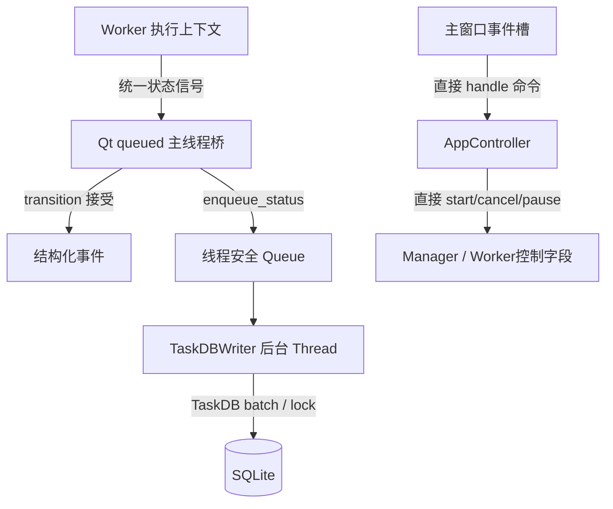

# 新版架构 V2 · 并发、消息与资源所有权

2026-09-19，静态源码结论。本章不用“用了 Qt signals/锁”代替线程安全证明；`[CONFIRMED/static]` 表示存在具体实现，`[UNKNOWN]` 保留实际时序限制。

## 执行上下文与 owner

| 上下文 | 产生点 / owner | 输入、资源及输出 | 停止路径 |
|---|---|---|---|
| Qt GUI 主线程 | QApplication/main、窗口和 manager QObject | 事件循环、窗口、任务 model、pending deque；接收 unified_status；直接调用 controller | close 可能只隐藏到托盘；quit_app 调 shutdown。[主窗口 596 行](../../src/fluentytdl/ui/reimagined_main_window.py#L596)。 |
| 下载 QThread | manager.start_worker / Worker | 每 run 的 Event、opts、trace、executor、staging | cancel→进程终止与等待点；shutdown wait→terminate；没有统一协作排空协议。[manager 507 行](../../src/fluentytdl/download/download_manager.py#L507)。 |
| 单项/VR/频道解析 QThread | 配置窗口 start_extraction | 请求快照与 cancel Event | 请求 watcher 终止 CLI；worker 静默 return。[窗口 1354 行](../../src/fluentytdl/ui/components/dialogs/download_config_window.py#L1354)。 |
| ChannelTab ThreadPoolExecutor | ChannelExtractWorker.run | ≤3 个 tab Future，显式传 trace；collector 发 Qt signal | shared cancel Event；with executor 退出须等任务终结。[worker 360 行](../../src/fluentytdl/download/workers.py#L360)。 |
| QThreadPool / QRunnable | AsyncExtractManager | runnable 包裹 EntryDetailWorker，直接 `.run()`；QMutex 保护 active 表 | cancel 发 Event；仅完成/错误信号清 active，取消 return 存在缺口。[extract_manager 11 行](../../src/fluentytdl/download/extract_manager.py#L11)、[139 行](../../src/fluentytdl/download/extract_manager.py#L139)。 |
| TaskDBWriter daemon Thread | db_writer 单例 init | Queue、正常 `_collect` 至多200条批量、TaskDB 写锁；关闭 drain 无此上限 | poison pill→drain→break；调用线程 join(timeout) 没有检查 is_alive。[db_writer 40 行](../../src/fluentytdl/storage/db_writer.py#L40)、[74 行](../../src/fluentytdl/storage/db_writer.py#L74)、[116 行](../../src/fluentytdl/storage/db_writer.py#L116)。 |
| 解析 CLI cancel watcher | `run_dump_single_json` | proc.poll未退出时每0.2s等待cancel Event；只调用一次communicate收stdout/stderr | 进程退出结束loop；取消则终止proc并return；finally watcher.join(1s)，主路径按Event抛YtDlpCancelled。[yt_dlp_cli 1124 行](../../src/fluentytdl/youtube/yt_dlp_cli.py#L1124)。 |
| 片段进度 daemon | Executor download_sections | parts_probe、同一个 on_progress、每0.75s读取 | proc.poll 退出；没有独立 join 句柄。[executor 483 行](../../src/fluentytdl/download/executor.py#L483)。 |
| Cookie 启动 daemon | main.launch_main_window | 延迟2s静默刷新；结果 health signal | daemon 生命周期；此处没有 join。[main 468 行](../../main.py#L468)。 |
| VR FFmpeg 外部进程 | VRFeature._run_ffmpeg 内局部 p | stdout readline、状态回调；workfile | EOF/poll；函数未检查 cancel/pause，也未把 p 登记为 Worker executor/_proc_ref。[features 624 行](../../src/fluentytdl/download/features.py#L624)。 |

表内均 [CONFIRMED/static]。这是主下载纵切片的线程地图，不宣称囊括认证/更新的每个线程；对应模块另有资源章。

[CONFIRMED/static] 图片请求另用全局 `QNetworkAccessManager`，可配置临时目录 `fluentytdl_thumb_cache` 与 50 MiB `QNetworkDiskCache`；失败时记录 warning，不等同于创建独立 Python 下载线程。配置窗连接图片信号并在关闭时断开。[ImageLoader 76 行](../../src/fluentytdl/utils/image_loader.py#L76)、[配置窗 453 行](../../src/fluentytdl/ui/components/dialogs/download_config_window.py#L453)、[1258 行](../../src/fluentytdl/ui/components/dialogs/download_config_window.py#L1258)。

[CONFIRMED/static] 本轮搜索 main.py 与 src 的 `network_watchdog|NetworkWatchdog|DiskMonitor`，只发现 [NetworkWatchdog 定义](../../src/fluentytdl/core/network_watchdog.py#L15)、同模块单例和 [DiskMonitor 定义](../../src/fluentytdl/core/disk_monitor.py#L18)，未见生产导入/启动调用。[UNKNOWN] 动态外部接线未验证；它们属于候选监控代码，不能画作默认启动的活跃后台回环。

## 信号与直接调用边界

[CONFIRMED/static] manager 对 started/unified_status/output_path_ready 明确使用 QueuedConnection，其他 finished/completed/error 使用默认连接；不能把所有回调都表述为源码显式指定了 GUI 线程。实际 QObject affinity/Qt 投递线程还需运行验证。[manager 443—497 行](../../src/fluentytdl/download/download_manager.py#L443)。

[CONFIRMED/static] Worker 的 pause/cancel Event 可跨线程 set，但它同时写 `_final_state`、`is_cancelled` 和 executor 引用；CleanLogger/Worker 状态既可由 UI 控制调用触发，也可由 Worker 输出、片段监视线程回调触发。没有在这些字段周围发现统一锁。[worker 765 行](../../src/fluentytdl/download/workers.py#L765)、[executor 1186 行](../../src/fluentytdl/download/executor.py#L1186)。[INFERRED] Event 本身安全不能推导整个对象每个字段更新原子且顺序一致。

## 队列、公平性与 backpressure

[CONFIRMED/static] 下载 manager 的 pending deque 受 max_concurrent 控制；精确片段运行时跳过新的精确片段候选，但允许后续普通任务先行。[pump 376 行](../../src/fluentytdl/download/download_manager.py#L376)。[INFERRED] 这是类型限制下的近似 FIFO，不是绝对入队顺序；暂停/错误挂起线程继续占用运行槽。

[CONFIRMED/static] 列表调度有 fg/bg/exec 三队列和 dedup set；viewport 预取 first−1 到 last+3，后台400ms一次最多补一行；exec_limit 与 QThreadPool maxThreadCount 是两层限制。主窗下载并发与解析并发不是同一预算。[scheduler 157 行](../../src/fluentytdl/ui/playlist_scheduler.py#L157)、[276 行](../../src/fluentytdl/ui/playlist_scheduler.py#L276)、[320 行](../../src/fluentytdl/ui/playlist_scheduler.py#L320)。

[CONFIRMED/static] DBWriter 的 Queue 无显式容量上限，正常 `_collect` 批次上限200不是队列上限；关闭 `_drain_remaining` 全量收集剩余项后交给单次 `_process_batch`，没有200条限制。不人为等攒批，忙时自然合并；同(op,db_id)仅保留最后出现位置。[db_writer 40 行](../../src/fluentytdl/storage/db_writer.py#L40)、[98 行](../../src/fluentytdl/storage/db_writer.py#L98)、[116 行](../../src/fluentytdl/storage/db_writer.py#L116)、[148 行](../../src/fluentytdl/storage/db_writer.py#L148)。[INFERRED] 降低 WAL 写放大换来中间状态不可从单行 DB 重建；读日志与读数据库服务于不同问题。

## 退出及资源缺口

| 事实 | 意义、代价与需验证的边界 |
|---|---|
| [CONFIRMED/static] shutdown 先 stop_all，再逐 worker wait(grace_ms)，超时 terminate/wait(500)，最后 DB flush_and_stop(3s)。[562 行](../../src/fluentytdl/download/download_manager.py#L562) | [INFERRED] 总等待可随任务数增长；强停可能越过 Staging critical section、finally 和 outcome；此函数返回值只表示 worker 等待情况，不证明 DB 已排空。 |
| [CONFIRMED/static] Worker 删除从 active 移除时不阻塞等待，仅请求 cancel。[remove_worker 599 行](../../src/fluentytdl/download/download_manager.py#L599) | [INFERRED] 后续 shutdown 遍历 active 不包含已移除仍未结束者；需验证 UI model/其他引用与线程生命期。 |
| [CONFIRMED/static] 关闭配置窗停 timer/断信号，部分 worker wait(200) 后清列表，但主 worker 仅 cancel。[窗口 1230 行](../../src/fluentytdl/ui/components/dialogs/download_config_window.py#L1230) | [UNKNOWN] 长解析、POT等待、池析构期间实际关闭耗时与资源泄漏。不能将 bounded wait 写成确定销毁。 |
| [CONFIRMED/static] AsyncExtractManager 取消只设 Event，而 EntryDetailWorker 取消直接 return。[139 行](../../src/fluentytdl/download/extract_manager.py#L139)、[worker 579 行](../../src/fluentytdl/download/workers.py#L579) | [INFERRED] 缺内部终结通知可能保留容量；应将静默 UI 取消与内部释放分离。 |

[RECOMMENDATION] 生命周期验收必须同时观察 Qt thread 状态、子 PID、pending/active、DBWriter thread、Staging journal。仅检查窗口消失或主进程退出不足以证明无残留/完整提交。
