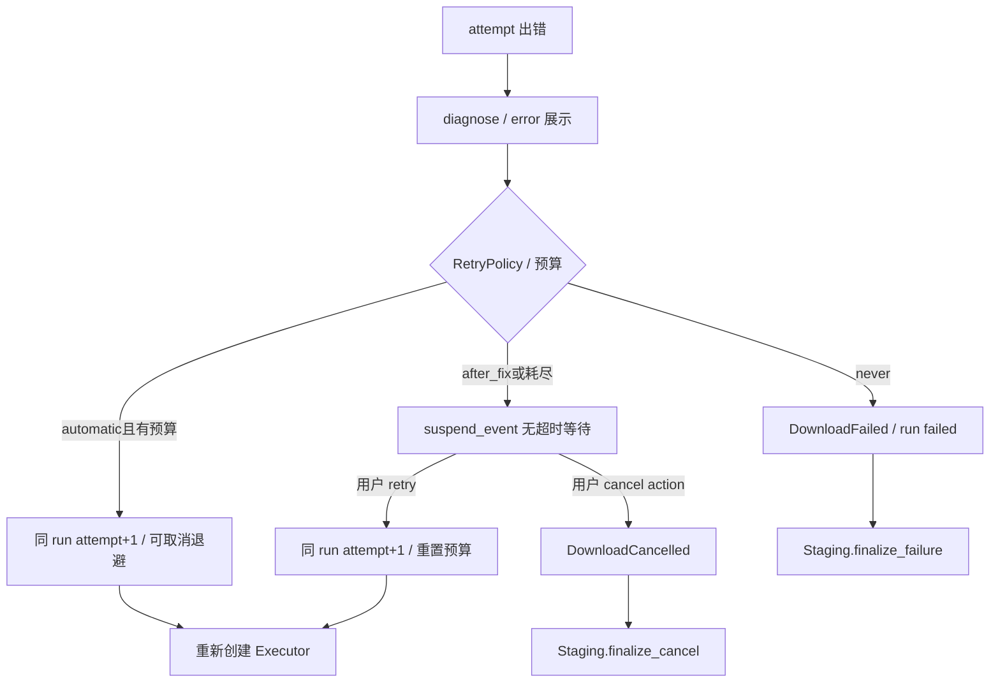

# 新版架构 V2 · 失败分层、恢复与保证上限

2026-09-19。所有 `[CONFIRMED/static]` 为源码事实，本章没有测试执行结果。错误阶段、用户动作与最终结果是三个概念，不能把“出现 error 信号”视为 run 已结束。

## 分类与结果仲裁

[CONFIRMED/static] 标准 Executor 用 `saw_format_decision`、`saw_progress` 区分 parse/select/download，未容忍的非零退出抛 `YtDlpExecutionError(exit_code,stderr,phase)`。[executor 508 行](../../src/fluentytdl/download/executor.py#L508)、[815 行](../../src/fluentytdl/download/executor.py#L815)。`diagnose()` 解析规则、挑主因并带 RetryPolicy；Worker 捕获后发 diagnosis，UI 消费结构化错误。[engine 405 行](../../src/fluentytdl/diagnostics/engine.py#L405)、[worker 1369 行](../../src/fluentytdl/download/workers.py#L1369)。

图为标准媒体路径，不能套到快速通道。自动策略类型为 immediate/backoff；backoff 按 policy 计算 delay。见 [RetryPolicy 94 行](../../src/fluentytdl/diagnostics/models.py#L94)、[worker 1421—1509 行](../../src/fluentytdl/download/workers.py#L1421)。

## 分层恢复表

| 失败层 / owner | 触发与当前动作（[CONFIRMED/static]） | 资源与退出 | 缘由/代价 |
|---|---|---|---|
| 元数据解析 worker | 非取消异常 translate_error+parse diagnosis+error signal；取消静默 return | 当前 flow，无持久 task/run；CLI watcher 终止 subprocess | 取消不是解析故障；但池包装器仍需内部终结通知。见 [worker 168 行](../../src/fluentytdl/download/workers.py#L168)。 |
| Channel tab | unsupported/empty/failed/cancelled 与 loaded 分开；Future 外逸异常补 diagnosis | 一 tab 失败保留其他 tab；cancel 不发最终汇总 | 不把网络失败永久当“该频道没有 Shorts”。见 [241 行](../../src/fluentytdl/download/workers.py#L241)。 |
| 列表详情 | scheduler 错误自动重试一次；第二次 failed；显式点击清 failed 重排 | 释放 row running/exec，继续 pump | 不同于 DownloadWorker attempt；此时通常还没有 DB 下载任务。见 [371 行](../../src/fluentytdl/ui/playlist_scheduler.py#L371)。 |
| 标准 CLI 非零 | 输出至少10KiB、有可比体积时不得小于预期50%，满足则 recovery_accept/low confidence；否则抛诊断异常 | Executor 尚非终局，后面仍有 Feature/commit | 容忍 Windows 残片清理失败，不能证明媒体完整解码；0.5–0.9只 signal。见 [684 行](../../src/fluentytdl/download/executor.py#L684)。 |
| 自动 retry | 预算未耗尽：attempt+1，cancel_event.wait(delay)，新 Executor | 同 run/同 Staging；每 attempt 独立最终路径报告 | 复用请求意图与事务，但诊断/raw按尝试保留，不把每次尝试算新任务。 |
| after_fix | error 信号后 suspend_event.wait；UI retry_all 唤醒全部 suspended worker | 线程/槽位仍保留；用户 retry 重置预算、不换 run | 便于修好配置后重试；cancel() 未唤醒此等待，可能阻止自然收尾。见 [主窗1933行](../../src/fluentytdl/ui/reimagined_main_window.py#L1933)。 |
| Feature 异常 | on_post_process 外层逐 Feature catch，emit_warning后继续；字幕/VR亦有内部 best-effort | 保留可用媒体，后续 verify 决定可提交性 | 附属失败不应抛弃媒体；不等于要求都满足。见 [worker1561行](../../src/fluentytdl/download/workers.py#L1561)。 |
| Staging verify/commit | 缺主媒体、小文件、空计划/重复目标拒绝；commit异常补偿，失败裁决按 phase | retain_staging 可留现场；committing/rollback_failed 不删；committed 已成功 | 文件系统侧不可逆事实优先于展示。见 [1172行](../../src/fluentytdl/download/staging.py#L1172)、[1517行](../../src/fluentytdl/download/staging.py#L1517)。 |
| 轻量/封面 CLI | rc非零直接 diagnosis+failed；rc零仍走 Staging，无标准自动/after_fix loop | 用户重试重建 worker；纯提取重启不恢复执行壳 | 同一错误类型不代表三执行路径拥有相同重试能力。见 [2251行](../../src/fluentytdl/download/workers.py#L2251)、[2464行](../../src/fluentytdl/download/workers.py#L2464)。 |
| TaskDB 写入 | `_process` 捕获异常并 warning；仅外逸到 batch 层的异常触发上层回滚后逐条重试，单项吞错不必触发它 | 失败项不重新入队；flush 不回传成功数量 | 状态持久化是 best-effort，不能从 outcome 发出推导 DB 保存成功。见 [128行](../../src/fluentytdl/storage/db_writer.py#L128)、[166行](../../src/fluentytdl/storage/db_writer.py#L166)。 |

## 成功、降级与质量保证不是同一件事

[CONFIRMED/static] `TaskTrace.finish` 防重复 outcome，degraded 从 expected−actual 得到；Executor 只能 mark_recovered，不能宣布成功。[trace195行](../../src/fluentytdl/observability/trace.py#L195)、[executor795行](../../src/fluentytdl/download/executor.py#L795)。成功路径用 signal 记录字幕等警告，标准主路径提交后 cleanup/emit_actual 失败仍成功。[worker1648行](../../src/fluentytdl/download/workers.py#L1648)。

[CONFIRMED/static] 质量预检使用 metadata formats，未接通的 post_verify 不能证明实际媒体高度；Staging 10KiB门与 Executor 体积启发式也不等于解码/音轨/分辨率验收。[quality_guard100行](../../src/fluentytdl/download/quality_guard.py#L100)、[artifacts83行](../../src/fluentytdl/observability/artifacts.py#L83)。[INFERRED] “completed”只能在当前实现规定的交付合同内理解，不能扩大为每项画质/播放能力都满足。

## 跨会话恢复与退出保证

[CONFIRMED/static] `load_unfinished_tasks` 分页查 unfinished+error，先补旧 run interrupted/restored_pending，再将 active/queued 改 paused；error按保留期处理；skip_download标 error并跳过壳。正常 live pause 不产生旧 run 的 paused outcome；这里是另一次启动的恢复政策。[manager174行](../../src/fluentytdl/download/download_manager.py#L174)。

[CONFIRMED/static] 新 run 建新的 UUID txn；`continuedl=True` 只设置引擎选项，未把旧 txn 的 parts 导入新 txn。GC 默认6小时年龄门：downloading/prepared/committed 可回收，committing清已证明占位符并留现场，rollback_failed留现场。[worker1242行](../../src/fluentytdl/download/workers.py#L1242)、[1272行](../../src/fluentytdl/download/workers.py#L1272)、[gc_orphans1744行](../../src/fluentytdl/download/staging.py#L1744)。[UNKNOWN] 跨会话字节续传能力不能由 continuedl 字段推导。

[CONFIRMED/static] GC 只特判 `committing`/`rollback_failed` 保留。损坏、不可读、非 dict journal 被视作无 journal；未知 phase 也进入满足年龄门后的删除分支，没有 journal 版本/schema 校验。[phase 分派 1807 行](../../src/fluentytdl/download/staging.py#L1807)、[删除 1845 行](../../src/fluentytdl/download/staging.py#L1845)、[读取 1864 行](../../src/fluentytdl/download/staging.py#L1864)。[INFERRED] 保守保留只覆盖可识别的这两个状态，不能推广成“所有不确定现场都保留”；未验证实际数据损失。

[CONFIRMED/static] `_write_journal` 在 open/write/replace 的 OSError 上仅发 `journal_write_failed`，随后返回；commit 调用它后仍可 reserve/publish。[journal1630行](../../src/fluentytdl/download/staging.py#L1630)、[commit1298行](../../src/fluentytdl/download/staging.py#L1298)。[INFERRED] 不仅断电耐久未证，显式 journal 写入失败也不是阻止用户目录副作用的硬门；异常退出可能留下缺失/旧phase记录，后续GC无法恢复内存中曾到达的phase。此处记录条件性缺口，不声称已发生用户文件损失。

## 需正式追踪的静态风险

1. [INFERRED] after_fix 取消未唤醒、强制 shutdown 绕过 finally/commit，以及解析取消容量残留，见 [并发模型](09-concurrency-model.md)。
2. [CONFIRMED/static] 快速通道 `except Exception` 在 `_fastpath_fail` 判断 committed 前先发 error 状态/diagnosis：[轻量2310行](../../src/fluentytdl/download/workers.py#L2310)、[封面2503行](../../src/fluentytdl/download/workers.py#L2503)。[INFERRED] postcommit 逃逸异常最终保持 success，但可能已产生一条失败诊断/短暂 error 展示，观测合同需专项复核。
3. [CONFIRMED/static] 快速通道在逐行 loop 检查取消，EOF 后直接 rc 分流；cancel 杀进程若没有下一行输出，存在不经过 loop 取消分支的结构。[2251行](../../src/fluentytdl/download/workers.py#L2251)、[2464行](../../src/fluentytdl/download/workers.py#L2464)。[INFERRED] 真实取消有机会被诊断为非零失败，需静默子进程场景验证。
4. [CONFIRMED/static] VR `_run_ffmpeg` 无取消检查与 Worker 进程引用；QuickAddWorker 无 cancel Event；不能承诺退出已覆盖全部外部进程。[VR624行](../../src/fluentytdl/download/features.py#L624)、[QuickAdd51行](../../src/fluentytdl/core/quick_add_worker.py#L51)。

[RECOMMENDATION] 先验证取消/退出不破坏用户文件和持久任务，再验证诊断计数/重试可解释性。每个缺口须记录触发交错、最终文件、journal、UI、DB、outcome 六种证据；此次仅记录现状，不修改业务。
