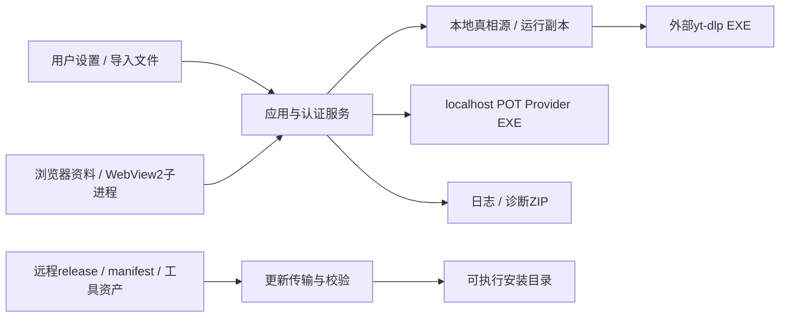

# 新版架构 V2：11 安全与信任边界

2026-09-19 源码静态边界说明。没有读取用户真实凭据/数据库、执行网络、运行产品或漏洞利用。`[CONFIRMED]` 表示分支存在；`[INFERRED]` 表示风险条件与影响推导；`[UNKNOWN]` 表示实际环境/利用结果未证明；`[RECOMMENDATION]` 为后续处理建议。本章不把威胁建模结论冒充已发生安全事件。

## 1. 信任边界图

[CONFIRMED] Cookie来源、外部CLI、独立POT进程、远程更新和诊断导出都是实际边界，分别见 [AuthService](../../src/fluentytdl/auth/auth_service.py#L483)、[CLI](../../src/fluentytdl/youtube/yt_dlp_cli.py#L1054)、[POT spawn](../../src/fluentytdl/youtube/pot_manager.py#L181)、[Transport.download](../../src/fluentytdl/core/update_transport.py#L201)、[bundle](../../src/fluentytdl/observability/bundle.py#L87)。图不意味着每条边都有身份认证或加密。

## 2. 凭据保护与账户边界

| 已有机制 | 防止的失败与代价 | 不具备的保证 |
|---|---|---|
| `[CONFIRMED]` 平台参数贯穿Cleaner、validator、真相源 | `[INFERRED]` 防YouTube规则误删X auth_token/ct0；每入口都必须携带正确platform | 字符串platform不是强类型能力令牌；调用错仍可能发生。[CookieSentinel.commit](../../src/fluentytdl/auth/cookie_sentinel.py#L382) |
| `[CONFIRMED]` 真相源先验证、原子替换 | `[INFERRED]` 半份/过期新jar不覆盖尚可用旧文件 | 本地字段齐全不证明在线有效；meta与txt分开写。[commit](../../src/fluentytdl/auth/cookie_sentinel.py#L411) |
| `[CONFIRMED]` 托管runfile字节复制 | `[INFERRED]` yt-dlp退出回写只改副本，不污染长期账户 | 用户自管路径及识别异常直通；临时副本依然含可用凭据。[runfile](../../src/fluentytdl/auth/cookie_runfile.py#L37) |
| `[CONFIRMED]` 匿名请求删除Cookie参数 | `[INFERRED]` 开关不应因retry/合并opts意外重新附带Cookie | 该开关不删除磁盘凭据，也不禁用POT/JS；不是“无任何网络身份”。[enforce_cookie_mode](../../src/fluentytdl/utils/youtube_request.py#L10) |
| `[CONFIRMED]` WebView2平台账户profile | `[INFERRED]` 账户之间分离浏览器存储；跨启动可复用登录 | 进程隔离不是OS级凭据保险箱；源码写Netscape明文缓存，本轮未审实际ACL。[账户路径](../../src/fluentytdl/auth/auth_service.py#L1144)、[write_netscape](../../src/fluentytdl/auth/auth_service.py#L922) |

[CONFIRMED] CookieRunfile轻量执行分支在进入主try之前已取得副本；初始化异常可能不走显式close，详见 [资源模型](07-resource-model.md#2-获取使用释放之间的显式保护区)。`[UNKNOWN]` 实际残留时间及访问权限未测试。

[CONFIRMED] 设置UI在管理员必要场景提示并可调用restart_as_admin；AuthService对明确解密失败给替代来源提示，对App-Bound权限分支可抛PermissionError。CookieRefreshWorker第三个need_admin参数目前固定False，`force_refresh_with_uac`名字不等于它自己总会触发UAC。[UI权限分支](../../src/fluentytdl/ui/settings_page.py#L3861)、[提取错误分支](../../src/fluentytdl/auth/auth_service.py#L841)、[Worker信号](../../src/fluentytdl/ui/components/common/cookie_refresh_worker.py#L76)

[RECOMMENDATION] 后续安全审查需按“用户主动登录/导入”“后台静默检查”“失败后的刷新”分别记录权限与交互条件，不能依赖函数命名推导授权策略。

## 3. 日志脱敏有明确覆盖范围

[CONFIRMED] 公共日志initialize_logging配置patch_record，对message/extra统一redact；sink再次redact；diagnostic export再次redact。规则处理URL userinfo、Cookie/Authorization头、常见secret键、用户主目录；结构递归深度与条目数有上限。[initialize_logging](../../src/fluentytdl/utils/logger.py#L15)、[patch_record](../../src/fluentytdl/utils/log_runtime.py#L64)、[redact_text/redact_value](../../src/fluentytdl/utils/log_privacy.py#L23)

[CONFIRMED] **例外：WebView2子进程 `_log` 自行open/append profile/webview_subprocess.log，L145记录login_url/cache_dir，L155–159把手动proxy_full写入该日志，没有调用共享redactor。**[直接写文件](../../src/fluentytdl/auth/providers/webview2_provider.py#L109)、[代理日志](../../src/fluentytdl/auth/providers/webview2_provider.py#L155)

[INFERRED] 若proxy_url含user:pass，该特定分支可能把凭据写入旁路文件；profile绝对路径也不折叠。`[UNKNOWN]` 本轮没有查看用户代理配置或日志，不声称真实凭据已泄漏。该文件不自动受公共log retention控制，也不应假定诊断ZIP一定包含它。

[CONFIRMED] `redact_text`是基于模式的转换，不是通用secret识别器；Netscape Cookie原始行、任意未命名token、非标准格式不天然保证覆盖。[规则](../../src/fluentytdl/utils/log_privacy.py#L9)。`[RECOMMENDATION]` 用合成凭据做旁路日志与导出端到端验证，避免只测redactor函数。

## 4. 进程、localhost 与插件不是同一种安全域

[CONFIRMED] POT绑定127.0.0.1，内部HTTP禁代理；start_server启动独立bgutil provider EXE，并非Node脚本。[POT命令](../../src/fluentytdl/youtube/pot_manager.py#L202)、[local_urlopen](../../src/fluentytdl/youtube/pot_manager.py#L139)。`[INFERRED]` loopback缩小远程暴露面，但不证明本机进程之间具有认证。

[CONFIRMED] 默认端口范围的cleanup逐个POST/shutdown，无owner检查；匿名Job/KILL_ON_JOB_CLOSE只控制自己纳管的子进程寿命。[cleanup](../../src/fluentytdl/youtube/pot_manager.py#L151)、[Job](../../src/fluentytdl/youtube/pot_manager.py#L70)。`[INFERRED]` 多实例可能互相关闭服务。`[RECOMMENDATION]` 单独验证HTTP服务所有权，不用Job替代owner/nonce。

[CONFIRMED] 插件逐文件内容核对、临时写fsync、replace、验证；CLI先指定验证目录，再保留default插件目录。[部署](../../src/fluentytdl/youtube/yt_dlp_cli.py#L242)、[搜索参数](../../src/fluentytdl/youtube/yt_dlp_cli.py#L374)。`[INFERRED]` 这防止不完整内置插件优先加载，**不是只加载内置受信代码的沙箱**；default及用户选中custom/PATH工具仍属于信任输入。

[CONFIRMED] ProcessManager按名兜底限定ppid；工具更新worker缺psutil时全局taskkill /IM，同名外部进程可能被影响，二者不能合并说明。[ProcessManager](../../src/fluentytdl/core/process_manager.py#L194)、[updater_worker](../../src/fluentytdl/core/updater_worker.py#L52)

## 5. 更新完整性的实际调用边界

| 路线 | Hash从哪里来 | 缺失/失败行为与安全含义 |
|---|---|---|
| `[CONFIRMED]` 应用app-core | manifest app_core.get("sha256", "")→UI update_info→download_app_update→_DownloadWorker | 默认可空；没有入口强制非空分支。[manifest映射](../../src/fluentytdl/core/component_update_manager.py#L369)、[下载](../../src/fluentytdl/core/component_update_manager.py#L379)、[UI](../../src/fluentytdl/ui/components/dialogs/update_dialog.py#L109) |
| `[CONFIRMED]` 组件更新 | DependencyManager component.expected_sha256 or ""→worker配置expected_sha256→updater_worker | 传输收到空值仍下载。[dependency入口](../../src/fluentytdl/core/dependency_manager.py#L358)、[worker config](../../src/fluentytdl/core/dependency_manager.py#L921)、[接收](../../src/fluentytdl/core/updater_worker.py#L183) |
| `[CONFIRMED]` yt-dlp / Deno / FFmpeg远程校验文件 | release assets里的SUMS/sha256sum/checksums.sha256 | 校验文件获取异常仅warning，remote.sha256保持空；不是失败关闭。[yt-dlp](../../src/fluentytdl/core/dependency_manager.py#L735)、[Deno](../../src/fluentytdl/core/dependency_manager.py#L763)、[FFmpeg](../../src/fluentytdl/core/dependency_manager.py#L801) |
| `[CONFIRMED]` Transport.download | 每块更新digest，sha256非空才比较 | 不匹配抛错，异常删除目标；记录sha256_checked。[download](../../src/fluentytdl/core/update_transport.py#L201) |

[INFERRED] 同渠道manifest/hash能检测下载损坏与不匹配，但不是独立签名信任根；不得声称“所有在线更新强制hash”或“hash本身证明发布者”。`[UNKNOWN]` 本轮未审全部远程服务签名/来源治理，不将不存在证据表述为确定不存在保护。

[CONFIRMED] 正常READY采用PID+nonce避免陈旧信号，但新程序自动启动失败分支仍commit清备份后提示手动启动；旧进程等待超时继续更新。[watch判定](../../src/fluentytdl/core/updater.py#L1125)、[自动启动失败commit](../../src/fluentytdl/core/updater.py#L1663)、[旧进程超时](../../src/fluentytdl/core/updater.py#L1488)。`[INFERRED]` rollback保留策略不是所有分支一致的完整事务，需要在更新验收单列。

## 6. 删除和保留数据的边界

[CONFIRMED] 公共日志清理避开链接、未知文件、active文件和bundles；runfile只按前缀/年龄；账户profile由不同生命周期持有。[log GC](../../src/fluentytdl/utils/log_runtime.py#L184)、[runfile GC](../../src/fluentytdl/auth/cookie_runfile.py#L91)。`[INFERRED]` 前者以保守删除防误伤，后者年龄不证明owner死亡，不能视为同等强度保护。

[CONFIRMED] `announcements.sqlite3`为数据根独立文件；[maintenance.ps1根清单](../../installer/maintenance.ps1#L205)未包含该文件，与[默认创建路径](../../src/fluentytdl/notification/announcement_service.py#L159)存在静态差异。`[UNKNOWN]` 未执行卸载或确认实际遗留，不能把清单差异夸大成已证残留。

## 7. 需保留在正式基线的风险条目

- `[RECOMMENDATION]` WebView2旁路日志纳入公共脱敏/大小治理，并保留Python.NET启动失败仍可记录的能力。
- `[RECOMMENDATION]` 统一POT HTTP所有权、Cookie runfile owner与进程清理身份校验；验证双实例，不通过扫描同名进程证明归属。
- `[RECOMMENDATION]` 明确在线更新缺hash时的产品政策及来源信任；区分传输完整性、发行者真实性和启动可用性。
- `[RECOMMENDATION]` 以合成凭据验证导出、日志、错误UI、临时文件和卸载清单；基线应记录未覆盖路径，避免“全部安全”的不可证断言。
