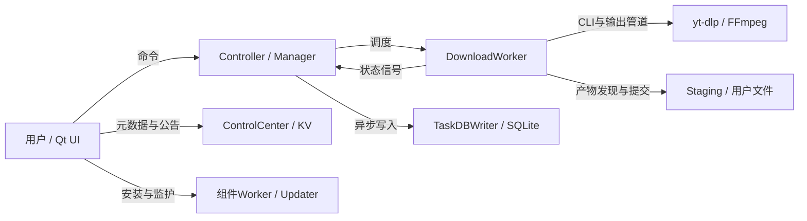

# 新版架构 V2 · FluentYTDL 系统架构与运行机制说明书

**源码参考版 · 2026-09-19 · 含明确未决边界**

> 3.7.4 准备说明（2026-09-20）：本书保留原取证基线，未覆盖随后落地的全部元数据改动。该链路以 [元数据实施记录](../../specs/media-metadata/implementation.md) 为准；最新静态检查记录了源码漂移，不能据旧哈希报告宣称当前版本已完整复核。

本书基于当前工作树重新追踪代码，经过三名 subagent 分工与交叉复核后汇总。新版专属目录是 `docs/architecture-v2/`，不沿用旧书文件名；旧 `ARCHITECTURE_CN.md` / `ARCHITECTURE_EN.md` 仅保留历史参考价值。原始[项目适配方案](../architecture/reconstruction-plan/README.md)记录执行依据，实际结果以本书和[验证记录](evidence/verification.md)为准。

客户端基线：`release/3.7.3`，HEAD `c441f2cde2e7973fe5902da50358f25c37c6525f`，**包括既有未提交修改**；关联 ControlCenter 单独取证。完整范围见[源码基线](evidence/source-baseline.md)。本次没有修改业务代码，也没有执行产品、下载、构建、安装或线上验收。

阅读约定：`[CONFIRMED]`为源码直接支持；`[INFERRED]`为有条件推导；`[UNKNOWN]`为缺证；`[RECOMMENDATION]`为后续建议。下文现状摘要为已核对的静态事实，“缘由”是从实现约束解释其工程作用，不冒充作者历史决策记录。

## 1. 系统总览

FluentYTDL 是 Windows Qt 桌面程序，使用外部 yt-dlp/FFmpeg 等工具解析、下载和加工文件。UI、调度、持久化、文件交付与外部进程有不同完成点。ControlCenter 提供更新元数据与公告，不承载媒体下载或二进制代理。见[00 系统总览](00-system-overview.md)。

图表示L0调用/数据关系；详细进程、线程、认证和失败分支分别展开，不能把箭头理解为同步事务或成功保证。

## 2. 关键处理及其缘由

| 当前机制 | 要解决的约束 / 为什么这样处理 | 代价与保证上限 |
| --- | --- | --- |
| CLI执行与结构化输出 | 外部工具可独立选择和更新，GUI不直接承载下载引擎 | argv、stdout、stderr、退出码成为跨进程协议；工具退出不等于文件已交付 |
| 六种解析/选择入口、三条执行通道 | 媒体处理需要Feature链，纯提取和图片直链需要不同参数 | 快速通道不拥有标准通道全部重试、暂停和错误仲裁能力 |
| task/run/attempt/transaction分开 | 同一持久任务可多次运行；一次运行可多次尝试；文件所有权需独立身份 | 不能用按钮动作、DB行或短日志ID替代所有身份 |
| Staging→Manifest→计划→提交 | 避免扫描共享目录误认产物；整组命名和补偿减少文件冲突 | 提交临界区不随意取消；journal写错仍可能继续，强停与断电保证有限 |
| TaskDBWriter队列与合并 | 减少UI阻塞和重复SQLite写入 | 接受状态、入队、SQL提交不同时；单行DB不能还原全部事件 |
| Cookie真相源与受管runfile | 刷新材料与单次CLI读写隔离；刷新失败保留旧凭据 | 自管路径不走同一隔离；账户选中、源提交、在线认证是不同事实 |
| 有界重试与after_fix等待 | 临时错误可自动恢复；配置/认证类问题等待用户修复 | 活线程和槽位仍被持有；取消未唤醒所有等待点 |
| 独立Updater与READY监护 | 主程序运行时不能可靠替换自身；需区分磁盘更新与启动 | 兼容survival及无PID分支另有语义，不能承诺所有启动失败都回滚 |
| D1管理记录与KV公开快照 | 将公开读取与管理权限/数据写入分离 | 跨存储没有共同事务；同步报错可能已经公开了新内容 |

这些取舍的源码、前置条件和失败路径见02、05–12；完整风险见13。未找到生产调用的监控/质量接口没有作为已运行能力写入图。

## 3. 应用与子系统

[01 仓库地图](01-repository-map.md)区分桌面入口、WebView2子进程、POT Provider EXE、应用Updater、组件worker、安装维护、构建发布、ControlCenter Worker/Admin。POT是独立EXE；组件worker由当前程序特殊启动模式承载，与updater.exe不同。

## 4. 模块架构

[02 模块地图](02-module-map.md)按真实调用和所有权划分M01–M16，记录入口、主要符号、调用者、读写、状态、资源、生命周期和失败边界。物理目录不自动等于逻辑模块；UI既有Qt结果信号，也有直接controller命令。

## 5. 运行架构

[03 运行架构](03-runtime-architecture.md)描述窗口、解析池、任务manager、下载worker、executor、Feature、Staging和后台writer的交接。标准媒体、轻量提取、封面直链在进入产物执行后均接入Staging；前置失败可能发生在事务创建之前。

## 6. 核心数据与控制路径

[04 数据流](04-data-flow.md)从URL、请求快照和options追到进程输出、文件、UI与数据库；[05 控制流](05-control-flow.md)追调度、attempt、暂停、挂起、轮询、watchdog和清理回环的进入与退出。请求模式冻结不等于所有配置或Cookie字节都在排队时冻结。

## 7. 状态模型

[06 状态模型](06-state-machines.md)区分UI状态、DB分组、run outcome、进程/等待标志和Staging phase。live pause/resume保持run，after_fix再试增加attempt；已结束worker重新开始是另一条创建路径。实现中的守卫是分散的，不能宣称存在覆盖全局的严格状态机。

## 8. 资源所有权

[07 资源模型](07-resource-model.md)回答谁创建、谁持有、正常和失败时谁释放、什么能跨启动保留。显式stop/close、对象回收和确认资源消失分别记录。重点包括文件事务、CLI管道、线程、数据库、Cookie、profile、POT端口、日志和更新备份。

## 9. 依赖模型

[08 依赖模型](08-dependency-model.md)分开编译/导入、运行、控制、数据、资源和外部协议依赖。215个src模块的静态图发现5组SCC候选，已区分TYPE_CHECKING、局部导入和包重导出；候选环不等于运行时循环导入故障。

## 10. 并发模型

[09 并发模型](09-concurrency-model.md)展示Qt主线程、QThread、QThreadPool、Python线程和子进程，以及队列、Event、锁的作用范围。Event可跨线程使用，不代表同对象其余字段都受同一锁保护。关闭窗口、请求取消、线程退出和DB排空各有独立证据要求。

## 11. 失败与恢复

[10 错误恢复](10-error-recovery.md)把解析、选择、下载、Feature、文件提交和持久化失败分开。自动重试、修复后继续、重新创建worker、下次启动恢复和更新回滚具有不同输入与资源后果。`continuedl=True`本身不能证明跨新旧事务字节续传；completed也不等于完整媒体解码和所有附属要求验收。

## 12. 安全边界

[11 安全边界](11-security-boundaries.md)描述认证材料、匿名模式、代理、日志、URL/路径、完整性校验及管理接口权限。公共日志脱敏不能覆盖WebView2直接写文件的旁路日志；下载哈希的实际必选/可选条件按调用链核对，不概括为全链强制校验。

## 13. 构建、安装与部署

[12 部署](12-deployment.md)串起构建目标、产物身份、发行、应用更新、组件安装、维护脚本和ControlCenter。Actions Artifact、Public Release、元数据快照和用户有效运行版本是不同结果；本次只验证这些实现链存在，没有生成或发布安装包。

## 14. 20条端到端纵向切片

每条切片沿用户触发追到执行与结果，同时记录状态、资源、异步/进程边界、失败、恢复和处理缘由。

| 日常操作 | 控制与支撑 | 维护与发行 |
| --- | --- | --- |
| [VS-01 启动与关闭](vertical-slices/VS-01-startup-shutdown.md) | [VS-09 暂停与恢复](vertical-slices/VS-09-pause-resume.md) | [VS-16 应用更新](vertical-slices/VS-16-app-update.md) |
| [VS-02 视频](vertical-slices/VS-02-video.md) | [VS-10 重试](vertical-slices/VS-10-retry.md) | [VS-17 组件更新](vertical-slices/VS-17-component-update.md) |
| [VS-03 VR](vertical-slices/VS-03-vr.md) | [VS-11 取消与崩溃恢复](vertical-slices/VS-11-cancel-recovery.md) | [VS-18 公告](vertical-slices/VS-18-announcements.md) |
| [VS-04 频道](vertical-slices/VS-04-channel.md) | [VS-12 登录与账户](vertical-slices/VS-12-authentication.md) | [VS-19 安装与卸载](vertical-slices/VS-19-install-uninstall.md) |
| [VS-05 播放列表](vertical-slices/VS-05-playlist.md) | [VS-13 Cookie请求上下文](vertical-slices/VS-13-cookie-context.md) | [VS-20 构建与发布](vertical-slices/VS-20-build-release.md) |
| [VS-06 字幕](vertical-slices/VS-06-subtitle.md) | [VS-14 POT与运行时](vertical-slices/VS-14-pot-runtime.md) | |
| [VS-07 封面](vertical-slices/VS-07-cover.md) | [VS-15 诊断与日志](vertical-slices/VS-15-diagnostics.md) | |
| [VS-08 快速添加、音频与片段](vertical-slices/VS-08-quick-audio-section.md) | | |

## 15. 已知差异、风险与未知项

[13 风险登记](13-known-risks.md)收录R01–R29，分开已确认结构、条件性后果、缺证和最小验证。优先关注强停与提交、journal写错/未知状态回收、after_fix取消等待、旁路日志、账户有效源和更新恢复边界。这里没有把静态风险写成已经发生的事故，也没有顺手修改程序。

## 16. 文档索引与验证

00–14章节构成专题索引；第14节构成用户操作索引；[37问题映射](evidence/coverage-review.md)对应原始总提示词。[集成验证](evidence/verification.md)汇总三份独立复核报告及文档修订关闭情况，[机械检查结果](evidence/documentation-check.json)记录最终链接/行号/围栏和源码哈希检查。

Mermaid图直接维护在所属章节，避免图文副本不同步。本轮没有渲染图，也没有执行产品测试；逐符号穷尽、第三方内部、运行并发和真实部署仍有明确限制。

## 17. 代码定位与持续维护

先用[14 代码索引](14-code-index.md)从概念定位文件/符号，再用[反向引用](evidence/code-to-docs.json)找到受影响文档。入口、状态、资源、取消、重试或协议发生变化时，同步修改专题和对应切片，重跑index/verify并调查源码漂移；需要新基线时保留变更说明。

后续业务修复以源码和隔离验证为准。本书是带日期、范围和未决项的维护参考，不能替代运行证据。
