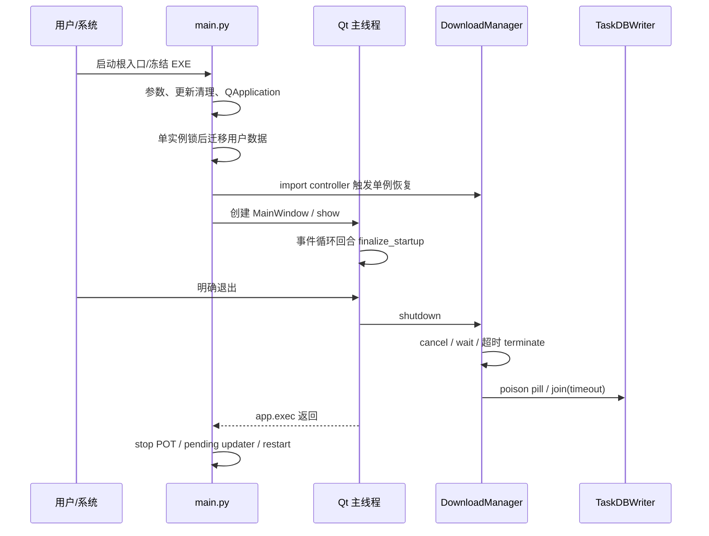

# 新版架构 V2 · VS-01 启动、关闭与退出

2026-09-19，source/static 纵切片；未实际启动应用。`[CONFIRMED/static]` 为源码行为，时序效果用 `[INFERRED]`，运行保证未知用 `[UNKNOWN]`。

## 用户动作到最低执行

[CONFIRMED/static] 根入口先处理 `--build-self-test`、数据根/ready token；`main()` 加 src、处理 restart parent/update worker，再进入普通启动。[main.py 7 行](../../../main.py#L7)、[289 行](../../../main.py#L289)。参数路径优先于配置/日志导入是当前显式顺序。

| owner/阶段 | trigger / precondition | transition、副作用、资源 | failure / exit |
|---|---|---|---|
| `main` 单实例 | QApplication 已创建 | SingleInstanceChecker check_and_start；成功后 migrate_user_data | 第二实例退出；迁移异常 best-effort；不能以启动继续证明迁移完成。[331行](../../../main.py#L331)。 |
| Manager 恢复 | import 单例，TaskDB 已可用 | 分页读取旧状态、旧 run audit、新 worker壳、旧任务降 paused、GC | error过期可删；skip_download标error不建壳；不自动 pump。[manager174行](../../../src/fluentytdl/download/download_manager.py#L174)。 |
| 主窗就绪 | controller注入、window.show | QTimer.singleShot(0,finalize_startup)，更新就绪握手 | 事件循环调度证明的就绪范围不含真实下载验收。[main423行](../../../main.py#L423)。 |
| 后台初始化 | POT开关、主窗初始化 | POT async warm；Cookie daemon延迟刷新；health queued signal | 后台失败不阻止主窗；daemon没有此处join。[main468行](../../../main.py#L468)、[主窗319行](../../../src/fluentytdl/ui/reimagined_main_window.py#L319)。 |
| `closeEvent` | 点窗口关闭 | 若托盘可见则hide+ignore；否则shutdown | 隐藏不是退出，更不自动取消任务。[596行](../../../src/fluentytdl/ui/reimagined_main_window.py#L596)。 |
| `quit_app/shutdown` | 菜单/明确退出/更新退出 | stop_all清pending并取消正在运行者；逐个wait，超时terminate；DB flush_and_stop | 每worker grace2s，另wait500ms；DB join3s不返回成功证明；finally可能被强停跳过。[manager562行](../../../src/fluentytdl/download/download_manager.py#L562)。 |
| `main` 最后动作 | app.exec返回 | stop_server→launch_pending_updater→launch_pending_restart | 各调用有容错；不能将“执行到这里”升级为所有后台进程与DB已排空。[main509行](../../../main.py#L509)。 |

表中均 [CONFIRMED/static]。主窗关闭过程不拥有全系统线程登记表；配置窗解析线程、QuickAddWorker、VR局部FFmpeg等须单独核对，见 [并发模型](../09-concurrency-model.md)。

## 处理缘由、代价与验收缺口

[INFERRED] 单实例锁后迁移防并发迁移；先配置再构造UI防数据根被导入期冻结；把 updater 放事件循环返回之后减少与活程序文件替换竞争。代价是启动有真实I/O副作用，静态调查不能通过 import 产品来“查看结构”。

[UNKNOWN] 当前 shutdown 是收尾尝试，未证实全局排空。需验收：托盘关闭仍下载、显式退出无悬挂；after_fix等待可结束；committing时关闭不损坏整组产物；DBWriter队列慢写/异常时报告准确；ready握手和迁移失败重启不误删源数据。恢复路径不是自动重试下载，恢复后等待用户继续。
