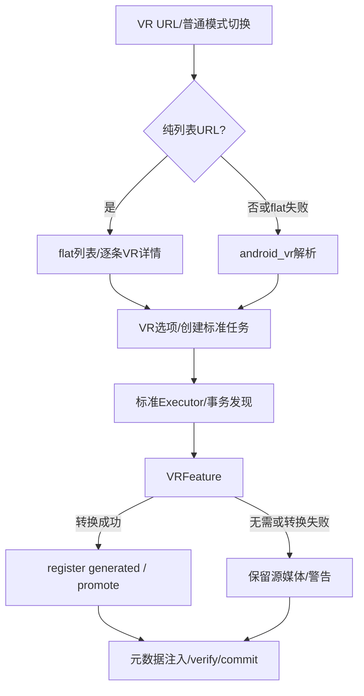

# 新版架构 V2 · VS-03 VR 解析、转换与交付

2026-09-19，source/static；未验证真实VR媒体或FFmpeg转换。VR共用标准下载运行骨架，但有独立解析策略及后处理进程边界。

## 调用链与分流

[CONFIRMED/static] 用户进入VR或智能检测切换→主窗`show_vr_selection_dialog`→`VRInfoExtractWorker`：只有list无视频标识先flat；含v或shorts/youtu.be视作单视频；flat失败非取消时继续尝试VR单视频。`extract_vr_info_sync`固定android_vr、无Cookie请求策略，再将VR格式送选择器。[主窗766行](../../../src/fluentytdl/ui/reimagined_main_window.py#L766)、[worker453行](../../../src/fluentytdl/download/workers.py#L453)、[service1963行](../../../src/fluentytdl/youtube/youtube_service.py#L1963)。

## 所有者与控制合同

| owner/触发 | 前置、转换与副作用 | 资源、失败、取消/退出 |
|---|---|---|
| 主窗模式切换 | 传同flow和preloaded_info；预览不替代VR格式重新解析 | 原/新窗口操作链关联；标准与VR缓存不能混用。[793行](../../../src/fluentytdl/ui/reimagined_main_window.py#L793)。 |
| 配置窗口get_selected_tasks | VR模式设置`__fluentytdl_use_android_vr`及format IDs | 下游仍走标准Worker；不是额外“VR下载线程池”。[4084行](../../../src/fluentytdl/ui/components/dialogs/download_config_window.py#L4084)。 |
| VRInfoExtractWorker | cancel Event传入service；列表失败允许单视频后备 | 取消静默return；最终异常parse diagnosis/error。 |
| Worker/Executor | 标准attempt retry、pause/cancel及Staging | 标准下载完成后才到VRFeature；中途下载错误按标准RetryPolicy。 |
| VRFeature.on_post_process | 需android_vr标记、可识别projection和现存主媒体；EAC转换需开关、v360支持、分辨率不超限制 | reserve_workfile，Popen FFmpeg；无v360/过高分辨率跳过并警告；失败保留原源。见 [477行](../../../src/fluentytdl/download/features.py#L477)。 |
| `_adopt_transcode` | FFmpeg成功 | register_generated中间名；keep_source则源改.eac，否则supersede到internal；新文件改原stem并promote | 保留源与新文件角色；避免裸覆盖使Manifest与磁盘失配。[541行](../../../src/fluentytdl/download/features.py#L541)。 |
| `_inject_meta` | mp4/mov，有stereo/projection元信息 | reserve workfile→inject→replace_artifact_content | 异常记录并保留原文件；随后标准verify/commit。[652行](../../../src/fluentytdl/download/features.py#L652)。 |

表中 [CONFIRMED/static]。最低执行除了yt-dlp及其工具，还包含VRFeature自己启动的独立FFmpeg进程。

## 缘由与实际限制

[INFERRED] android_vr解析与正常预览分开是为获得VR专用格式；事务API采纳转换产物使保留源/替换源可追溯。代价是额外解析、CPU与磁盘成本，并引入一个标准Executor不拥有的进程。

[CONFIRMED/static] `_run_ffmpeg` 的p只存在于局部，readline循环没有worker cancel/pause检查，也未写`executor`或`_proc_ref`。[624行](../../../src/fluentytdl/download/features.py#L624)。[INFERRED] UI暂停/取消和shutdown并不因此自动控制VR转换进程；转换/空间信息失败也可退回原媒体成功交付，不等于VR意图全部满足。

[UNKNOWN] 验收必须覆盖EAC成功/失败、无v360、超分辨率、keep_source两种模式、转换中取消/退出及元数据注入失败。用户重试已结束任务创建新run、新txn；错误修复重试只覆盖进入标准attempt异常环的失败，不能假设Feature警告自动重试。
