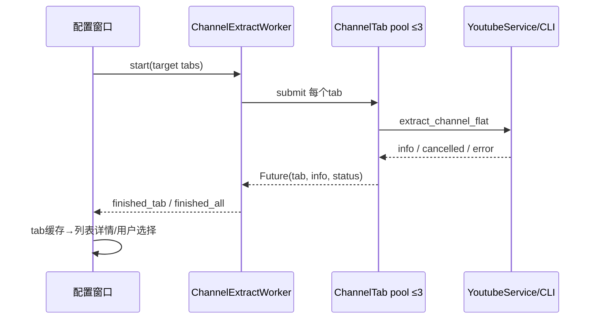

# 新版架构 V2 · VS-04 频道标签页解析与下载

2026-09-19，source/static，无网络验收。频道是“多tab枚举→列表选择→独立任务”的编排，不是一个无限扩展的下载任务。

[CONFIRMED/static] 用户提交频道URL→`MainWindow._show_channel_dialog`规范化base URL→普通配置窗口带target_tab/playlist_flat→`start_extraction`识别频道优先选择`ChannelExtractWorker`→`_extract_tab`调用`YoutubeService.extract_channel_flat`→窗口频道缓存/列表→选中条目创建标准或模式特定任务。[主窗783行](../../../src/fluentytdl/ui/reimagined_main_window.py#L783)、[窗口1374行](../../../src/fluentytdl/ui/components/dialogs/download_config_window.py#L1374)、[worker241行](../../../src/fluentytdl/download/workers.py#L241)。

| owner、状态/loop | trigger/precondition | side effects/resources | failure/exit |
|---|---|---|---|
| Channel worker | target_tab=all展开videos/shorts/streams，否则单tab | 基础opts构建一次，flat/lazy/skip_download；ThreadPoolExecutor max=min(3,total) | 无tabs发空结果；cancel已set直接return。[309行](../../../src/fluentytdl/download/workers.py#L309)。 |
| `_extract_tab` | pool内任务 | service负责URL、tab过滤、cache、authcheck恢复；显式trace | 返回loaded/unsupported/empty/failed/cancelled；不存在tab与网络失败分开，不混成unsupported。[241行](../../../src/fluentytdl/download/workers.py#L241)。 |
| as_completed收集 | Future完成 | 成功finished_tab；累计results；observe_futures观测外逸异常 | failed仍允许其他tab完成；empty不写results；cancel break且最终不发finished_all。[360行](../../../src/fluentytdl/download/workers.py#L360)。 |
| 配置窗口 | finished_all | 更新频道缓存，`_build_channel_info`组装playlist形态 | tab状态决定隐藏还是允许重取；用户切tab可能另发worker。[1456行](../../../src/fluentytdl/ui/components/dialogs/download_config_window.py#L1456)、[1484行](../../../src/fluentytdl/ui/components/dialogs/download_config_window.py#L1484)、[2832行](../../../src/fluentytdl/ui/components/dialogs/download_config_window.py#L2832)。 |
| 下载交接 | 用户选定可用条目并确认 | 每条task共享解析flow，独立run/txn；标准run强制noplaylist | 下载错误/取消/重试分别归每条任务，不改变频道本身“是否有tab”的事实。[worker1186行](../../../src/fluentytdl/download/workers.py#L1186)。 |

以上 [CONFIRMED/static]。行详情与列表并发见 [VS-05](VS-05-playlist.md)，文件最终执行见 [VS-02](VS-02-video.md) 或字幕/封面切片。

[INFERRED] 3个tab并发降低串行延迟，但一个线程池上下文退出仍需所有已启动工作结束，cancel信号不等于即时关闭。把unsupported与failed分开保护可恢复性：瞬时错误不应变成永久频道属性。

[UNKNOWN] 未验证真实缺tab、空tab、某tab超时、全失败、取消与切tab重试的UI效果；亦未证明service内所有后备HTTP请求都响应同一cancel Event。验收需要保留各tab原始状态而非仅看“频道解析成功”。
