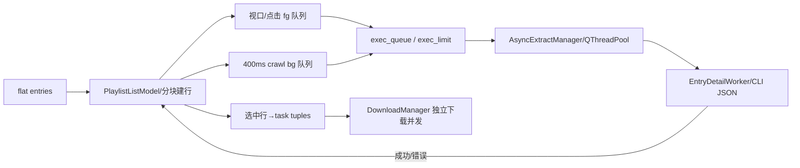

# 新版架构 V2 · VS-05 播放列表懒加载、选项与批量任务

2026-09-19，source/static。列表枚举、行详情提取和文件下载是三个资源预算，未执行网络/测试。

[CONFIRMED/static] 初始列表通过InfoExtractWorker的playlist_flat分支或service对playlist识别获得entries；窗口创建PlaylistListModel、delegate和AsyncExtractManager，再由PlaylistScheduler按视口/用户点击/后台crawl派发EntryDetailWorker。用户确认后`get_selected_tasks`把选中行转换为多条任务。[worker179行](../../../src/fluentytdl/download/workers.py#L179)、[窗口2536行](../../../src/fluentytdl/ui/components/dialogs/download_config_window.py#L2536)、[scheduler297行](../../../src/fluentytdl/ui/playlist_scheduler.py#L297)、[窗口4336行](../../../src/fluentytdl/ui/components/dialogs/download_config_window.py#L4336)。

| owner/loop | trigger/precondition→transition | side effects/resources | failure/exit |
|---|---|---|---|
| 窗口建行 | entries数组→分块append model | viewport滚动信号；缩略图请求；避免每行独立Widget | 关闭置_build_is_chunking=False停后续chunk。[2580行](../../../src/fluentytdl/ui/components/dialogs/download_config_window.py#L2580)。 |
| Scheduler | viewport预取first−1..last+3；点击前台；crawl400ms | fg优先，bg提升fg；loaded/failed/running/exec集合去重；pipeline_size限制 | lazy_paused阻止pump；stop_crawl只停timer不取消活任务。[157行](../../../src/fluentytdl/ui/playlist_scheduler.py#L157)、[236行](../../../src/fluentytdl/ui/playlist_scheduler.py#L236)。 |
| AsyncExtractManager | 有capacity，task_id=URL | mutex保护active；QRunnable直接调用EntryDetailWorker.run；options/vr/read_cache传入 | success/error清active；cancel只设Event。[100行](../../../src/fluentytdl/download/extract_manager.py#L100)。 |
| EntryDetailWorker | 普通详情extract_video_info，VR详情extract_vr_info_sync | flow绑定池线程；返回info/diagnosis | cancel静默return；不发task_finished/error，存在容量释放缺口。[548行](../../../src/fluentytdl/download/workers.py#L548)。 |
| Scheduler错误恢复 | task_error映射URL→row | 首次错误自动前台重排一次；第二次failed；点击清failed后重排 | 这里的retry_count不是下载TaskTrace.attempt；row只是窗口索引。[371行](../../../src/fluentytdl/ui/playlist_scheduler.py#L371)。 |
| 选项生成 | 选中行，手工override/全局预设/模式参数 | 普通、音频、VR、字幕、封面有各自opts；逐条COOKIE_MODE/quality intent；task共享flow | 构造失败不发任务；预检报告用户拒绝不创建下载任务。[窗口4003行](../../../src/fluentytdl/ui/components/dialogs/download_config_window.py#L4003)。 |
| 关闭/重解析 | `_stop_background_parsing` | 清队列、stop_all、cancel_all、断ImageLoader和依赖信号 | 有界wait不证明全部释放；新列表旧回调/同URL映射需验证。[1230行](../../../src/fluentytdl/ui/components/dialogs/download_config_window.py#L1230)。 |

均 [CONFIRMED/static]。列表下载后每条最低执行/文件结果遵循相应媒体或快通道切片，不存在“列表完成就说明所有条目下载成功”。已创建下载任务的取消/重试/应用退出也与解析窗口关闭分别处理。

[INFERRED] flat首屏与局部深解析兼顾响应与请求数量，三级队列让可见行优先；代价是多集合、URL映射、异步回调代际及取消终结协议必须一致。URL做dedup key意味着重复URL多行的映射不可默认为一一对应。

[UNKNOWN] 未验证重复URL、快速切换列表、关闭时池任务取消、失败重试耗尽、用户开始尚未全部详情加载的实际体验。应测活槽数、model行状态及新请求能否继续派发，不能只验一次全成功枚举。
