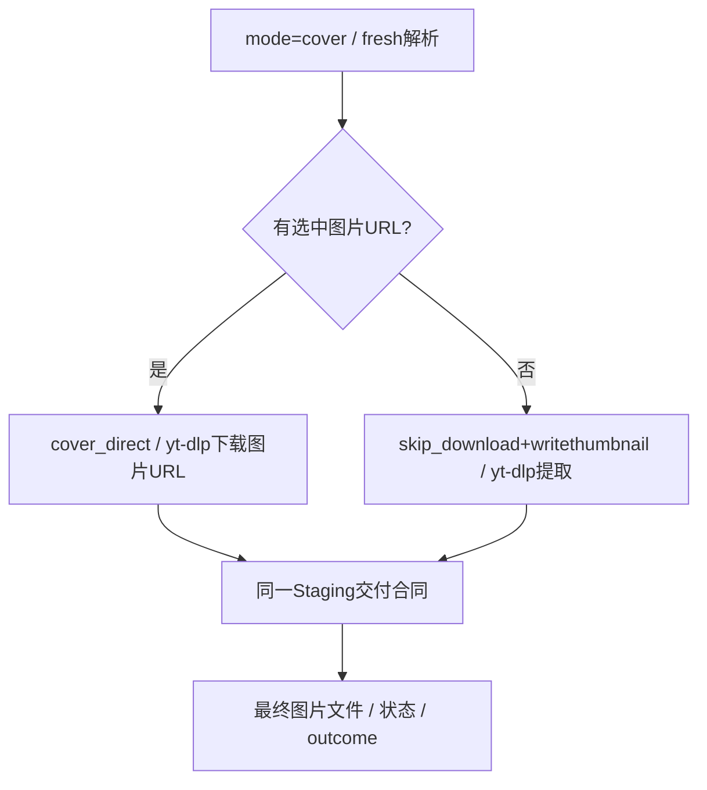

# 新版架构 V2 · VS-07 封面选择、直链与轻量提取

2026-09-19，source/static；没有请求实际图片。封面是一个产品入口、两个执行分支，均使用yt-dlp外部进程并统一Staging。

[CONFIRMED/static] 配置窗口mode=cover解析时`read_cache=False`，因为选中的thumbnails URL会成为下载任务URL。单项CoverSelector存在时选图片URL并设`__fluentytdl_is_cover_direct=True`；否则设skip_download+writethumbnail走轻量封面提取。列表行也有相应分支。[窗口1395行](../../../src/fluentytdl/ui/components/dialogs/download_config_window.py#L1395)、[4045行](../../../src/fluentytdl/ui/components/dialogs/download_config_window.py#L4045)、[4422行](../../../src/fluentytdl/ui/components/dialogs/download_config_window.py#L4422)。

| owner/触发 | 前置、转换、资源副作用 | failure/cancel/retry/exit |
|---|---|---|
| CoverSelector/配置窗口 | 解析获得图片候选；选URL和输出相对模板 | 构造失败不建task；图片预览不是下载交付文件。 |
| Manager/Worker | 正常建DB任务/trace；run优先识别cover_direct而后才看skip_download | queued/并发政策与其他任务共用；用户重开任务仍新run。见 [worker1159行](../../../src/fluentytdl/download/workers.py#L1159)。 |
| `_run_cover_direct_download` | `_fastpath_open_staging`先转换模板/路径，再构建极简argv；Popen `_proc_ref` | loop只检查is_cancelled；cancel按PID结束进程；无暂停检查/标准自动retry；非零直接diagnosis+failed。[2330行](../../../src/fluentytdl/download/workers.py#L2330)、[2413行](../../../src/fluentytdl/download/workers.py#L2413)。 |
| 轻量封面 | skip_download/writethumbnail，原视频URL | 见[VS-06](VS-06-subtitle.md)的轻量进程和失败分流，不经Feature/Executor。 |
| `_fastpath_land` | verify_opts补无媒体期望；reconcile/seal，确定group_stem | 同组命名、空计划拒绝、commit gate；无media primary，不设置标准output_path。[1871行](../../../src/fluentytdl/download/workers.py#L1871)。 |
| completed/异常收口 | committed后actual/cleanup，再设置success | 清理异常signal；异常逃逸最终可由_fastpath_fail保持success，但此前可能已发diagnosis。[2494行](../../../src/fluentytdl/download/workers.py#L2494)、[2503行](../../../src/fluentytdl/download/workers.py#L2503)。 |

表项 [CONFIRMED/static]。封面直下与skip_download恢复政策不能混同：manager重启排除仅检查`opts.skip_download`，不能未经核对就宣称“所有封面任务都不恢复”。[manager236行](../../../src/fluentytdl/download/download_manager.py#L236)。

[INFERRED] 不读旧解析缓存减少过期图片直链风险；代价是更频繁元数据请求，排队时间很长的直链仍可能过期。使用同一事务交付是为了避免小文件路径成为覆盖与半产物的例外。

[UNKNOWN] 需要验选中URL失效、扩展名变化、同名图片并发、无图片、非零留下半图、无新输出的取消、重试是否重新解析直链、最终“打开文件/文件夹”行为。不能把preview成功或rc=0当成图片最终交付成功。
