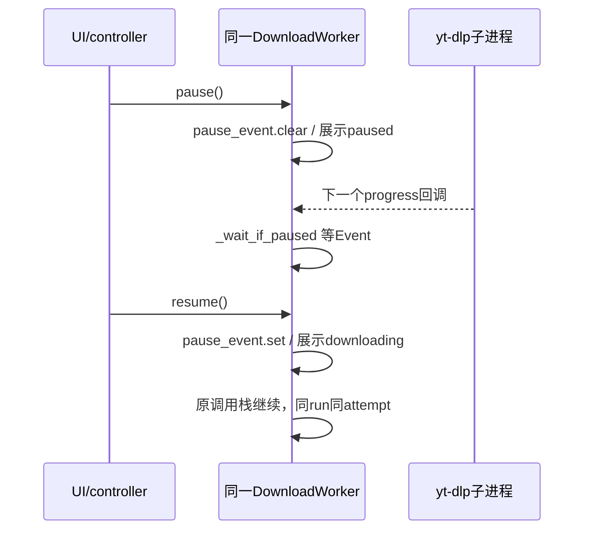

# 新版架构 V2 · VS-09 暂停、继续与重新执行

2026-09-19，source/static。暂停不是一个统一“线程暂停”API；live pause、列表懒加载暂停、错误挂起和跨会话恢复是不同机制。

## 用户意图路由

[CONFIRMED/static] 主窗口直接调用controller.handle_pause_resume_task。活worker点击暂停调用pause；暂停且线程仍活着调用resume；已结束worker恢复或重试创建新worker并复用db_id；历史snapshot则由handle_start_snapshot重建。[主窗口1147行](../../../src/fluentytdl/ui/reimagined_main_window.py#L1147)、[controller477行](../../../src/fluentytdl/core/controller.py#L477)、[352行](../../../src/fluentytdl/core/controller.py#L352)。

## 状态、资源与边界表

| 操作与owner | trigger/precondition / transition | side effects/resources | failure/exit |
|---|---|---|---|
| `DownloadWorker.pause` | cancel未set；clear pause Event | force_update(paused)、paused signal；线程/进程/txn/槽位均保留 | 不是杀进程，不创建paused outcome。[765行](../../../src/fluentytdl/download/workers.py#L765)。 |
| `_wait_if_paused` | 标准on_progress进入；Event为红灯 | wait(0.5)直到set；cancel则抛DownloadCancelled | 只有抵达检查点才阻塞；解析、后处理、快速通道并无统一检查。[891行](../../../src/fluentytdl/download/workers.py#L891)。 |
| `resume` | cancel未set | set Event；force_update(downloading)、resumed signal | 不创建run/attempt；先展示“继续”不等于已收到新的网络字节。[778行](../../../src/fluentytdl/download/workers.py#L778)。 |
| 已结束worker继续 | isFinished分支 | create_worker(restore_db_id)，新TaskTrace、run、新UUID txn | 沿用opts/cached metadata；不是旧调用栈继续，也未证明字节断点复用。[controller485行](../../../src/fluentytdl/core/controller.py#L485)。 |
| 恢复壳继续 | old DB active→paused，新worker尚未start | controller.resume后start；该新worker是本次会话run | 恢复时旧run audit已处理；不自动下载。[manager245行](../../../src/fluentytdl/download/download_manager.py#L245)。 |
| 批量暂停 | effective_state running/queued | 运行者pause；queued未运行者remove_worker+cancel | “暂停队列”当前代码对queued走取消，不等同所有行都paused。[controller537行](../../../src/fluentytdl/core/controller.py#L537)。 |
| 列表lazy pause | PlaylistScheduler.lazy_paused / stop_crawl | 停新派发/计时器，已运行详情继续 | 与DownloadWorker pause Event无关。[scheduler178行](../../../src/fluentytdl/ui/playlist_scheduler.py#L178)、[297行](../../../src/fluentytdl/ui/playlist_scheduler.py#L297)。 |

表中均 [CONFIRMED/static]。after_fix使用另一个suspend_event，不在本切片的pause Event中；见[VS-10](VS-10-retry.md)。

[INFERRED] live pause保留现场可避免重解析和重建事务，但继续占并发槽，Python停止消费输出也不保证子进程立即停止网络传输。重启新run保持任务身份便于追踪，但新的事务目录隔离旧残骸，不能同时声称自然复用旧parts。

[UNKNOWN] 未验证静默CLI、FFmpeg合并、VR转换、快通道、片段monitor双回调时的暂停可见性/网络效果；需验证pause→cancel可唤醒、cancel后resume不启动、queued批量暂停的DB与UI终态一致。不能以按钮切换成功作为执行暂停证明。
