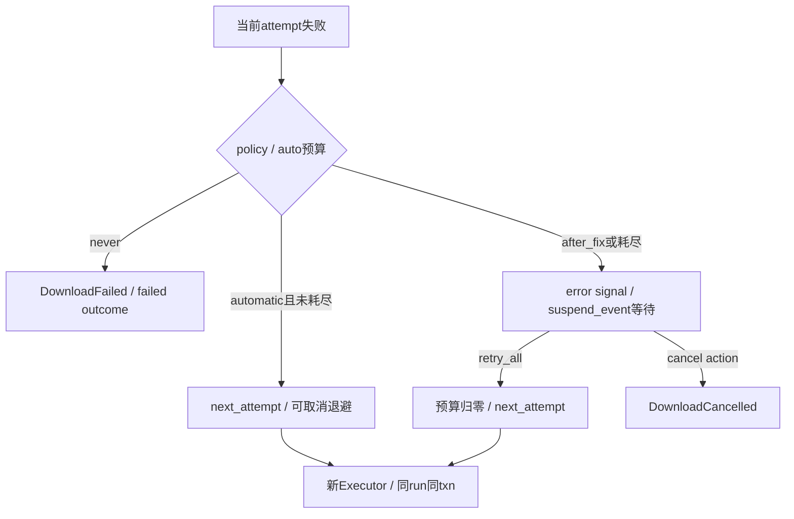

# 新版架构 V2 · VS-10 自动重试、修复后重试与新 run

2026-09-19，source/static；未制造实际网络故障。重试至少有service内部恢复、列表详情重试、标准下载attempt及用户重建任务四层，预算和身份不能混用。

## 标准下载 attempt 环

[CONFIRMED/static] Executor非零未被体积容忍时抛带phase/stderr的YtDlpExecutionError；Worker diagnose→diagnosis→error展示，然后按RetryPolicy决定。[Executor815行](../../../src/fluentytdl/download/executor.py#L815)、[Worker1369行](../../../src/fluentytdl/download/workers.py#L1369)。

| owner/trigger | precondition、transition | side effects/resources | failure/exit |
|---|---|---|---|
| RetryPolicy | immediate/backoff且max_attempts>0 | delay_for使用policy；Worker判断_auto_retries预算 | never不等待修复；未耗尽自动重试不弹等待对话框。[models94行](../../../src/fluentytdl/diagnostics/models.py#L94)。 |
| 自动恢复 | diagnosis后预算足够 | _auto_retries+1；trace.next_attempt；retry event；cancel_event.wait(delay) | cancel可立即打断退避；pause不冻结此计时；run不变。[1421行](../../../src/fluentytdl/download/workers.py#L1421)。 |
| after_fix等待 | 自动耗尽或policy after_fix | is_suspended=True，创建Event，error信号，再无超时wait | 仍占下载槽；cancel()只唤醒pause Event，不唤醒suspend Event。[1475行](../../../src/fluentytdl/download/workers.py#L1475)。 |
| 主窗retry_all | 用户点修复/重试 | 遍历active_workers，对is_suspended调用resume_suspension('retry') | 不是只重试当前错误任务；被移出active的挂起者不在遍历范围。[1933行](../../../src/fluentytdl/ui/reimagined_main_window.py#L1933)。 |
| 用户修复后继续 | suspend_action='retry' | 预算归零，attempt继续递增；同run；新Executor；同merged opts/Feature前置结果 | 不会自动重新执行run之前全部配置合并；修复全局设置是否被CLI新解析读取需逐字段核对。[1488行](../../../src/fluentytdl/download/workers.py#L1488)。 |
| 新attempt清单 | while循环继续 | Staging.prepare_attempt生成独立final.n.txt；_harvest_raw_lines保存本次executor缓冲到run缓冲 | 防print-to-file append混旧主媒体；raw deque最多4000行并非无限完整记录。[1335行](../../../src/fluentytdl/download/workers.py#L1335)、[1070行](../../../src/fluentytdl/download/workers.py#L1070)。 |

以上 [CONFIRMED/static]。单run可以多条diagnosis/retry，正常finally只一条outcome；成功恢复不抹掉失败attempt证据。

## 其他重试层与范围

- [CONFIRMED/static] `PlaylistScheduler._on_mgr_error`每行自动重试一次，是解析阶段，不创建下载attempt。[371行](../../../src/fluentytdl/ui/playlist_scheduler.py#L371)。
- [CONFIRMED/static] `YoutubeService`内playlist authcheck重试、SABR重解析等在服务内部，不能用DownloadWorker的_auto_retries总括。入口见 [`extract_playlist_flat`2103行](../../../src/fluentytdl/youtube/youtube_service.py#L2103)、[`_maybe_reparse_after_sabr_flip`815行](../../../src/fluentytdl/youtube/youtube_service.py#L815)。
- [CONFIRMED/static] 轻量字幕/封面分支无上述while RetryPolicy loop，rc非零直接failed；UI再次开始已结束worker时controller创建新run、新txn并复用db_id。[轻量2254行](../../../src/fluentytdl/download/workers.py#L2254)、[controller509行](../../../src/fluentytdl/core/controller.py#L509)。

[INFERRED] attempt和自动预算分离让用户修复后仍可获得完整预算而保持时间线单调；代价是“重试”按钮可能作用于不同层，必须说明重建了什么和仍沿用了什么。不能声称用户改任意设置后，同run retry都会刷新全部opts。

[UNKNOWN] 需验自动预算边界、退避取消、after_fix在Event创建前后的race、修复动作失败、多个错误同时弹框被主窗抑制、同task新run身份与旧run审计。真正失败阶段由parse/select/download证据决定，不由任务卡固定文字猜测。
