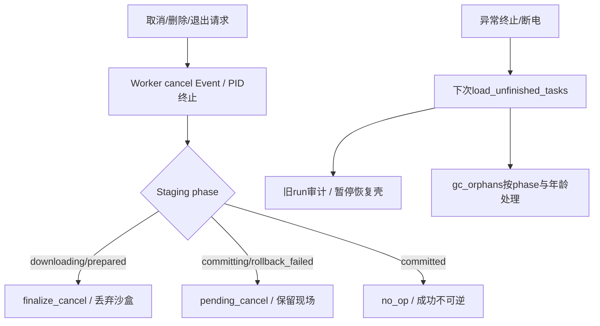

# 新版架构 V2 · VS-11 取消、删除、崩溃恢复与提交边界

2026-09-19，source/static，无故障注入执行。取消请求、停止进程、移除列表、删除文件、事务撤销和下次启动恢复分别有owner，不能合并为“cancel即清空”。

## 用户动作到资源处理

[CONFIRMED/static] UI删除/取消经controller和manager请求worker.cancel；cancel设_cancel_event/is_cancelled、set_pause_event，终止executor或_proc_ref；controller文件删除仅收集最终文件/辅助路径，不直接删除活Staging。`remove_worker`不等待完成即从active移除。[controller242行](../../../src/fluentytdl/core/controller.py#L242)、[280行](../../../src/fluentytdl/core/controller.py#L280)、[worker791行](../../../src/fluentytdl/download/workers.py#L791)、[manager599行](../../../src/fluentytdl/download/download_manager.py#L599)。

## 取消与文件阶段

| owner/触发与前置 | transition / side effects | resources / failure / exit |
|---|---|---|
| Worker.cancel | 设两个取消表示，唤醒pause等待，按PID/进程树结束CLI | 不唤醒suspend_event；不拥有VRFeature局部FFmpeg；执行器终止best-effort，不承诺OS资源立刻释放。 |
| `_finalize_staging_cancel` | 等1秒文件句柄释放，再调用Staging.finalize_cancel | 异常保留给GC；这里返回裁决，但调用处仍须正确决定UI/outcome。[832行](../../../src/fluentytdl/download/workers.py#L832)。 |
| Staging.commit前 | 唯一cancel gate先检查，随后phase=committing与journal | reserve本身已创建用户目录占位符，所以必须在不可取消区内。[1283行](../../../src/fluentytdl/download/staging.py#L1283)。 |
| committing期间取消 | 发布内不再检查；完成后记录pending_cancel | 文件整组继续完成或异常补偿；外部rmtree会破坏源文件，不能采用。[1321行](../../../src/fluentytdl/download/staging.py#L1321)。 |
| phase=committed | finalize_cancel no_op；finalize_failure返回already_succeeded | 不因cleanup/日志失败删成品或变failed。[1517行](../../../src/fluentytdl/download/staging.py#L1517)。 |
| 提交失败 | `_compensate`按journal/fingerprint处理已发布成员/占位符 | 成功退prepared并保留CommitFailed现场；失败rollback_failed；未知所有权文件不应盲删。[1427行](../../../src/fluentytdl/download/staging.py#L1427)。 |
| Controller删除最终文件 | force_delete_files时收集output_path/aux，FileDeleteWorker尝试删除 | 与Staging取消是不同操作；历史/列表目录路径还需独立范围验证，不自动等同事务取消。[FileDeleteWorker24行](../../../src/fluentytdl/core/controller.py#L24)、[batch_remove559行](../../../src/fluentytdl/core/controller.py#L559)。 |

表项 [CONFIRMED/static]。QThread.terminate不是协作取消，不经过上述保证；shutdown对此只做有界等待再强停，见[VS-01](VS-01-startup-shutdown.md)。

## 崩溃/重启恢复

[CONFIRMED/static] Manager读取DB原状态后，给旧active run补interrupted、未开跑队列补restored_pending；paused/error不重复补旧结果。接着active/queued变paused，新worker壳不自动开始；skip_download提取任务标error跳过恢复；error按failed_task_retention_days决定保留。[manager96行](../../../src/fluentytdl/download/download_manager.py#L96)、[174行](../../../src/fluentytdl/download/download_manager.py#L174)。

| GC对象与前置 | owner / side effect | 退出与证据上限 |
|---|---|---|
| 非live staging_id且达到默认6小时 | `gc_orphans(download_dir,live_ids)`扫描当前download目录与恢复任务目录 | 新run新UUID；不据相同task_id保护所有旧txn。 |
| 无journal/downloading/prepared | 删除旧沙盒 | prepared表示尚未进入reserve；若真实存储写入未耐久，语义还需故障注入。 |
| committing | 清仅可证明匹配fingerprint的零字节占位符，保留沙盒 | 不自动续交付，不伪造成功。 |
| rollback_failed | 保留且signal | 需要人工/后续修复，不做猜测性删文件。 |
| committed | 清旧沙盒 | 已交付文件不属于沙盒GC删除范围。 |
| journal损坏/不可读/非dict、未知phase | 满足年龄门且不在live集合后走删除分支 | `_read_journal` 返回None或phase不匹配；未见版本/schema校验，不能归为保守保留。[1807行](../../../src/fluentytdl/download/staging.py#L1807)、[1845行](../../../src/fluentytdl/download/staging.py#L1845)、[1864行](../../../src/fluentytdl/download/staging.py#L1864)。 |

表内 [CONFIRMED/static]，见[gc_orphans1744行](../../../src/fluentytdl/download/staging.py#L1744)。Cookie运行副本另由startup sweep清理，不属于媒体txn。[manager322行](../../../src/fluentytdl/download/download_manager.py#L322)。

[INFERRED] 对可识别的 committing/rollback_failed 保守保留以减少误删，代价是磁盘残留和用户需要后续处理；其它未知/损坏状态没有同等保护。journal write-ahead及tmp+replace是源码顺序，不是断电fsync耐久证明；DB状态与文件提交也无跨系统事务。

[CONFIRMED/static] journal写入的OSError被捕获，仅发`journal_write_failed`；commit仍继续reserve/publish。[1630行](../../../src/fluentytdl/download/staging.py#L1630)、[1298行](../../../src/fluentytdl/download/staging.py#L1298)。[INFERRED] 因此写入失败后异常退出可能使GC只看见旧phase/无journal而按默认分支删除现场；写前日志不是必然落盘的准入门。[UNKNOWN] 未注入此故障，不宣称实际发生损失。

[UNKNOWN] 必须验取消到达进程输出EOF、after_fix等待、Executor返回后、commit gate前后、跨卷publish中、DB bridge尚未消费及shutdown强停时的组合。现有结构中可能出现cancel请求未自然结束、快通道取消分类为failed、run_outcome_unset；这些是待验静态风险，不是本次复现结论。
