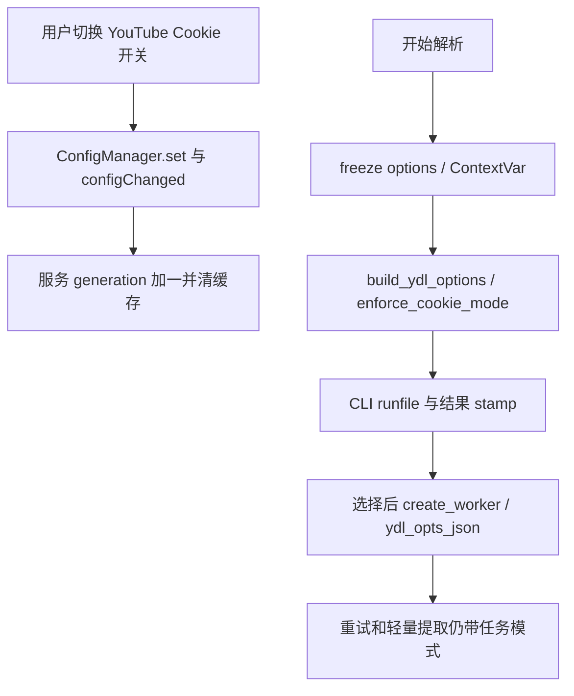

# 新版架构 V2：VS-13 请求 Cookie 上下文、快照与缓存隔离

2026-09-19 静态逆向；未读取Cookie文件。`[CONFIRMED]`为源码事实，`[INFERRED]`为推导，`[UNKNOWN]`为未证，`[RECOMMENDATION]`为建议。核心区分：请求模式快照、实际凭据来源、临时字节副本是三种数据。

## 完整纵向路径

1. `[CONFIRMED]` Settings切换调用config_manager.set("youtube_cookies_enabled", enabled)，配置变化被YoutubeService监听；服务增generation并清解析缓存。[UI入口](../../../src/fluentytdl/ui/settings_page.py#L3394)、[服务槽](../../../src/fluentytdl/youtube/youtube_service.py#L235)。`[INFERRED]` 开关只控制请求附带，不删除账户/来源资料。
2. `[CONFIRMED]` `freeze_youtube_options`与`_snapshot_request`先选base_ydl_opts已有模式，再冻结请求选项；ContextVar保存模式/generation，嵌套沿用外层generation，finally reset。[freeze/snapshot](../../../src/fluentytdl/youtube/youtube_service.py#L130)。`[INFERRED]` 配置变化不能改变已经开始的逻辑请求。
3. `[CONFIRMED]` `enforce_cookie_mode`为false移除cookiefile、cookiesfrombrowser、cookies_from_browser并清SABR_SCOPE；解析结果递归stamp entries。[内部元数据](../../../src/fluentytdl/utils/youtube_request.py#L5)。`[INFERRED]` 防调用者补传文件或合并opts重新注入身份。
4. `[CONFIRMED]` create_worker若YouTube任务尚未标记COOKIE_MODE，从cached_info取或兼容回退当前设置，并更新恢复任务opts；新任务写ydl_opts_json。[create_worker](../../../src/fluentytdl/download/download_manager.py#L408)、[insert_task](../../../src/fluentytdl/storage/task_db.py#L227)。`[INFERRED]` 旧历史无模式字段时只能采取兼容策略，不能反推原请求的真实开关。
5. `[CONFIRMED]` 真正CLI调用从当前托管真相源创建字节副本，yt-dlp结束可回写副本，with结束删除；非托管文件/识别异常直通。[cookie_runfile](../../../src/fluentytdl/auth/cookie_runfile.py#L37)、[解析调用](../../../src/fluentytdl/youtube/yt_dlp_cli.py#L1073)。`[INFERRED]` 任务持久化的是模式和路径等options，不是Cookie字节保险箱；同一模式不保证执行时仍是排队时账户字节。

## 状态与字段契约

| 维度 | 所有者与变化 | 为什么单独存在 |
|---|---|---|
| `[CONFIRMED]` config开关 | ConfigManager全局未来请求默认值 | `[INFERRED]` 修改后新任务生效，不能 retroactively 改所有旧任务 |
| `[CONFIRMED]` COOKIE_MODE | options/result/task内部布尔快照 | `[INFERRED]` 跨UI选择、队列、轻量调用保持匿名/附带模式 |
| `[CONFIRMED]` generation | YoutubeService进程内整数，切换递增 | `[INFERRED]` 拒绝早发晚到请求重填已清缓存 |
| `[CONFIRMED]` SABR_SCOPE | 实际请求上下文，匿名时清空 | `[INFERRED]` 网站账户实验不能污染仅被UI选中但未参与请求的账户 |
| `[CONFIRMED]` truth source meta | Sentinel平台文件伴随来源信息 | `[INFERRED]` 用于解释有效来源与回退，不能只看当前账号选择 |
| `[CONFIRMED]` runfile | 单次子进程的临时原始字节副本 | `[INFERRED]` 把yt-dlp jar回写约束到短期资源 |

字段证据：[youtube_request](../../../src/fluentytdl/utils/youtube_request.py#L5)、[snapshot](../../../src/fluentytdl/youtube/youtube_service.py#L144)、[meta保存](../../../src/fluentytdl/auth/cookie_sentinel.py#L180)、[runfile](../../../src/fluentytdl/auth/cookie_runfile.py#L58)。

## 缓存并发、失败和重试

[CONFIRMED] cache key含Cookie模式、generation、Cookie fingerprint等，值为monotonic写时与deepcopy；按mode桶LRU淘汰；POT预热状态不稳定、过大entries、禁缓存/TTL<=0时不写；put持锁再对generation。[key](../../../src/fluentytdl/youtube/youtube_service.py#L1586)、[put](../../../src/fluentytdl/youtube/youtube_service.py#L1697)

[INFERRED] 只清空缓存存在交错：A旧模式请求→用户切换并clear→A完成→旧值回填；generation将最后一步拒绝。代价是旧请求仍可能完成但不缓存，增加下一次解析成本。deepcopy隔离消费方修改，代价是大playlist复制成本，因此有entries上限。

[CONFIRMED] `invalidate_parse_cache`目前全清，源码说明hash key无URL反查索引，未实现按URL精细失效。[invalidate](../../../src/fluentytdl/youtube/youtube_service.py#L1734)。`[INFERRED]` 不应写成按视频粒度精确清理。

[CONFIRMED] 账号切换成功不保证真相源被该账户替换：set_current保存选择后忽略同步失败返回True，旧Cookie被弱回退保留。[账号切换](../../../src/fluentytdl/auth/auth_service.py#L1307)。`[UNKNOWN]` 所有此类变化触发缓存失效的完整覆盖与跨线程ContextVar传播，本轮未做运行验证。

## 资源、取消、退出与清理

- `[CONFIRMED]` ContextVar的token在decorator finally reset；这属于请求调用栈的清理，不是Qt worker取消协议。[snapshot](../../../src/fluentytdl/youtube/youtube_service.py#L160)
- `[CONFIRMED]` 正常runfile close删除失败被吞，启动GC默认一小时后按专用前缀清理；没有owner PID/nonce。[runfile GC](../../../src/fluentytdl/auth/cookie_runfile.py#L91)。`[INFERRED]` 多实例长任务可能与年龄清理冲突，实际影响未测。
- `[CONFIRMED]` 轻量分支2052先取runfile，2162才进显式try，2325 close；staging/env前置失败可绕过显式close。[获取](../../../src/fluentytdl/download/workers.py#L2052)、[try](../../../src/fluentytdl/download/workers.py#L2162)、[close](../../../src/fluentytdl/download/workers.py#L2325)。`[UNKNOWN]` 对象回收是否及时，不写成确定永久泄漏。
- `[CONFIRMED]` DownloadManager启动恢复末尾调用runfile sweep；旧任务模式读持久化opts，新run与旧task ID的关系应从恢复逻辑判断。[恢复及GC](../../../src/fluentytdl/download/download_manager.py#L293)

## 验证目标与范围

[RECOMMENDATION] 隔离验证：开关切换后旧worker保持模式；匿名时直接cookiefile/重试/轻量路径都不注入；POT独立开关不受影响；旧generation不回填；任务mode JSON roundtrip；用户自管文件直通与托管识别异常分支；账号选中与有效真相源不一致时UI说明。已有 [test_youtube_cookie_mode](../../../tests/test_youtube_cookie_mode.py)、[test_cookie_runfile](../../../tests/test_cookie_runfile.py) 是测试资产，**本轮未执行**。
