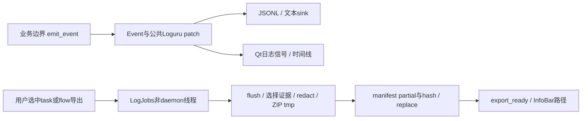

# 新版架构 V2：VS-15 事件、日志时间线与诊断包

2026-09-19 静态逆向。没有读取真实日志、导出用户数据或运行应用。`[CONFIRMED]`事实；`[INFERRED]`作用/风险；`[UNKNOWN]`未验证；`[RECOMMENDATION]`建议。此切片包含业务产生观测、UI读取及用户主动导出三个入口。

## 用户到最低组件再返回

1. `[CONFIRMED]` 业务调用FlowTrace/TaskTrace.emit或emit_event，Event保留session→flow→task→run→attempt；as_dict处理保留键冲突并JSON-safe，emit异常不向业务上抛。[trace](../../../src/fluentytdl/observability/trace.py#L41)、[Event](../../../src/fluentytdl/observability/events.py#L268)、[emit](../../../src/fluentytdl/observability/events.py#L382)
2. `[CONFIRMED]` initialize_logging配置公共patch_record，之后sink与UI走各自输出；LogViewer收到结构化Qt event交给timelineView。[初始化](../../../src/fluentytdl/utils/logger.py#L15)、[UI事件入口](../../../src/fluentytdl/ui/components/dialogs/log_viewer_window.py#L641)
3. `[CONFIRMED]` 用户在时间线选择scope，`_export_bundle`禁用按钮并emit export_requested(selection)，无选择则警告；连接到LogJobs.export。[UI入口](../../../src/fluentytdl/ui/components/dialogs/log_viewer_window.py#L659)、[连接](../../../src/fluentytdl/ui/components/dialogs/log_viewer_window.py#L112)
4. `[CONFIRMED]` LogJobs启动non-daemon线程，调用export_bug_bundle；成功后读取ZIP内manifest，再export_ready到UI；UI区分失败/部分/完成，并显示本地路径。[LogJobs.export](../../../src/fluentytdl/ui/components/common/log_jobs.py#L50)、[UI完成](../../../src/fluentytdl/ui/components/dialogs/log_viewer_window.py#L680)
5. `[CONFIRMED]` export先flush_sinks，固定cutoff，筛task/flow/run/session，写唯一tmp ZIP，记录missing/truncated、文件SHA256、隐私版本与runtime来源；os.replace完成，异常finally清tmp。[export](../../../src/fluentytdl/observability/bundle.py#L87)、[完成](../../../src/fluentytdl/observability/bundle.py#L313)

## 事件身份与语义

| 维度 | 当前语义 | 必要性与代价 |
|---|---|---|
| `[CONFIRMED]` session | 进程会话身份 | `[INFERRED]` 防同task跨重启日志拼错 |
| `[CONFIRMED]` flow | task产生前的解析/选择用户操作；child_task继承 | `[INFERRED]` 不丢掉失败发生在建任务之前的证据 |
| `[CONFIRMED]` task | DB任务身份；bind_task_id发identity | `[INFERRED]` 关联任务历史，不等于单次执行 |
| `[CONFIRMED]` run | TaskTrace执行身份；new_run清累计集合/outcome标记 | `[INFERRED]` 同task重启恢复另一次结果，活worker暂停恢复不能一律当新run |
| `[CONFIRMED]` attempt | 自动重试next_attempt递增，run不变 | `[INFERRED]` 防一次失败恢复被计成多个独立运行 |
| `[CONFIRMED]` expected/actual | 用户请求与实际产物集合 | `[INFERRED]` 缺用户没要的封面不应计降级 |

证据：[FlowTrace.child_task](../../../src/fluentytdl/observability/trace.py#L90)、[TaskTrace.new_run/next_attempt/bind_task_id](../../../src/fluentytdl/observability/trace.py#L126)、[artifact累计](../../../src/fluentytdl/observability/trace.py#L167)。`[UNKNOWN]` 本轮没有独立复核所有生产者均严格只发一次outcome/transition；规则与结构不代替全调用点验收。

## 数据、文件与并发

[CONFIRMED] JSONL trace enqueue=True，error同步sink enqueue=False；JSONL长期句柄受Lock和OrderedDict LRU管理，最多8个，单文件阈值10MiB，淘汰close；flush_sinks调用logger.complete再flush，应后台执行。[LRU](../../../src/fluentytdl/observability/sinks.py#L72)、[install/flush](../../../src/fluentytdl/observability/sinks.py#L321)

[INFERRED] 双通道降低异步日志在异常退出时全部丢失的概率，但不是断电耐久承诺；每个sink的失败应独立计入health，日志失败不能将业务成功改为失败。

[CONFIRMED] LogJobs.load每次设置旧cancel、创建新Event，历史线程读read_page(cancelled=...)，用generation返回；`cancel()`仅设置当前读取Event。export另开线程，不检查该Event。[LogJobs](../../../src/fluentytdl/ui/components/common/log_jobs.py#L21)。`[INFERRED]` UI关闭停止历史读取不等于取消导出；non-daemon导出可能延长退出。`[UNKNOWN]` 实际关闭时序与超时没有运行证据。

## 隐私、保留与旁路

[CONFIRMED] 公共patch对message/extra脱敏，redact_text去URL userinfo、常见secret键和值、Cookie/Authorization头、用户目录；JSON值深度8/单容器256项/长文本截断；raw dump与export再脱敏。[privacy](../../../src/fluentytdl/utils/log_privacy.py#L9)、[patch](../../../src/fluentytdl/utils/log_runtime.py#L64)、[raw](../../../src/fluentytdl/observability/sinks.py#L190)

[CONFIRMED] raw dump默认值得保存的outcome集合只有failed；取消/暂停不是默认异常dump理由。`[INFERRED]` 节省噪声/空间，但强杀时不能补回已经丢失的原始行。[raw policy](../../../src/fluentytdl/observability/sinks.py#L218)

[CONFIRMED] retention只管理日志根已知文件，trace14天，其它7天，总预算200MiB；不追链接，跳active和bundles，daemon每1800秒维护。[sweep](../../../src/fluentytdl/utils/log_runtime.py#L184)。`[INFERRED]` 这是可清理集合的目标，不是整个目录/所有应用日志硬上限。

[CONFIRMED] **WebView2 profile/webview_subprocess.log是旁路**：本地_log直接append，记录cache_dir且手动代理分支记录proxy_full，未调用公共redactor/retention。[旁路写](../../../src/fluentytdl/auth/providers/webview2_provider.py#L109)、[代理](../../../src/fluentytdl/auth/providers/webview2_provider.py#L155)。`[INFERRED]` 特定带凭据代理URL可能保留原文。`[UNKNOWN]` 未读取真实配置/日志，不声称实际泄漏；当前bundle的候选收集也不能据名称推断包含这个文件。

## 失败、重试、退出与结果边界

| 场景 | 实际行为 | 对解释结果的要求 |
|---|---|---|
| `[CONFIRMED]` emit序列化/写日志异常 | emit_event内部兜底记录失败 | `[INFERRED]` 业务可以继续，日志缺失不等于业务没执行 |
| `[CONFIRMED]` sink安装部分失败 | install_sinks只重试缺少channel，不重复安装成功项 | `[INFERRED]` 避免重复sink把事件计数翻倍。[install](../../../src/fluentytdl/observability/sinks.py#L321) |
| `[CONFIRMED]` 证据不存在/预算不足 | manifest.missing/truncated，partial=True | `[INFERRED]` 部分导出必须与完整导出分开展示，不把ZIP存在当完整证据 |
| `[CONFIRMED]` 导出总失败 | record_failure并返回None，finally删除tmp，UI错误 | `[INFERRED]` 临时半成品不应显示为完成包。[bundle尾部](../../../src/fluentytdl/observability/bundle.py#L315) |
| `[CONFIRMED]` 导出重试 | 用户再次触发创建新tmp，同一默认目标label可被replace | `[UNKNOWN]` 本轮未运行并发多窗口/同目标导出，不保证自动防并发覆盖 |
| `[CONFIRMED]` 关闭窗口 | LogJobs.cancel设置读取Event；export继续自己的代码 | `[RECOMMENDATION]` 明确导出是否允许完成、退出预算、结果接收对象消亡处理，不笼统写全部取消 |

[RECOMMENDATION] 验证应包括：合成凭据经所有sink与ZIP，旁路日志，读取generation迟到结果，导出missing/truncated，磁盘满/不可写，export期间关闭窗口，流/task/run选择跨重启；已有observability测试是证据入口，本轮未运行。正式交付应写“静态流程已定位”，而非“诊断数据绝不泄漏且必然完整”。
