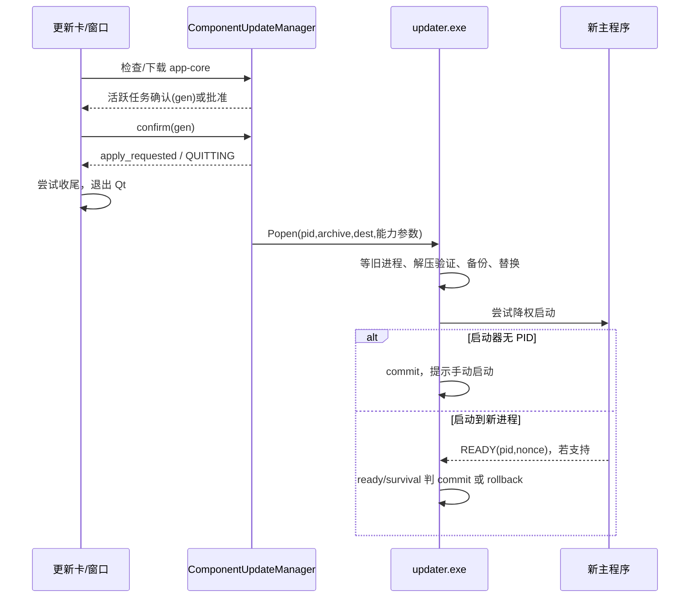

# 新版架构 V2 · VS-16 应用检查、更新与启动回滚

证据：2026-09-19 source/static。未执行真实检查、下载、更新或测试。CONFIRMED 指源码分支，不表示该分支实机通过；INFERRED 是机制解释；UNKNOWN 是未证；RECOMMENDATION 是验收建议。

## 1. 用户触发到后台执行

[CONFIRMED] 设置更新卡的检查按钮调用 `check_app_update(silent=False)`，下载按钮把 URL/SHA 交给 `download_app_update`；下载完成转 `request_app_core_update`：[app_update_card，L132/L158/L233](../../../src/fluentytdl/ui/components/settings/app_update_card.py#L132)。自动检查用 silent 模式，界面通知策略不同，但实际 manifest 消费仍归 ComponentUpdateManager。

[CONFIRMED] `_ManifestWorker` QThread 使用 CheckSession 取 manifest，随后 manager 比较版本；`_DownloadWorker` 在临时目录下载 app-core。[component_update_manager，L127–169](../../../src/fluentytdl/core/component_update_manager.py#L127)、[compare，L325](../../../src/fluentytdl/core/component_update_manager.py#L325)。CheckSession 共享 RLock/requests Session，至多一次换源，取消不换源；这是元数据控制策略：[update_transport._request，L252](../../../src/fluentytdl/core/update_transport.py#L252)。

[CONFIRMED] 请求应用更新先校验归档/updater 存在，按归档路径去重；生成 pending generation，活跃任务存在则发 apply_confirm_needed。过期 generation 的确认/取消会被忽略；没有活跃任务则批准。**活跃任务查询抛错时按无任务放行**：[request/confirm/cancel，L427–526](../../../src/fluentytdl/core/component_update_manager.py#L427)。

[CONFIRMED] `_approve` 在 emit 之前进入 QUITTING，避免信号重入看到 APPROVED；主窗口接 apply_requested，关闭 Qt 后根 main 才执行 `launch_pending_updater`。[manager，L535–548](../../../src/fluentytdl/core/component_update_manager.py#L535)、[主窗口，L307/L367](../../../src/fluentytdl/ui/reimagined_main_window.py#L307)、[main，L527](../../../main.py#L527)。

## 2. 控制时序与成功条件

用途：区分应用内批准与进程外替换。范围：正常更新主干及主要分支；箭头为 signal、启动或文件读写，不表示操作天然原子。

| 状态/条件 | [CONFIRMED] 分支 | 成功或失败含义 |
|---|---|---|
| IDLE → AWAITING_CONFIRM | manager L479–488 | 包存在且有活跃任务；尚未退出或替换。 |
| QUITTING → LAUNCHED | [launch_pending_updater，L550–645](../../../src/fluentytdl/core/component_update_manager.py#L550) 只接受 QUITTING，Popen 成功才 LAUNCHED | 仅表示更新器已拉起，不是新版通过。Popen 失败时 Qt 已结束，只能日志报告。 |
| 等待旧主进程 | [updater.main，L1486–1492](../../../src/fluentytdl/core/updater.py#L1486) 超时警告后继续 | 不是“旧进程没退就绝不替换”的硬门；锁冲突由后续动作承担。 |
| 解压/验证/替换 | [main，L1494](../../../src/fluentytdl/core/updater.py#L1494)、[_verify_extraction，L624](../../../src/fluentytdl/core/updater.py#L624)、[_move_extracted_files，L693](../../../src/fluentytdl/core/updater.py#L693) | _update_tmp 与 _internal.old/exe.old 属 updater；先验证再替换，失败按所在阶段清临时或恢复备份。 |
| ready 模式 | [decide_watch_outcome，L1147–1159](../../../src/fluentytdl/core/updater.py#L1147) PID+nonce 匹配 commit，不匹配/退出/90 秒无 ready rollback | READY 表示入口关键服务和事件循环已就绪，非真实下载成功。 |
| survival 模式 | [L1161–1166](../../../src/fluentytdl/core/updater.py#L1161) 到 15 秒宽限判 commit；更早观测到退出才 rollback | 与 READY 不同的弱监护；代码先判宽限，不能说最后一次一定再次证明存活。 |
| 启动器完全失败 | [main，L1663–1677](../../../src/fluentytdl/core/updater.py#L1663) 无 launch_mode/PID 时主动 commit、提示手动启动、尝试 updater 自更新、返回 1 | 当前保留新版而不回滚；“非零退出=已恢复旧版”不成立。 |
| 正常 commit / rollback | [L1712–1743](../../../src/fluentytdl/core/updater.py#L1712) commit 清旧文件并自更新；rollback 恢复旧 app，再提示 | 句柄在 finally 关闭；成功后的清理故障不自动翻成替换失败。 |

## 3. 参数、权限与资源

[CONFIRMED] 新主程序先读 updater PE 版本资源，足够新才传 `--data-dir`/`--origin-user-sid`，旧 updater 没有这些参数会解析失败；UI 语言通过环境变量兼容传输：[launch_pending_updater，L586–639](../../../src/fluentytdl/core/component_update_manager.py#L586)。updater 根据目录写权限决定提权，`--elevated` 防递归；降权启动候选用 SID/令牌校验：[request_admin_if_needed，L513](../../../src/fluentytdl/core/updater.py#L513)、[pick_launch_rung，L990](../../../src/fluentytdl/core/updater.py#L990)。

[CONFIRMED] 新进程收到 data-dir/ready token，入口转换为环境变量；`finalize_startup()` 原子写 ready JSON，并尝试提交 copy-only 迁移标记：[main，L63](../../../main.py#L63)、[update_signal，L70/L121](../../../src/fluentytdl/utils/update_signal.py#L70)。ready token 不可复用于另一 PID/运行；旧 `.update_ready` 先删除，避免旧成功误判。

[CONFIRMED] `updater.exe.new` 属 updater 自更新投递；正常替换不成则 detached helper 延后，失败保留供重试；rollback 会删除同批 .new：[self_update，L1281](../../../src/fluentytdl/core/updater.py#L1281)、[rollback，L1334](../../../src/fluentytdl/core/updater.py#L1334)。它不是普通垃圾文件。

## 4. 缘由、代价与异常验收

[INFERRED] generation 防旧对话框批准新包；退出后启动 updater 避免边下载边替换；独立 updater 避免自身依赖 _internal；READY 绑定身份避免陈旧文件/PID 重用。代价是多个非原子阶段、权限转换、老版本协议兼容、弱监护和手动启动分支必须分别诊断。

[CONFIRMED] 下载 shutdown 只尝试 cancel/wait/terminate，DBWriter join(timeout) 不确认 drain；因此更新启动时间序不等于资源完全释放：[shutdown，L562–591](../../../src/fluentytdl/download/download_manager.py#L562)。[UNKNOWN] committing 时强停、旧进程超时继续替换、提权跨用户、无 PID commit 的实机后果均未验证。

[RECOMMENDATION] 最小验收：成功 READY；旧协议 survival；旧 generation 确认；活跃任务查询异常；下载 hash 失败；解压失败不触主载荷；替换中失败补偿；READY 不匹配；启动器无 PID 的新版本保留；updater.exe.new 被占用后重试。记录包 SHA、路径、PID/nonce 和最终安装字节，不使用真实账户作破坏测试。本轮仅定位 [test_updater](../../../tests/test_updater.py)、[test_component_update_manager](../../../tests/test_component_update_manager.py) 等资产，未运行。
