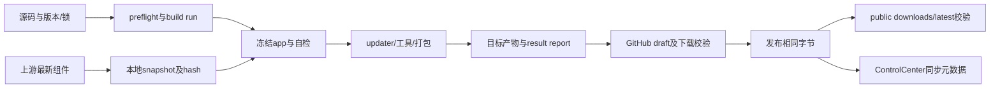

# 新版架构 V2 · VS-20 构建、发布与更新元数据同步

证据：2026-09-19 source/static；没有安装依赖、运行构建/测试、下载工具或发布。CONFIRMED 为代码，INFERRED 为作用解释，UNKNOWN 为本轮未验，RECOMMENDATION 为验收建议。维护者是此切片的用户。

## 1. 触发与构建身份

[CONFIRMED] release workflow 的 tag 或 workflow_dispatch 进入 resolve→共享检查/构建→stage→Actions artifact→条件 publish：[release.yml，L1](../../../.github/workflows/release.yml#L1)、[L58–94](../../../.github/workflows/release.yml#L58)。`publish=false` 的 artifact 不等于公开 release。

[CONFIRMED] `release_pipeline.resolve()` 从 tag/输入/VERSION 确定版本，公开发布必须 target=all、与 VERSION 一致、tag 精确指向当前 HEAD、HEAD 在 origin/main 祖先链；beta 的最终 publish=false：[resolve，L32–62](../../../scripts/release_pipeline.py#L32)。[INFERRED] 版本不是唯一身份，commit、dirty 标志、组件 snapshot 和最终哈希共同约束发布的字节。

[CONFIRMED] build preflight 检查 Windows x64、Python 3.12.12 与锁定依赖；每次 initialize_workspace 建 build/runs 独立路径，版本覆盖用于本次构建，不应改源 VERSION。[build_environment，L40](../../../scripts/build_environment.py#L40)、[build.initialize_workspace，L877](../../../scripts/build.py#L877)。

## 2. 工具解析与产物流水线

用途：避免把“构建成功”与“用户下载到同批文件”混为一体。范围：发行主干；箭头为阶段输入依赖，非已经执行的记录。

[CONFIRMED] `ensure_tools` 首次 prepare/replay 后保留 snapshot_path，后续同 build 复用；`component_snapshot.prepare` 解析最新 release/asset 身份并下载到构建本地，历史 TOOLS.lock 只是 baseline；verify 核对文件集合、路径与哈希，replay 是诊断路径：[build，L407–419](../../../scripts/build.py#L407)、[component_snapshot，L68–170](../../../scripts/component_snapshot.py#L68)。

[CONFIRMED] `ReleaseSource.download` 总会核对解析时 asset size 并计算本地 SHA；只有 upstream asset digest 为 sha256 时才执行该 digest 比对，metadata 区分 `github-sha256` 与 `observed-sha256`：[component_snapshot，L36–56](../../../scripts/component_snapshot.py#L36)。[INFERRED] 本地哈希锁定同批字节与上游独立摘要验证是不同证据；不能把每个 observed hash 都写成已得到上游签名认证。

[CONFIRMED] `run_all` 创建 workspace、准备 tools（非 spec）、冻结 app、自检；spec 到此返回。其它目标构建 updater、bundle tools，再按 TARGET_OUTPUTS 生成 full/app-core/setup/manifest/checksums，确认预期文件存在后写报告：[build.run_all，L806–869](../../../scripts/build.py#L806)。

| 目标 | [CONFIRMED] 合同 | 缘由 |
|---|---|---|
| all | full + app-core + setup + manifest + checksums | 公开发行需要完整下载与更新入口。 |
| 7z/full | full only | 便携产物单独构建不伪造空更新清单。 |
| app-core | app-core + manifest | manifest 必須绑定真实 app-core 字节。 |
| setup | setup only | 安装包不是完整 release。 |
| spec | 冻结自检，无分发集合 | 快速检查 spec 可生成可自检程序，不承诺工具、安装器或公开下载。 |

依据：[TARGET_OUTPUTS/aliases，L77–94](../../../scripts/build.py#L77)。全目标使用 hygiene 校验，未知 app-core 顶层项/运行数据污染失败：[classify_app_core_items，L266](../../../scripts/build.py#L266)、[assert_dist_clean，L294](../../../scripts/build.py#L294)、[pyproject 载荷契约，L133](../../../pyproject.toml#L133)。

## 3. 报告、草稿与公开字节

[CONFIRMED] `write_result` 保存产物显式路径/大小/哈希及构建身份，最后更新 latest-result；validate_result 重新检查目标集合、实际存在、名字/大小/SHA、manifest 的 version/tag 和 app-core 绑定：[build.write_result，L925](../../../scripts/build.py#L925)、[validate_result，L66–94](../../../scripts/release_pipeline.py#L66)。不能扫描整个 release 文件夹后把旧包一并发布。

[CONFIRMED] publish 拒绝 dirty source/非 latest snapshot、构建 commit 不一致；已有公开 release 拒绝覆盖，已有 draft 只允许完整相同字节恢复；新建 draft 后下载验证，再把同批 release 转 public；稳定版核对 latest endpoint：[publish，L175–251](../../../scripts/release_pipeline.py#L175)、[verify_downloads，L110](../../../scripts/release_pipeline.py#L110)。

[INFERRED] draft 为检查远端上传是否完整提供暂存阶段；真正不可忽略的终点是 public 下载字节与报告一致。代价是本地成功以后仍有远端权限、上传、GitHub eventual visibility、manifest 路径等独立失败。重试必须沿已识别的 draft 与字节，不替换已发布版本。

## 4. ControlCenter 同步是另一完成条件

[CONFIRMED] 同级服务 `synchronize` 按仓库/channel 顺序拉 release，应用 stable 用 latest、pre 用版本筛选列表，拒绝 draft/beta、要求 update-manifest 身份与 tag 一致；组件 payload 重建 GitHub release URL：[updates.repositories/selectAppRelease，L4–30](../../../../FluentYTDL-ControlCenter/apps/worker/src/updates.ts#L4)、[synchronize，L50–88](../../../../FluentYTDL-ControlCenter/apps/worker/src/updates.ts#L50)。

[CONFIRMED] sync 可由 cron、管理 POST、CI internal/sync Bearer 触发；临时 GitHub token 仅用于 API 请求，不持久化。按 channel 写 KV→D1 状态；KV 写入前失败通常保留旧 snapshot，KV 成功后 D1 失败则不恢复旧 KV，可能呈现新快照与错误/旧状态。catch 中记录失败状态本身也可再次失败，不能保证每次故障都留下失败记录；限流设 cooldown、可能提前 break：[index，L61–75](../../../../FluentYTDL-ControlCenter/apps/worker/src/index.ts#L61)、[updates，L33–87](../../../../FluentYTDL-ControlCenter/apps/worker/src/updates.ts#L33)。

[CONFIRMED] 锁仅 240 秒租约无续租；整个同步不是全 channel 原子提交，单项成功即可先公开；KV 成功而 D1 状态写失败也可能出现新快照与失败状态并存。[INFERRED] 因此“GitHub发布成功”“所有 channel 同步成功”“某客户端缓存刷新”需独立读回，不能把同步 endpoint HTTP 成功本身当所有 key 成功。

## 5. 失败/重试/资源与验收

| 故障阶段 | 现有处理与资源归属 | 尚需证明 |
|---|---|---|
| [CONFIRMED] preflight/工具完整性 | build-local workspace/snapshot；失败中止，不以旧工具悄悄替代；[snapshot.verify，L146](../../../scripts/component_snapshot.py#L146) | [UNKNOWN] 真实网络异常与每种上游资产校验覆盖。 |
| [CONFIRMED] 冻结/自检/包校验 | 成功才更新 result 指针；旧 release artifacts 不在本次清理范围；[build.clean，L402](../../../scripts/build.py#L402) 限制 build/runs | [UNKNOWN] 当前最终包空 PATH/Unicode/Windows 权限实机结果。 |
| [CONFIRMED] 上传/草稿验证 | 既有 draft 只恢复相同完整字节；公开版本不覆盖 | [UNKNOWN] 远端现状及 CDN 下载身份，本轮未联网。 |
| [CONFIRMED] 元数据部分同步失败 | KV 写入前失败通常保留旧快照；KV 成功后 D1 失败可保留新快照与旧/错误状态，失败记录也可失败；下一同步可重试，public 超龄拒绝 | [UNKNOWN] 超租约重叠、KV/D1 故障下当前生产效果。 |

[RECOMMENDATION] 报告分别列 source/build/frozen smoke/archive/install/update/public download/ControlCenter 证据等级。复用 [test_release_pipeline](../../../tests/test_release_pipeline.py)、[test_release_protocol](../../../tests/test_release_protocol.py)、[test_build_app_core](../../../tests/test_build_app_core.py)、[test_fetch_tools](../../../tests/test_fetch_tools.py) 等验证资产，但本轮并未执行，不填写绿色验收结果。
