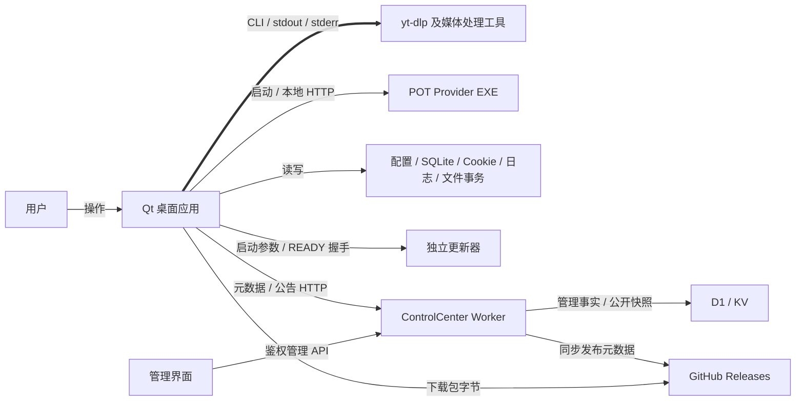

# 01 · 执行方案与阶段门

> **2026-09-19 执行修订：** 正式章节落点为 `docs/architecture-v2/`，新版总入口为 `NEW_ARCHITECTURE_REFERENCE.md`；不沿用旧书名。下列阶段责任和准出原则保持有效。

## 1. 目标与不变量

[RECOMMENDATION] 最终知识库应让读者沿着“系统 → 子系统 → 模块 → 调用链 → 符号 → 状态 → 资源 → 失败与恢复”定位问题。当前先完成适配方案和首轮取证，后续按本文件阶段门展开正式章节。

只读逆向期间，不改变业务行为。发现缺陷形成风险条目，不随手修复；运行型验证需要隔离目录和受控输入，不能用用户现有账户、任务或下载目录做试验。只有证据不足且运行能回答具体问题时才增加验证。

优先级为正确性、覆盖、可追溯性、图、行文质量。章节篇幅不是进度指标；一个已找到生产者、消费者与清理出口的资源条目，比一张猜测的全景图更有价值。

## 2. 适配后的系统层次

以下为**调查用分组**，不是仅据目录宣布的最终架构。源码入口见 [Repository Survey](evidence/01-repository-survey.md)。

| 层次 | 本项目落点 | 处理缘由 |
| --- | --- | --- |
| L0 System | FluentYTDL 产品及关联发布/公告服务 | 桌面依赖更新元数据，但下载文件并不因此由元数据服务传输 |
| L1 Application | Qt 桌面；updater；安装/卸载维护；ControlCenter Admin/Worker；构建发布工具 | 不同入口的权限、进程生命期和失败后果不同 |
| L2 Logical Module | 解析与选择、下载调度、事务交付、认证、运行组件、持久化、可观测性、更新公告 | 避免把 `core/` 这种物理目录当单一职责 |
| L3 Component | Worker、Executor、StagingArea、CookieSentinel、DBWriter、TaskTrace 等 | 将控制者、事实持有者和执行者分开，便于找写入权限 |
| L4 Runtime Flow | 六种解析、任务恢复、认证刷新、文件提交、升级握手 | 必须从用户操作/启动事件追踪到终态，不能只画 imports |
| L5 Symbol | 具体函数、Signal.connect、锁、文件/数据库写入点 | 让每条图边和状态转换都能被反查 |

Qt Signal 是进程内通信；`subprocess` 管道、multiprocessing 队列、HTTP、更新启动参数是不同边界。不要套用 Tauri 前后端 IPC，也不要把 Python 线程池描述为 asyncio。

### 首轮系统边界图



用途：划定后续调查边界。范围：首轮已定位子系统，依据三份专项证据；不表达所有 fallback、认证进程和 OS 辅助组件。节点是应用、外部执行体或资源组；带标签的箭头表示调用/数据方向，粗线突出下载 CLI 主路径。Local 内部的数据根与所有权并不相同，正式资源章节应拆开。此图不证明远端在线状态。

## 3. 资料与产物安排

当前方案集中于 `docs/architecture/reconstruction-plan/`。未来正式知识库结构如下，**此树是计划，不表示文件已完成**：

```text
docs/architecture-v2/
├── NEW_ARCHITECTURE_REFERENCE.md    # Phase 17 才生成新版总入口
├── 00-system-overview.md
├── 01-repository-map.md
├── 02-module-map.md
├── 03-runtime-architecture.md
├── 04-data-flow.md
├── 05-control-flow.md
├── 06-state-machines.md
├── 07-resource-model.md
├── 08-dependency-model.md
├── 09-concurrency-model.md
├── 10-error-recovery.md
├── 11-security-boundaries.md
├── 12-deployment.md
├── 13-known-risks.md
├── 14-code-index.md
├── vertical-slices/                 # VS-01 至 VS-20
├── diagrams/{system,runtime,state,dependency,resource}/
├── evidence/                        # 已采纳证据、反例、复核与基线
└── tools/                          # 新版文档检查与源码索引工具
```

独立图文件用于复用和审阅；正文引用同一图源。第一轮使用 Markdown + Mermaid，不引入 Structurizr/D2 或额外产品依赖。Iconify 的 Lucide/Simple Icons 只在渲染器支持时用于语义标识，图的理解不能依赖在线图标加载。

## 4. Phase 0–17 执行表

表内均为 [RECOMMENDATION] 工作安排。每阶段输出须通过其准出条件，后续才可据此形成结论。允许前瞻搜索，不能跳过依赖证据。

| Phase | 调查对象与具体动作 | 产物/责任 | 准出条件及缘由 |
| --- | --- | --- | --- |
| 0 初始化 | 记录两根目录、Git/非 Git 边界、既有修改、源码哈希、现有文档 | 基线；Lead | 能重找实际分析版本，避免 dirty tree 被误写为某 commit 的事实 |
| 1 仓库普查 | 清点 Python/TS/Vue/SQL/构建安装配置；验证根 main、特殊模式、updater、maintainer、Worker/后台入口 | `01`；Repository | 所有候选入口标已定位/缺失/待查；源文件入口与打包入口分别确认 |
| 2 模块重建 | 从公开符号和调用者聚类；列每个模块的读写、持有资源和外部依赖 | `02`；Lead 采纳各代理证据 | 不能只列文件夹；每个模块至少一条实际进入和退出路径 |
| 3 运行重建 | 六解析模式→选项→任务→子进程→结果；启动和关闭；附加维护进程 | `03`；Runtime | UI 触发、线程/进程边界、终态及失败出口连通 |
| 4 数据流 | URL/DTO、options 隐含键、Cookie 模式快照、DB 行、产物 Manifest、CLI 输出、更新元数据 | `04`；Resource | 每类数据有来源、变换、读写者、持久化与销毁；区分几种 Manifest |
| 5 控制流 | pump、PlaylistScheduler、stdout/stderr 消费、重试退避、POT 健康检查、watchdog、Qt timer | `05`；Runtime | 每个回环有进入/重复/退出条件、最大次数或时间边界；没有的标未知 |
| 6 状态机 | WorkerState、持久化 status、UI TaskRow、Staging phase、run outcome、更新状态、认证状态 | `06`；Runtime + Lead | 转换归属明确；不把界面文案、事务状态和业务终态合成一个枚举 |
| 7 资源所有权 | staging/WAL/预留文件、Cookie 真相源及 runfile、DBWriter、Qt/线程/句柄、日志缓存 | `07`；Resource | 正常/取消/失败/重启四类清理或保留策略具证；存活事务不外删 |
| 8 依赖 | AST import 候选图加动态导入/信号/配置人工追踪；插件与 frozen 特殊路径 | `08`；Repository | 编译/打包、运行、控制、数据、资源、外部、隐式依赖分开；强连通分量人工判定 |
| 9 并发 | Qt 对象线程亲和性、QThread、线程池、DB queue、锁、ProcessManager、子进程继承 | `09`；Runtime/Resource | 写共享状态的实体、同步条件、取消传播、关闭顺序可追溯；列反例交错 |
| 10 错误恢复 | stderr→异常→诊断规则→retry/fallback→终态→UI；暂存回滚与更新回滚 | `10`；Runtime | 主因与伴随信号分开；自动重试、人工重试、跨启动恢复分开 |
| 11 安全边界 | URL/参数/路径、账号材料、日志脱敏、WebView2/UAC、更新哈希、Worker 鉴权/Origin | `11`；Resource/Repository | 描述实现约束与未覆盖条件，不能从存在校验函数推断所有调用均安全 |
| 12 部署 | Python 锁定环境、工具快照、Full/app-core/setup、portable/installed、更新握手、卸载 | `12`；Repository | 源码、冻结包、安装版分支独立；本地构建、Actions artifact、公开 release 分开 |
| 13 纵向切片 | 完成覆盖矩阵每条用户路径，复用已确认实体与状态表 | `vertical-slices/`；分领域代理 | 每条包含成功、失败、取消适用性、资源出口及证据，不只“调用主干” |
| 14 双向索引 | 章节/实体→符号；符号→运行流/状态/资源；给出适用配置 | `14`；Documentation | 读者按一个错误阶段或函数名都能找到关联说明 |
| 15 风险台账 | 整合代码/注释/规则冲突，资源归属、竞态、入口漂移、未覆盖异常分支 | `13`；Lead | 已证问题、潜在风险、改进建议分栏；不把风险自动变成实施工单 |
| 16 反向复核 | 重新查入口、状态赋值、connect、线程/进程/文件写入、恢复与退出；寻找遗漏反例 | 复核记录；Verification | 高影响错误结论全部修正；无法证明的降级并记录下一步 |
| 17 最终总书 | 只汇总已验收章节，给出导航与局限，不重新发明事实 | `NEW_ARCHITECTURE_REFERENCE.md`；Lead | 满足 06 中完整逆向门槛，且说明哪些仅有静态证据 |

## 5. 调查深度与停止条件

第一层必须清点所有主要区域。第二层深挖会改变任务终态、发布用户文件、写账户真相源、启动/终止进程、修改安装内容的代码。第三层针对 UI delegate、图标、翻译等纯表现组件，先确认入口和事件/数据边界，只有它们参与控制或持久化时再追到内部。

这样安排是为了把精力放在“错误理解会造成什么后果”上，同时保持全库覆盖。某模块缺证不能通过增加无关文字掩盖；用明确的 [UNKNOWN] 指明缺失分支和最小补证动作。

## 6. 本次与后续进度

本次完成 Phase 0 的方案工作区、Phase 1 的首轮清单，以及支持方案选择的运行/资源样本取证和方案级复核；并行样本取证不代表 Phase 2–15 全部通过。正式各阶段的“完成”需要独立产物和准出证据。无需为了填目录创建空章节。
