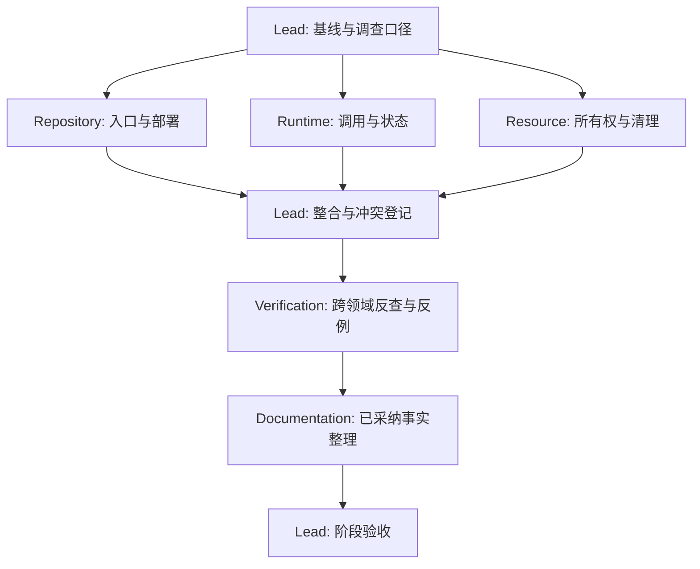

# 02 · Subagent 分工与交接协议

## 1. 实际分配

本次采用一个 Lead 加三个并行调查代理，符合当前四个并发槽位。角色名称是职责，不等于需要同时常驻六个代理。

| 角色 / 当前代理 | 调查职责 | 本次唯一可写区域 | 禁止事项 |
| --- | --- | --- | --- |
| Lead Architect / 主代理 | 系统边界、术语、方案、证据规范、缘由、冲突裁决、最终验收 | 本方案正文、工具、基线、验证报告 | 不用主观判断替代源码，不提前写最终总书 |
| Repository / `repository_survey` | 客户端与 ControlCenter 的入口、模块、依赖、构建、安装与部署 | `evidence/01-repository-survey.md` | 不认定线上已部署；不发布、不安装依赖、不改规则生成物 |
| Runtime / `runtime_survey` | 启停、解析、调度、状态、事务、Qt 信号、重试与关闭 | `evidence/02-runtime-survey.md` | 不把状态意图视为严格 FSM，不运行真实下载 |
| Resource / `resource_survey` | 数据、路径、认证、DB、进程、日志、安全、清理 | `evidence/03-resource-survey.md` | 不读取凭据值，不清理现有缓存/任务/沙箱 |

写入边界按文件分割，是为了防止共享工作目录中多个代理互相覆盖。调查可以交叉，结论命名由 Lead 统一。代理遇到超出范围的事实发消息交接，不顺手改另一个代理的文档。

## 2. 分波执行

用途：说明工作交接；范围：文档生产过程，不是产品运行图。节点表示角色工作包，箭头表示必须具备的输入。调查可并行，结论发布顺序遵守阶段门。

### 波次 A：普查和样本取证

三个调查代理从代码查事实，输出少量足以决定调查重点的真实调用链和异常分支。Lead 同步编写项目适配方案、覆盖矩阵、证据模板，避免所有代理等待一个总报告。

### 波次 B：独立质疑

先完成原工单，再将空闲代理切换为 Verification。优先交叉分配：Repository 复核 Runtime/资源关键边界；Runtime 复核仓库/构建声明；Resource 复核总方案是否遗漏资源出口。不得将作者本人重读原稿冒充独立复核。

本次进行的是**方案级独立复核**，不冒充 Phase 16 的完整仓库反向验证。报告必须列出查过的具体结论、证据、发现和修订，而不只是“看起来正确”。

### 波次 C：文档整理

由 Lead 承担当前 Documentation 职责；后续章节足够多时，可把已完成调查的代理切换为 Documentation。只接收 Lead 已采纳的事实与术语表，不重新划分状态和资源所有权。最后仍由 Lead 负责入口与风险结论。

## 3. 可直接复用的工单

### Repository 工单

输入：当前目录结构、相关 AGENTS、基线、构建文件、现有文档。

必须回答：根 `main.py` 与声明的 console entry 是否对应；frozen 特殊模式何时退出；updater 与 maintenance 工具如何启动；哪些程序实际需要管理员身份；Python 与 TypeScript 的锁定环境；所有 artifact target；本地工具来源和远程元数据边界；ControlCenter 的公开读取/管理写入/发布缓存是否分离。

交付：inventory、入口表、逻辑模块候选表、七类依赖、打包矩阵、文档冲突表，每项有代码锚点。缘由重点：可运行入口不同于配置声明；构建成功不同于发布成功；服务元数据不等于二进制分发。

### Runtime 工单

输入：入口表、任务和工作线程相关代码、六解析入口。

必须回答：信号连接在哪建立、槽运行在哪个线程；选项何时冻结；QThread 是否重建；持久化状态谁写；调度槽何时释放；暂停与取消是否杀进程；重试保持哪个身份；提交边界内取消如何仲裁；进度 100% 与成功是否等价；关闭超时后还可能存在什么实体。

交付：调用链、转换表、控制回环表、并发交错假设、失败链及 VS-01–VS-11 草案。缘由重点：避免把同一任务、多次运行和多次尝试统计为重复失败，避免把文件已交付误回退为下载失败。

### Resource 工单

输入：路径解析、数据写入、认证、外部进程、日志、更新代码。

必须回答：谁创建/持有/销毁文件和句柄；SQLite 状态更新与 GUI 是否异步；Cookie 真相源怎样变成调用专属 runfile；POT 自建服务与复用服务的停止权限；自定义工具是否允许被 updater 覆盖；更新/卸载/回滚对数据的不同处理；日志哪些字段可能跨信任边界。

交付：资源表、数据谱系、释放矩阵、跨启动遗留物表、安全边界和未确认项，支撑 VS-12–VS-20。缘由重点：不同数据根不能混用，持久材料与短生命周期副本不能混删。

### Verification 工单

输入：已经整合的方案和证据，不能仅看摘要。

必须逐条挑战：没有源码的“全部/唯一/总是”；状态漏写者；注释与实现矛盾；关闭中的超时/强杀；commit 前后取消差异；更新失败补偿；由 AST 导入图错误推断的调用关系；旧文档继承的入口和沙箱假设。

交付：`结论ID → 判断 → 反例/代码 → 影响 → 修订要求 → 回查结果`。发现未复现风险就写 [INFERRED]，不能为了显得完成审查而夸大成已证缺陷。

## 4. 所有代理统一交接包

1. 范围与基线：读了什么、没有读什么、相应哈希或路径。
2. 事实清单：结论ID、状态标签、源码文件/符号/行号、调用者与消费者。
3. 机制与缘由：实际行为；代码注释是否明确说明动机；分析推断及其限制。
4. 状态和资源：写入者、持有者、释放点、失败出口。
5. 冲突：与代码/规则/旧架构的不一致，不静默选一边。
6. 未知项：缺哪段证据、最小补证步骤、影响哪个章节。
7. 文件清单与检查：只写自己的授权文档，不执行 Git 提交。

Lead 采纳时给实体分配稳定 ID。两位代理结论冲突时，回查相同哈希的同一分支，检查配置、frozen 与测试替身差异；仍无法解释则暂记 [UNKNOWN]，不通过投票形成“事实”。
