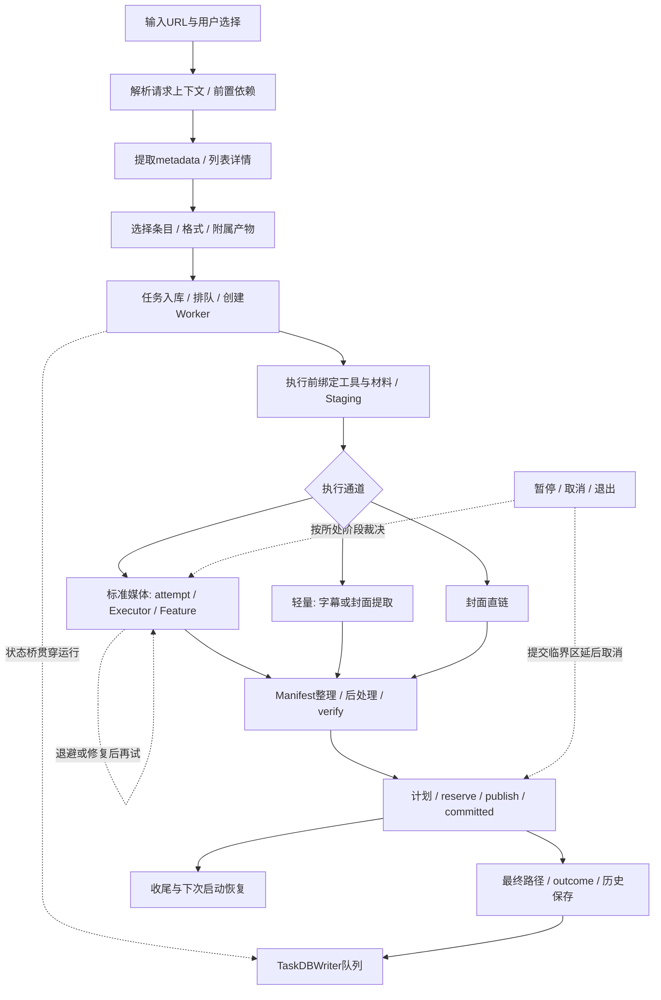

# 下载链路拆解 · 每一段为什么存在

本章把[架构V2运行图](../architecture-v2/03-runtime-architecture.md)变成优化的责任边界。现状为[CONFIRMED/static]，瓶颈是[INFERRED]假设；没有本轮耗时测量。下面是概念阶段，不暗示所有分支严格依次执行或尚未存在的统一Pipeline类。

## 1. 主链与旁路

这是控制/数据交接图。认证、POT、工具选择分别在解析或执行路径按需发生；部分字幕信息会在worker中迟解析。它们不是一次全局preflight后就永久有效。状态桥贯穿执行，数据库写入不是只在最后发生。

## 2. 阶段责任表

| 阶段 | 当前入口与作用 | 输入→输出 / 谁持有资源 | 为什么存在与优化问题 |
| --- | --- | --- | --- |
| P00 意图收集 | [配置窗](../../src/fluentytdl/ui/components/dialogs/download_config_window.py#L1354)、[QuickAdd](../../src/fluentytdl/core/quick_add_worker.py#L51) | URL、模式、控件→解析/任务参数；UI持窗口和解析请求 | 先显示可选项和风险再开下载；两条入口对选项归一化是否一致？I01 |
| P01 解析上下文 | [request snapshot](../../src/fluentytdl/youtube/youtube_service.py#L144)、[CLI](../../src/fluentytdl/youtube/yt_dlp_cli.py#L1054) | Cookie模式、工具、代理/POT→本次请求执行上下文 | 匿名/账号实验必须跟实际请求；材料与意图如何分开固定？C01/C03/I05 |
| P02 元数据提取 | [InfoExtractWorker](../../src/fluentytdl/download/workers.py#L137)、[详情manager](../../src/fluentytdl/download/extract_manager.py#L54) | 外部CLI结果→metadata、列表行状态；池持active | 没有metadata不能准确选格式；取消是否内部终结、旧结果是否污染新UI？I02/I03 |
| P03 用户选择 | [下载发出](../../src/fluentytdl/ui/components/dialogs/download_config_window.py#L1088)、[画质预检](../../src/fluentytdl/ui/components/dialogs/download_config_window.py#L4195) | metadata+显式偏好→所选任务/format/预期产物 | 预检避免无声降级，但只看metadata不等于事后成品验证；I01、06决策 |
| P04 准入与排队 | [controller](../../src/fluentytdl/core/controller.py#L95)、[create_worker](../../src/fluentytdl/download/download_manager.py#L403)、[pump](../../src/fluentytdl/download/download_manager.py#L376) | tasks→DB任务ID、pending/active/Worker | 持久身份与并发准入需先确定；同步批量开销、精确片段互斥、槽位占用分开看；I04/E06 |
| P05 执行准备 | [worker.run](../../src/fluentytdl/download/workers.py#L1143)、[Staging.create](../../src/fluentytdl/download/staging.py#L739) | task opts→实际工具、run/attempt、txn、runfile | 运行时材料可能已变化；参数多点覆盖会使上游意图失效；I01/I05/C02 |
| P06 外部下载 | [Executor.execute](../../src/fluentytdl/download/executor.py#L299)、[轻量](../../src/fluentytdl/download/workers.py#L1988)、[直链](../../src/fluentytdl/download/workers.py#L2330) | argv/env→输出、诊断、暂存文件；worker持子进程控制 | 保留引擎隔离；共享资源与终结机制是否值得提取，而非把三策略硬合并？E01–E06 |
| P07 产物整理与加工 | [Feature链](../../src/fluentytdl/download/workers.py#L1561)、[VR](../../src/fluentytdl/download/features.py#L477) | Manifest与用户意图→保留/丢弃/生成/晋升产物 | 不扫描全输出目录猜本任务文件；加工失败应保留可用媒体；E03与既有metadata方案 |
| P08 验证与计划 | [verify](../../src/fluentytdl/download/staging.py#L1172)、[build_plan](../../src/fluentytdl/download/staging.py#L1227) | kept artifacts→可发布成员/目标路径 | 安全门独立于“满足全部偏好”；缺失附件或真实画质需另判，避免把交付token用于前置门 |
| P09 最终交付 | [commit](../../src/fluentytdl/download/staging.py#L1283)、[_write_journal](../../src/fluentytdl/download/staging.py#L1630) | 计划→预留→逐项发布/补偿→committed | 命名和用户目录副作用需要唯一owner；journal失败、跨卷、取消、外来改写如何保守处理？A01–A03 |
| P10 结果可见与保存 | [输出信号](../../src/fluentytdl/download/workers.py#L1615)、[_finish_run](../../src/fluentytdl/download/workers.py#L1110)、[writer](../../src/fluentytdl/storage/db_writer.py#L125) | 文件事实→UI/trace/DB行；不同写者不同完成点 | “已交付”“历史已保存”“清理完毕”不能合成一个boolean；E01/A04/A05 |
| P11 收尾/退出/恢复 | [shutdown](../../src/fluentytdl/download/download_manager.py#L562)、[恢复](../../src/fluentytdl/download/download_manager.py#L174)、[GC](../../src/fluentytdl/download/staging.py#L1744) | 资源/DB/journal→释放、保留、恢复任务壳 | 退出不是把所有线程强杀；恢复任务不保证导入旧txn字节；A02/A06/E02/E03 |

## 3. 六入口不能用一条成功用例覆盖

| 入口/变体 | 共用部分 | 必须保留或验证的差异 |
| --- | --- | --- |
| 视频 | 排队、标准executor、Staging | 音轨/字幕/封面与容器选项来源；实际format决策 |
| VR | 标准下载与Staging | android_vr上下文、局部FFmpeg、生成候选晋升、取消后原媒体保护 |
| 频道 | 列表选择后成为逐条媒体任务 | tab并发、unsupported/empty/failed区分、取消汇总与pool退出 |
| 播放列表 | 逐条选择后成为媒体任务 | flat→详情、fg/bg优先级、旧请求代次、批量准入；QuickAdd语义冲突另核对 |
| 字幕 | 同一任务身份/交付机制 | lightweight不跑标准Feature/retry；语言解析和零产物处理 |
| 封面 | 同一交付owner | 图片直链与轻量提取两个分支；不能强塞媒体质量门 |
| 音频/精确片段 | 标准引擎与交付 | format过滤、输出容器、并发限制、进度辅助线程和处理成本 |

依据为V2的[20条切片入口](../architecture-v2/NEW_ARCHITECTURE_REFERENCE.md#14-20条端到端纵向切片)与本轮02–05的源码回查。

## 4. 优化边界选择

[RECOMMENDATION] 以“意图计划、执行上下文、运行控制、产物提交、保存确认”五个明确接口渐进切分，而不是先按目录移动代码。只有出现重复owner、隐含参数覆盖或无法独立测试的终结边界时才引入抽象；原有Qt、CLI、Staging和SQLite可继续使用。

图和阶段表用于定位瓶颈。真正决定I/O或网络开销前，先按[08测量方案](08-validation-and-benchmarks.md)区分排队、POT等待、提取、传输、加工、提交与DB确认，不能把总耗时统一归因于网络。
