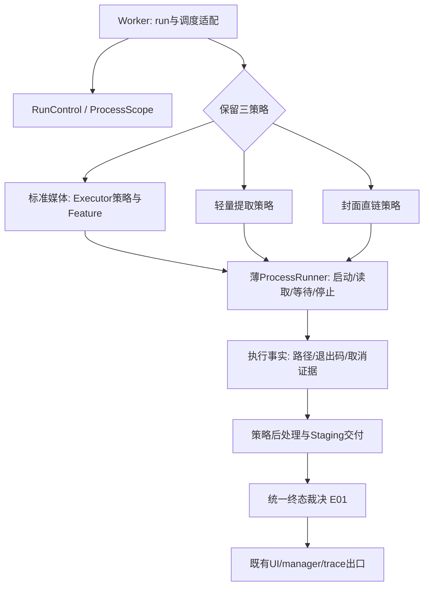

# 下载流水线优化 · 执行通道与控制语义

2026-09-19，基于 [新版架构 V2 运行架构](../architecture-v2/03-runtime-architecture.md)、[控制流](../architecture-v2/05-control-flow.md)、[风险登记](../architecture-v2/13-known-risks.md)及当前源码再次核对。本章仅为设计提案，没有修改业务、执行产品或运行测试。

证据标签：`[CONFIRMED/static]` 为源码或测试文本直接可见；`[INFERRED]` 为机制解释/风险推导；`[RECOMMENDATION]` 为尚未实现的建议；`[UNKNOWN]` 为未验证结果。以下新名字均是提案概念，不表示仓库已有对应类。

本轮先完整读取根 AGENTS.md、查看 dirty：既有 README/旧架构、locale、diagnostics、youtube_service 修改及未跟踪 V2/specs/test_playlist_authcheck 等均不属于本章可写范围。唯一写入是本文件；不把工作树视作干净提交快照。

需求对应：[00 G01–G09](00-goals-and-boundaries.md)中，E01覆盖G02/G03/G04，E02覆盖G02，E03覆盖G02/G06，E04覆盖G08/G09，E05覆盖G02/G07/G08，E06覆盖G01/G05/G08/G09。基础API约束统一引用[官方机制研究](evidence/research.md)，不以“换成QThread.requestInterruption”代替显式唤醒和进程收尾。

## 1. 推荐方向与明确保留项

[RECOMMENDATION] 优先把**终态裁决、取消唤醒和本轮子进程所有权**变成三条执行通道共享的薄边界；保留标准媒体、轻量提取、封面直链各自的参数生成、产物期望、重试和后处理策略。暂不引入统一巨型 Runner、全局 FSM、asyncio 或新的进程服务。

[INFERRED] 三路已有共同 Staging 交付协议，重复风险主要集中在“如何离开执行”和“谁负责停止资源”，而非所有下载逻辑都相同。先修 R11/R18/R27–29 能直接减少卡住、错误归类和假失败；全面重写会同时牵动 Cookie、字幕、VR、格式选择和文件事务，收益目前缺少测量支持。

[RECOMMENDATION] 必须保留：CLI 引擎边界；task/run/attempt 身份；live pause同run；after_fix重试同run且attempt单调；manager为transition生产者；trace为run outcome出口；Staging commit的唯一取消门及committed成功优先；六种UI模式映射三执行策略，不能把“六入口”改造成六个重复Runner。

[RECOMMENDATION] E01/E02直接使用现有opts/worker即可先实现，不以新的DownloadPlan重构为前提。已有[media-metadata设计](../../specs/media-metadata/design.md#L12)尚未实现，其MetadataFinalizer位于既有Feature后处理之后、Staging安全门之前，属于后处理职责，**没有最终commit权**。E03未来同样覆盖它启动的工具；不并行创造第二个元数据owner，不为容纳它擅自重排现有Feature列表。

## 2. 当前阶段 owner、输入输出及为何形成三路

| 阶段 / owner | 输入 → 输出与现状源码 | 现有缘由与代价 |
|---|---|---|
| 路由 / DownloadWorker.run | `[CONFIRMED/static]` cover_direct优先，随后skip_download，否则标准；输入持久opts，输出选定路径。[workers 1143行](../../src/fluentytdl/download/workers.py#L1143) | `[INFERRED]` 封面已有图片URL或字幕只需提取，无需媒体格式/合并整套流程；代价是手写进程/异常处理分散。 |
| 标准准备 / Worker + YoutubeService + Feature | Cookie请求快照+opts→合并执行配置→Staging→字幕解析→Feature configure/start。[1174行](../../src/fluentytdl/download/workers.py#L1174)、[1242行](../../src/fluentytdl/download/workers.py#L1242)、[1256行](../../src/fluentytdl/download/workers.py#L1256) | `[INFERRED]` 请求身份、格式和可选处理共同影响argv；目前部分Feature仍读取实时config，不能说全请求参数已冻结。 |
| 标准attempt / Worker + Executor | 新Executor、prepare_attempt、CLI输出→进度/路径/诊断事实，成功返回供后处理；automatic或after_fix可再入attempt。[1330行](../../src/fluentytdl/download/workers.py#L1330)、[Executor.execute 299行](../../src/fluentytdl/download/executor.py#L299) | `[INFERRED]` 独立attempt清理执行器局部数据而保留run身份/事务；重试预算与attempt序号不同。 |
| 标准后处理 / Feature有序列表 | reconcile/seal→SponsorBlock、Metadata、Subtitle、Thumbnail、VR→更新Manifest；单Feature Exception当前降为warning。[Feature顺序678行](../../src/fluentytdl/download/workers.py#L678)、[1561行](../../src/fluentytdl/download/workers.py#L1561) | `[INFERRED]` 尽可能交付已获得的主媒体；代价是处理失败、明确用户取消、必需能力失败不能全部按同一种warning处理。 |
| 轻量 / _run_lightweight_extract | skip_download、字幕/封面选项→自建argv/Popen→辅助产物→_fastpath_land；不经过标准Executor/Feature重试栈。[1988行](../../src/fluentytdl/download/workers.py#L1988)、[2163行](../../src/fluentytdl/download/workers.py#L2163) | `[INFERRED]` 避免无关主媒体门与嵌入处理；代价是进程、Cookie释放、取消和错误收尾另一份实现。 |
| 封面直链 / _run_cover_direct_download | 图片URL/命名→极简CLI/Popen→thumbnail；verify_opts补skip_download以表达无主媒体。[2330行](../../src/fluentytdl/download/workers.py#L2330)、[2407行](../../src/fluentytdl/download/workers.py#L2407) | `[INFERRED]` 保留图片URL和明确产物语义比套视频下载器合理；过期链接不能仅靠重复相同argv解决。 |
| 交付 / Worker + Staging | verify→plan→commit→最终路径/actual→cleanup；快速路不要求primary media/final.n.txt/embed证据。[标准1600行](../../src/fluentytdl/download/workers.py#L1600)、[fastpath1871行](../../src/fluentytdl/download/workers.py#L1871) | `[INFERRED]` 公用的是文件所有权协议，不是“必须同样有视频主文件”。 |
| 终结 / Worker finally + manager | _run_outcome→trace.finish；unified_status→manager transition与DB queue。[1123行](../../src/fluentytdl/download/workers.py#L1123)、[manager455行](../../src/fluentytdl/download/download_manager.py#L455) | `[INFERRED]` 一个事件出口约束计数，但赋值和diagnosis仍散落，不能仅靠finish去重证明分类正确。 |

表中事实均为静态证据；真实处理耗时、网络停止速度与资源峰值未知。

## 3. E01 — 先裁决再发终态，保留失败 attempt 的诊断

关联 V2 **R27/R28/R29**。优先级：第一批。

[CONFIRMED/static] 轻量[2310行](../../src/fluentytdl/download/workers.py#L2310)、封面[2503行](../../src/fluentytdl/download/workers.py#L2503)先发error/diagnosis再调用_fastpath_fail检查committed；EOF后[2251行](../../src/fluentytdl/download/workers.py#L2251)/[2464行](../../src/fluentytdl/download/workers.py#L2464)按rc分流。标准返回后[1528行](../../src/fluentytdl/download/workers.py#L1528)可能因is_cancelled跳过收尾，最终[1123行](../../src/fluentytdl/download/workers.py#L1123)落run_outcome_unset→failed。

| 可行方案 | 收益 | 代价/不足 |
|---|---|---|
| A 保持现状，仅增加日志/故障测试 | 改动最低；继续利用已有Staging finalizer | 能看到问题，不能修正已发失败诊断与取消错分；不推荐作为最终方案。 |
| B 小型终态裁决函数，三路接入 | 将相同优先级放在一处，避免每路先发副作用再补救 | 需要厘清Staging裁决可能包含清理副作用，必须防重复调用。**推荐。** |
| C 完整run状态机接管全部阶段 | 可统一状态转移约束 | 迁移面过大，容易把after_fix/显示状态误做run终态；当前不采用。 |

[RECOMMENDATION] B的输入是`RunContext`、明确的退出原因（执行完成/用户取消/异常）、Staging实际phase与执行证据；输出不可变`TerminalDecision`（内部结果、应发的signal/diagnosis、UI终态、交付路径、保留现场理由）。一处调用Staging finalizer完成必要副作用，另一个受保护出口应用decision。**不新增outcome producer**，仍由现有finally调用trace.finish。

[RECOMMENDATION] 优先级：已committed→success，后置错误只signal；尚在committing/rollback_failed→尊重Staging补偿/保留结论，不用cancel直接discard；可取消阶段且用户取消已线性化→cancelled；否则处理真实执行/校验失败。rc=0但空产物仍需verify，不得在裁决器伪造success。所有正常返回路径必须产生明确decision，unset仍保留为违规探针。

[RECOMMENDATION] 接入[04 A01](04-artifacts-and-recovery.md)的新CommitResult后，以Staging封存的“整组已确认交付”事实为准，包括最后member/最终committed检查点失败但内存已确认全组交付的情况；不能因磁盘phase滞后再判failed。E01不自行数文件或猜同名成品来制造success；needs_reconciliation继续保留不确定性并阻止自动重复交付。A05的finalize_delivery仅负责receipt持久化/DB确认，不重新仲裁或发第二次outcome。

[RECOMMENDATION] 取消和终结接受要有明确竞争顺序：控制锁只保护“cancel请求已登记/terminal已锁定”及快照，**不持锁执行文件提交、网络等待、signal或进程停止**。Staging commit仍以自己的gate/phase为事实来源；终态锁不能替代其提交锁。先接受终态后的取消成为no-op；先接受取消且未越commit门则取消；commit后无论晚到取消都成功。

[RECOMMENDATION] 不删除标准自动重试失败attempt已成立的diagnosis。一次run在失败attempt诊断后恢复成功是合法历史。需要消除的是“同一次已经提交成功的收尾异常却记为业务失败”，而非把所有成功run的历史诊断抹掉。

迁移/回滚：先给现有终结块加decision返回，再逐路接入，保持Signal签名、DB状态值、事件kind和run/attempt不变；不改任务schema。每批可代码回退，但不能在同一run中途切换新旧裁决。比较模式只比较纯decision，不双跑finalizer/cleanup/emit。

验收：三路rc=0/非零/空输出；stdout静默取消、EOF后wait前取消；标准execute返回前后取消；commit gate前/后取消；postcommit输出通知/清理合成异常。每例检查文件、UI最终值、outcome数量/类型、diagnosis与signal、资源已退出；不能只测函数返回。

## 4. E02 — 统一取消唤醒，先修 after_fix 的挂起缺口

关联 V2 **R11**。优先级：第一批，可先于E04。

[CONFIRMED/static] cancel设置_cancel_event并唤醒_pause_event，但不触碰suspend_event：[791行](../../src/fluentytdl/download/workers.py#L791)。after_fix先设is_suspended再新建Event，随后无超时wait：[1475行](../../src/fluentytdl/download/workers.py#L1475)；resume_suspension仅看到已发布Event且is_suspended时set：[759行](../../src/fluentytdl/download/workers.py#L759)。

| 可行方案 | 取舍 |
|---|---|
| A 保持Event分散，仅在cancel里判断属性并set | 最小修补，但cancel可能先于新Event发布，随后worker仍进入wait；单改一行不足以覆盖竞争。 |
| B run初始化时建立控制对象，集中cancel/等待谓词 | **推荐。** 永久cancel位，复用condition或受锁保护的Event代次；任何等待进入前后都重读cancel，不依赖一次唤醒不丢失。 |
| C after_fix立刻结束worker并释放槽，用户修复重建 | 改善大量失败占槽，但涉及same-run续接、txn保留与DB恢复；另立后续设计，暂不混入取消修复。 |

[RECOMMENDATION] `RunControl`归Worker拥有，从run开始前即可接受cancel；控制字段只有`cancel_requested`、`pause_requested`、修复等待`generation/action`和terminal锁定。resume_suspension带等待generation，旧弹窗不能批准新一轮等待。进入挂起在锁内发布generation和等待谓词；cancel登记后notify_all；等待循环检测cancel优先，再读当前generation对应action，抵抗虚假唤醒及重复点击。

[RECOMMENDATION] cancel接受必须同步更新供Staging gate、进程登记及所有等待读取的**同一个永久取消谓词**，可先适配现有`_cancel_event`；不能新`cancel_requested`已确认但等Qt排队信号到达后才set旧Event。Staging cancel_check读取此谓词，进程登记协议也读此谓词，UI信号只通知不承担控制状态复制。否则E01的“先接受取消且未越commit门则取消”仍会因双份状态延迟而失效。

[RECOMMENDATION] 暂保留现有自动退避按墙钟计时及用户修复后预算归零、attempt继续增长。pause不冻结退避剩余时间，但下一次attempt启动前检查暂停门；cancel可以打断退避/暂停/修复等待。控制锁不包住Qt信号发射，避免同步重入死锁。UI可以发命令，但只能由Worker接受后更新执行确认状态。

迁移/回滚：保留pause/resume/cancel/resume_suspension接口作适配；第一步不改队列/DB身份。旧UI未传generation时仅允许作用于唯一当前等待，并保留显式cancel接口；新UI逐步带generation。回滚仅在没有活动run时切版本，不能序列化并恢复线程Event。

验收：cancel在创建等待前/发布中/开始wait后；retry和cancel并发；旧generation迟到；暂停中取消；退避中取消；重复cancel/resume；每例要求有限结束并释放活动槽，无新attempt在已接受cancel后启动。超时只作测试失败界限，不能通过强制终止线程让测试“通过”。

## 5. E03 — 将 VR 和快通道纳入本轮进程所有权

关联 V2 **R18**，与R11/R28及资源退出风险协同。优先级：第一批取消修复之后。

[CONFIRMED/static] 标准由Executor持有_proc及terminate，快速路用Worker._proc_ref；VR `_run_ffmpeg`局部Popen/readline，无cancel检查或上述引用登记：[Executor469行](../../src/fluentytdl/download/executor.py#L469)、[Worker798行](../../src/fluentytdl/download/workers.py#L798)、[VR624行](../../src/fluentytdl/download/features.py#L624)。VR函数catch Exception返回False；外层Feature循环也catch Exception降warning。[Feature1561行](../../src/fluentytdl/download/workers.py#L1561)。

| 可行方案 | 取舍 |
|---|---|
| A 保持现状，VR仅开始/结束时检查cancel | 代码少，但无法中止静默长转码，不解决资源所有者缺失。 |
| B 本轮ProcessScope登记所有直接启动的执行子进程 | **推荐。** 先以现有Popen接入，无需立即替换参数和输出解析；cancel能找到VR。 |
| C 所有处理改为独立任务/独立进程服务 | 更强隔离，但需新IPC/产物协议、部署/权限维护；当前成本与问题不相称。 |

[RECOMMENDATION] ProcessScope owner是run，登记带stage/attempt及进程对象/句柄；先登记再消费输出，取消与登记使用短锁协议：若取消已接受，新登记立即停止并拒绝进入执行。取消时取快照，在锁外执行分级terminate/wait/kill；只有确认进程退出并收尾管道后移除登记，不能一发kill就认定资源归还。以进程句柄/持有对象校验身份，不引入按exe名全局kill。

[RECOMMENDATION] 此处ProcessScope是统一run/attempt资源scope中的“子进程登记部分”，与C02的Cookie runfile/资源收尾共用同一owner，不新增另一个全局manager。每attempt的子scope可结束，run scope保留身份与累计证据；POT共享服务不归单个scope强停，只有本任务waiter归本scope，服务所有权由C03约束。

[RECOMMENDATION] 覆盖静默stdout需要独立于readline的停止请求；不能把cancel检测仅移入逐行回调。标准Executor原有停止接口先作为适配，后续统一低层停止原语，避免Scope和Executor同时强杀/清Cookie。管道、Cookie runfile和workfile的释放继续由对应owner执行，并在子进程退出确认之后发生。

[RECOMMENDATION] VR要传播明确`DownloadCancelled`控制异常，且VR局部catch和Feature循环必须在普通Exception之前透传它；仅登记PID而将取消转为False/warning仍会继续管线。Feature普通失败的降级语义先保留；对于用户明确要求的VR转换未完成，后续应通过expected/actual说明降级或选择必需策略，不能隐式把cancel当降级成功。

[RECOMMENDATION] committing阶段不再以进程Scope取消去打断文件发布；请求仅记录pending_cancel，等待Staging裁决。新scope不替代Staging文件所有权，也不授权controller删除live txn。

迁移/回滚：标准、轻量、封面、VR逐个登记，同一进程只允许一个终止owner；先记录/断言重复登记，再撤旧引用。不修改最终产物格式/命名。回退时保持VR取消异常透传和最小登记补丁；不为了退回大抽象同时丢掉已验证安全修复。

验收：无输出的假yt-dlp/FFmpeg，VR转换中cancel，Popen刚成功但未登记窗口，停止失败/已退出/PID重用模拟，子进程树等待，正在commit时cancel；确认无活进程再清staging。平台集成测试必须另行在Windows临时目录执行，源码/mock证据不等于真实进程树验收。

## 6. E04 — 共享薄 ProcessRunner，保留三条执行策略

关联 V2 **R27/R28**重复处理根源。优先级：E01–03验证稳定后；若测不到维护收益，可延期。

| 可行方案 | 保持的优势 | 主要代价 |
|---|---|---|
| A 保留三份执行代码，仅共享E01/E02/E03 | 迁移小，模式特性完全保留 | 后续管道关闭/EOF处理仍可能漂移；短期可接受。 |
| B 三策略 + 薄ProcessRunner + 公共终结 | **推荐的目标**；复用进程协议而不复用媒体业务规则 | 增加少量数据对象/适配器，需逐路argv和产物对照。 |
| C 所有路径强制经现有DownloadExecutor/Feature | 表面重复更少 | 标准主媒体、final.n.txt、嵌入证据、非零退出文件大小恢复会污染纯字幕/封面；不推荐。 |

[RECOMMENDATION] ProcessRunner只接受预先验证的executable/argv/env/cwd、ProcessScope、输出consumer、取消控制，返回`ProcessResult(exit_code, cancelled, raw_facts, reported_paths)`。它不决定format、Cookie来源、诊断规则、重试次数、主媒体、空结果是否成功或Staging commit。bounded原文收集复用现有collector，不新增无限stdout缓存。

[RECOMMENDATION] 三个策略分别负责：标准参数/媒体进度/恢复证据/Feature栈；轻量字幕与封面提取参数和辅助产物期望；封面图片URL/命名/thumbnail期望。输出consumer使用同一底层流读取，但仍可各自解读行。标准非零退出的大小启发式只在标准策略判断，不能推广为“小图片不足10KiB就是损坏”或“字幕文件存在即可恢复成功”。

图为提案控制关系，不是当前类图；一次run仍只有一条被选择的策略，不能shadow双下载。

迁移/回滚：先封面直链做窄适配，再轻量，最后标准；使用假进程对argv/env/工作目录/路径报告做语义对照。发布时每run固定实现版本，禁止中途切换；可回退单策略适配，但公共取消/终态补丁保持。无需DB迁移，也不以新的抽象名重命名历史trace字段。

验收：六UI模式跨三策略，音频、精确片段、字幕语言/格式、封面直链和fallback、VR；匿名/带Cookie、非ASCII路径、stdout/stderr长行、静默EOF、返回码恢复。检查Feature顺序不变、快路无primary假门、所有产物仍经Staging、无重复outcome及工具启动次数不增加。

## 7. E05 — 暂停能力与确认语义应明确，而非宣传统一硬暂停

关联 V2 **R18/R29**及VS-09暂停差异。优先级：E02后，独立于共享Runner。

[CONFIRMED/static] pause立即显示paused，但实际只在标准progress `_wait_if_paused`阻塞；不表示CLI进程停止网络/FFmpeg，快速路与VR无相同检查。[765行](../../src/fluentytdl/download/workers.py#L765)、[891行](../../src/fluentytdl/download/workers.py#L891)。live pause保留线程/槽/txn/run，已结束worker重建是另一语义。[controller477行](../../src/fluentytdl/core/controller.py#L477)。

| 可行方案 | 取舍 |
|---|---|
| A 保持即时paused与现有Event | 兼容最强，但UI承诺超过执行事实；应至少补状态文案/能力限制。 |
| B 区分请求与worker检查点确认，按阶段公布能力 | **推荐。** 仍保留协作暂停；不承诺即时停止子进程I/O。 |
| C Windows进程树Suspend/Resume | 可减少进程执行，但外部工具锁/管道/子孙创建/跨平台与签名URL时效风险增大；不作为本轮默认方案。 |

[RECOMMENDATION] 执行上下文公布内部capability：`pause_mode=checkpoint/unsupported`、cancel是否允许立即停止、是否正在commit。UI先显示“暂停请求”；worker抵达checkpoint才确认“处理已暂停”，说明子进程可能仍在缓冲执行。只有有证据的实际I/O暂停才可表述网络已停止。fastpath/VR暂标unsupported，允许取消；不为统一外观插入阻塞stdout读取的伪暂停。commit期间取消为待处理，暂停不介入。

[RECOMMENDATION] 暂停请求/确认属于内存展示字段，不扩张现有DB状态集合和EventKind；确认后才投射现有paused，取消/完成优先于迟到确认。恢复保持同run/attempt，不发paused outcome。UI批量暂停也要区分queued停止派发与live pause，不能继续把取消queued任务呈现为字节续传保证。

迁移/回滚：先添加能力读取和文案，保留现有调用方法；旧UI适配仍能发命令但不可重启cancelled进程。若回退UI，保留控制门和终态排序，且不写入旧版本不认识的DB新枚举。

验收：stdout静默/密集输出、片段monitor双回调、FFmpeg合并、VR/轻量unsupported、退避暂停、pause→cancel、cancel→resume、完成前迟到pause确认；观察实际进程/字节变化，分别记录“请求接受”“worker等待”“I/O停止”，不混为一个断言。

## 8. E06 — 重试策略与执行意图分开，暂不释放 after_fix 的 run

关联 V2 **R11/R17**，以及配置冻结边界。优先级：E01/E02之后；吞吐优化另有证据再做。

[CONFIRMED/static] 标准automatic退避以cancel Event.wait中断；after_fix/预算耗尽保持线程等待，retry清预算并next_attempt。快速两路没有同等标准重试栈。[1421行](../../src/fluentytdl/download/workers.py#L1421)、[1475行](../../src/fluentytdl/download/workers.py#L1475)。QuickAdd single_worker设noplaylist=False，Worker合并后统一True：[QuickAdd129行](../../src/fluentytdl/core/quick_add_worker.py#L129)、[Worker1186行](../../src/fluentytdl/download/workers.py#L1186)。

| 可行方案 | 取舍 |
|---|---|
| A 保留opts自由合并、各路独立重试 | 兼容低成本，但执行意图和运行环境混在同一dict，容易覆盖路由语义。 |
| B DownloadPlan执行投影 + 显式RetryPolicy入口 | **推荐。** 保留现有序列化opts为外部兼容层，只冻结决定产物和模式的意图；环境/修复动作受控刷新。 |
| C after_fix变成可持久化续接并释放线程/槽 | 队列吞吐更好，但要定义同run跨Worker/txn lease/进程清理/应用重启恢复；本轮暂缓。 |

[RECOMMENDATION] 与入口章I01对齐：执行意图是`DownloadPlan`的只读投影，不再创建平行ExecutionIntent持久模型；记录通道、单项/列表展开语义、Cookie模式、字幕/音频/VR目标与命名规则，run开始规范化并验证冲突。`RunSpec`晚绑定代理、工具实际身份、有效凭据和Staging路径；冻结工具选择policy而非过期可执行身份/签名URL，不把全部全局config冻结成“永不更新”。用户after_fix提交允许修改项和revision，下一attempt原子读取完整新配置并记录decision；匿名Cookie模式不能被自动刷新悄悄改为认证请求。

[RECOMMENDATION] 标准保持已有规则budget/backoff；快路先保持“失败后显式重试”的策略，只有确认幂等和错误码适配后才增加有限自动重试。封面链接过期应先判断需要重取URL，不盲目重复同一请求；字幕不可用不是通用网络重试。与I01列表父计划/媒体子项设计一致，每个实际媒体worker仍执行noplaylist，列表展开归入口计划；旧QuickAdd single_worker须显式兼容转换并验任务数/argv，不能让worker隐式偷扩列表，也不能悄悄只下载首项。

[RECOMMENDATION] after_fix暂继续占槽，原因是保住现有run/txn/attempt语义并优先修醒不过来的缺口；代价明确为大量挂起可阻塞批量吞吐。后续若实际队列指标证明需要释放槽，应单独设计“等待修复也持有run而不持有执行线程”的续接对象、txn lease、有限保留期和重启语义；不能只把QThread结束并重新new_run冒充同一次retry。

迁移/回滚：新意图对象从旧opts派生，初期不增加DB必须字段，缺项按旧语义加载；保留旧opts快照以便诊断兼容。受控revision只影响下一attempt，不修改正在运行子进程argv。旧版本读回仍能识别task/opts，但在同run跨版本恢复之前必须按已有新run恢复规则处理。

验收：automatic预算耗尽→after_fix→预算重置但attempt不归零；修复与cancel竞争；旧修复对话框；修复只影响允许字段；anonymous跨retry不附Cookie；列表single_worker/expand与noplaylist冲突；VR选项/字幕语言不随全局设置变化漂移；标准与快路重试次数分别符合策略。

## 9. 已有测试的实际覆盖与缺口

以下只读测试正文，**没有运行通过结论**；测试注释不是产品实现证明。

| 测试资产 | 实际验证方式 | 能复用什么 / 不覆盖什么 |
|---|---|---|
| [test_download_staging 1278行](../../tests/test_download_staging.py#L1278)、[1310行](../../tests/test_download_staging.py#L1310)、[1345行](../../tests/test_download_staging.py#L1345) | 临时真实文件，包装os.replace/os.open触发取消，调用Staging.commit | 可守commit前后文件不变量；没有驱动Worker.cancel、Qt信号或真实进程。 |
| [test_21d 1364行](../../tests/test_download_staging.py#L1364) | AST/inspect断言取消门数量和位置 | 防误加gate；结构守卫不能证明时序无竞争，重构时应保持行为断言优先。 |
| [postcommit 1532行](../../tests/test_download_staging.py#L1532) | 已commit后直接finalize_failure，断言already_succeeded及signal | 守Staging仲裁；未覆盖fastpath先发diagnosis的顺序，需E01完整路径测试。 |
| [429 Worker测试548行](../../tests/test_observability_contract.py#L548) | 实际worker.run，FakeExecutor首次429次次取消，features=[]，退避置0 | 已覆盖automatic同run与attempt递增和一个outcome；不覆盖真实退避时取消、after_fix等待、Feature和EOF。 |
| [TaskTrace exactly-once671行](../../tests/test_observability_contract.py#L671)、[producer守卫659行](../../tests/test_observability_contract.py#L659) | 直接TaskTrace.finish与源码发射点检查 | 约束计数和producer；不能证明三路选择了正确终态，也不能证明强停finally执行。 |
| [raw dump249行](../../tests/test_observability_raw_dump.py#L249)、[clean success302行](../../tests/test_observability_raw_dump.py#L302) | FakeExecutor驱动多attempt或写payload文件，features=[] | 可复用原文跨attempt和真实Staging成功夹具；不覆盖VR/快路子进程取消。 |
| [字幕取消282行](../../tests/test_subtitle_deferred_resolution.py#L282) | mock extract抛YtDlpCancelled，调用字幕解析helper | 覆盖取消不降级成语言pattern；没有完整轻量生命周期。 |
| [WorkerErrorDialog101行](../../tests/test_worker_error_dialog.py#L101) | 真Qt对话框点击，断言fix_requested字符串 | 可守修复动作展示；不验证resume_suspension唤醒、generation或slot释放。 |
| [Cookie模式135行](../../tests/test_youtube_cookie_mode.py#L135) | mock service捕获字幕迟解析请求模式 | 意图兼容的单环节证据；不等于三策略全过程匿名验证。 |

[CONFIRMED/static] 本轮在tests搜索`resume_suspension/suspend_event/_wait_if_paused/_run_ffmpeg/_fastpath_fail`与三路方法名，没有找到直接覆盖R11/R18/R27–29完整交错的测试主体；相关符号仅有部分helper/说明引用。[UNKNOWN] 这不是全仓动态覆盖率报告，也不能排除间接覆盖；因此计划验收按缺失的行为证据补，不用“现有测试全绿”作替代。

## 10. 实施顺序、停止条件与验收记录

[RECOMMENDATION] 顺序为：E01终态矩阵与E02等待唤醒 → E03进程所有权/取消异常透传 → E05能力与展示 → E06意图/重试边界 → 有维护收益证据后E04抽公共Runner。最初三项可以在当前文件结构中完成，不能把抽象重构作为修复安全缺口的前置条件。

[RECOMMENDATION] 每一批先补最小故障夹具，再改一个边界；测试分纯裁决/临时真实文件、假进程协议、Qt投递、Windows真实受控子进程四层。后两层需要后续明确的执行环境，本文没有替它们填“通过”。涉及媒体联网验收时用获授权的受控素材，不能让本次文档工作暗中触发下载。

验收记录必须包含：提案ID与V2风险、旧/新行为、模式与phase、task/run/attempt、请求/确认顺序、子PID退出证据、Staging最终phase/文件、UI/DB/trace、实际运行层级与未覆盖限制。不可接受的回归包括：已committed转failed/cancelled、cancel后新attempt、匿名请求变认证、快路被要求主媒体、Feature顺序漂移、重复outcome/diagnosis、活进程尚存就删除沙盒。

[RECOMMENDATION] 回滚单位是一个已经验收的边界/策略适配，不是整套代码大爆炸。若新实现改变argv语义或终态数量，停止扩大范围并退回该适配；已经确认的取消唤醒、成功优先和资源归属修复应保留为独立补丁。文档阶段到此结束，未获得业务实现授权前不修改这些代码。
