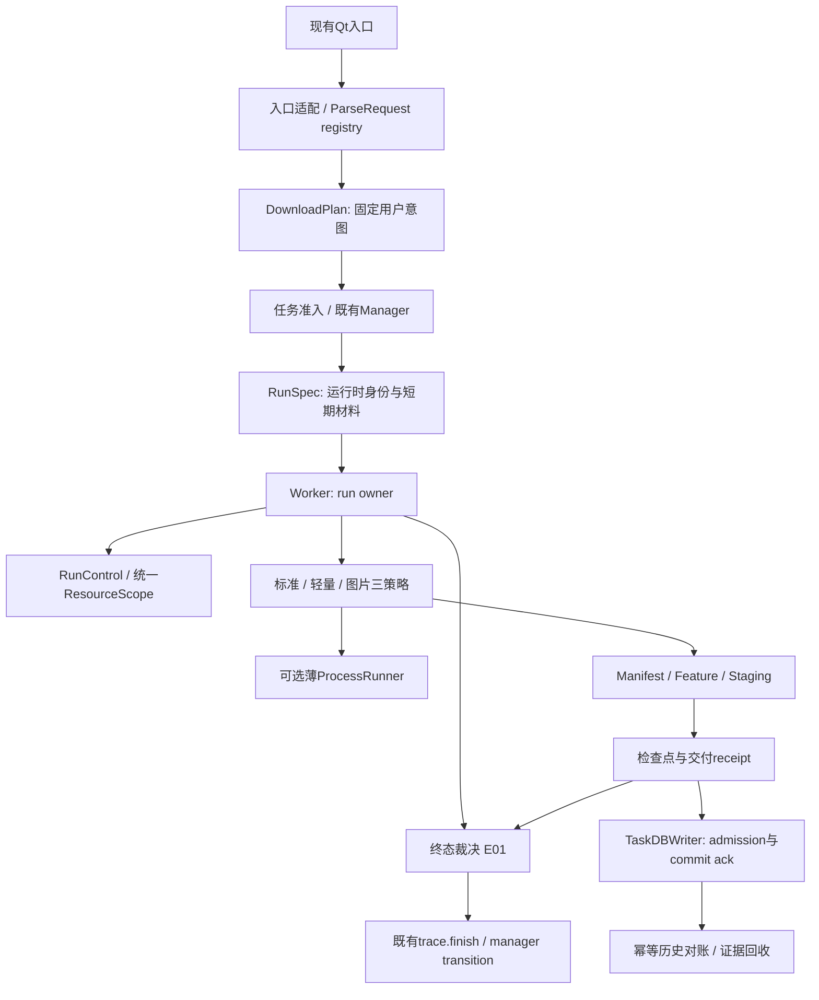

# 方案总裁决 · 哪些更优、哪些暂时不值得

本章所有目标设计均为[RECOMMENDATION]。源码依据、备选方案和行为边界分别在02–05；这里做跨章取舍，避免每个模块各自优化后产生多个owner。效益是待验证假设，不是实测结论。

## 1. 总体选择

推荐**在现有Qt + CLI + Staging + SQLite结构中渐进收拢责任**。先解决退出/身份/交付语义，再统一计划和基础执行协议，最后用测量决定缓存、合并请求、懒建worker等性能工作。

理由：目前最具体的证据指向边界缺口，如取消没有唤醒独立等待、最终交付与错误诊断排序不同、journal写失败仍继续、旧请求可回填、writer没有确认；这些问题不会因为换异步框架或增加线程自然消失。改动边界越小，越容易把行为改善与回归归因到具体修改。

## 2. 推荐目标结构与单一职责

图是建议责任关系，不是必须新增同名类。ParseRequest和DownloadPlan的纯数据类型可放现有models层；裁决/控制留在download层；DB确认留storage层；POT与认证继续各自由原服务拥有。先在原文件建立可测函数，再依据依赖决定是否拆文件，避免为画图先新建空框架。

| 契约 | 唯一owner | 不允许承担的职责 |
| --- | --- | --- |
| DownloadPlan | 任务确认/迁移入口I01；持久用户意图 | 不存Cookie字节、签名URL集合、进程句柄或临时txn路径 |
| RunSpec | Worker按I05绑定；可含C01的ExecutionBinding | 不覆盖用户显式意图；它是运行快照，不是第二份持久任务计划 |
| RunControl | E02 Worker生命周期 | 不持锁执行文件IO、发Qt信号或等待进程；不是全局产品FSM |
| ResourceScope | E03 run owner，attempt子scope登记资源 | C02只登记runfile；ProcessScope只是其中进程部分；不得杀共享POT或删live Staging |
| Staging与CommitResult | A01/A03文件交付owner | 不直接发第二个run outcome，不假定DB已经保存 |
| TerminalDecision | E01统一结果仲裁，应用到既有出口 | 不和A05重复发成功，不双跑finalizer，不抹除合法失败attempt诊断 |
| WriteReceipt / DeliveryReceipt | 前者A04确认SQL，后者A05记录文件交付证据 | 不混同两种receipt；DB失败不回滚用户成品，晚ack不重发outcome |
| Parse settled | I02 registry确认一次内部终结 | UI丢弃旧结果也要释放容量；它不是下载run outcome |

`needs_reconciliation`是文件交付维度的不确定结果，不新增outcome枚举。若本轮已结束但不能确认整组交付，使用现有failed终结并附安全的待核对原因，UI说明“交付状态待核对”，不宣称已回滚/文件已删，也不自动重新下载。若Staging已经确认整组交付，则维持success，即使checkpoint或DB同步仍待处理。最终字段命名与映射须由E01/A01同一评审确认，不能由receipt处理器自行选终态。

待核对状态必须进入受保护的任务/receipt或事务记录，单项重试、批量重试和重启恢复统一检查；只改UI文案不足以阻止既有error恢复路径重复交付。若状态写入失败但仍有关联未决txn，恢复先核验现场，不默认放行。无法建立持久证据时明确降低跨启动保证，不能凭内存标记承诺防重。用户显式新建下载前，应展示可能已有成品与保留现场并处理归属，不自动discard。后续对账若确认旧run其实已交付，只修复历史/交付记录并发signal，不重发或改写已锁定的原run outcome；执行时证据不足与后来确认事实分别保留。

## 3. 21项提案的选择与次序

成本S/M/L是相对实现与验证面，不是工期估计。优先程度由危害与前置证据共同决定，高风险不意味着可以跳过协议设计。

| ID | 推荐动作 / 直接收益 | 成本与风险 | 次序裁决 |
| --- | --- | --- | --- |
| I01 | 有版本语义Plan+兼容adapter，减少无声覆盖 | L；旧任务/六模式/metadata政策兼容 | 核心安全修补后逐入口接入 |
| I02 | request_id/view_epoch/settled，避免迟到写错行与槽位不释放 | M；Qt对象寿命与信号签名 | 第一批，可独立 |
| I03 | 先统一失效epoch，默认TTL0保持；合并在途请求需测量 | S→L；身份、取消订阅复杂 | epoch第一批；缓存性能后置 |
| I04 | 修列表语义冲突，目录扫描去重、分批准入 | M→L；批次部分成功和历史转换 | 分块/展示先做；懒worker后置 |
| I05 | 工具身份晚绑定、分级preflight、按identity合并probe | M；版本变化需重验格式资料 | Plan适配后接完整身份协议 |
| E01 | 先仲裁再发终态，消除已交付后的假失败 | M；三通道错误与文件边界 | 第一批，保持原事件出口 |
| E02 | 永久取消谓词与等待代次，修after_fix唤醒竞争 | M；同步重入/丢唤醒 | 第一批，不等待Plan |
| E03 | 全部本轮直接子进程登记，VR取消异常透传 | M；Windows树/管道/强停确认 | E02后；协同C02/A04 |
| E04 | 薄ProcessRunner复用进程协议，三策略保留 | L；参数/输出/Feature回归面大 | 只有维护收益明确再提取 |
| E05 | 暂停请求、确认及能力分开 | M；UI兼容但不加DB新枚举 | E02后；不承诺硬暂停网络 |
| E06 | 意图与恢复设置分开；明确各策略retry | M；same-run/attempt兼容 | E01/E02后逐步接Plan |
| A01 | 分阶段journal确认，发布事实优先 | L；最危险为部分/最后成员已发布 | 与A02联合设计，单独故障矩阵审查 |
| A02 | 未知现场保护、新根隔离旧GC | L；旧版回退/安装清理/多实例 | 可先收窄旧GC删除；新协议随A01 |
| A03 | 逐个占位归属登记和补偿验证 | M；目标替换/异常中断 | 先做可隔离的边界修复 |
| A04 | 关键SQL回执与异步退出屏障 | L；Qt在途信号与迟到生产者 | 先可选ack，再封口；依E02/E03终结 |
| A05 | 文件receipt、DB原子终态与幂等对账 | L；格式/任务删除/旧run冲突 | 依A01/A02/A04/E01 |
| A06 | 先明确恢复层级；字节续传另证 | S文案→L协议 | 恢复说明可先做；自动续传暂缓 |
| C01 | 选择账户与有效材料分开报告 | S→M；凭据版本与meta不一致 | 提示/详细结果先做；绑定后接I01 |
| C02 | 先资源保护区，后owner感知副本清理 | S→M；私密残留/旧GC兼容 | 最小窗口第一批；scope随E03 |
| C03 | 任务取消只退出POT等待，服务按owner停止 | M；端口/Job/共享预热 | E02后，不依赖上游新增nonce能力 |
| C04 | 源头日志白名单，低频阶段测量 | S→M；漏脱敏/统计自扰 | 隐私小修第一批；测量贯穿后续 |

## 4. 明确不采用或延后的方向

| 方向 | 为什么当前不是更优解 | 重新评估条件 |
| --- | --- | --- |
| 全部改asyncio/微服务/进程Actor | Qt与现有CLI已经划分执行边界；引入新调度/IPC不能直接修语义错误 | 测量证实线程结构无法满足规模，且有独立迁移收益 |
| 三通道强行套标准Executor | 主媒体、retry、输出与附属要求并不相同 | 能证明一个更小公共协议，不污染各策略语义；即E04而非巨型执行器 |
| 全局完整FSM替代所有状态 | task、run、attempt、txn、DB提交不是同一状态维度 | 局部契约稳定后，存在清晰状态owner的子模块可单独建状态机 |
| 直接提高并发、fragment数或默认缓存TTL | 未有网络/磁盘/429/内存基线，可能恶化响应与失败 | 08中的负载矩阵与对照数据支持，并有回退开关 |
| 每任务复制全部工具或永久Cookie快照 | 时效、空间、身份与秘密治理成本过大 | 独立的受控复现实验确需，而非普通下载默认 |
| 所有日志写失败都抛错 | 观测必须best-effort；产物journal又必须按发布阶段区别 | 分开安全记录与诊断记录，采用A01条件合同 |
| SQLite改另一个数据库/多writer | 目前缺口是确认与退出，不是已证明SQLite容量耗尽 | 先测单writer吞吐与持久要求，确认无法满足再选型 |
| DB失败就删除已交付文件 | 会把历史同步问题变为用户文件损失 | 不适用；交付事实与记录同步应分开 |
| 跨启动自动接管旧part、自动重放commit | 缺工具/格式/字节身份、所有权和幂等协议 | A06专门验证通过，且有必要收益；不得从continuedl字段推出 |

## 5. 与既有metadata设计及周边系统的接口

[CONFIRMED/static] `specs/media-metadata`已经提出policy冻结、字段来源、candidate验证与采纳，仍是方案阶段。[RECOMMENDATION] I01复用其policy字段及迁移约定；E03纳管它未来启动的工具；Staging继续拥有最终commit。这里不改变容器标签语义，也不把另一个设计当本轮已实现。

更新器和组件安装只影响I05有效工具身份及运行中更新协调；若新协议改变暂存根，必须补安装/卸载与回滚清单。ControlCenter的KV/D1风险仍归V2，不阻断本地下载安全修补，也不借本任务发布云端变更。

## 6. 接口演进的停止条件

出现以下任一情况，应停止扩大接入并退回该适配层：相同意图产生未经说明的argv变化；匿名请求附带身份；输出绕开Staging；已交付改成失败；旧版本GC能触达新格式危险现场；真实进程尚活就清runfile/沙盒；一任务产生两个终态owner。

回滚必须以没有活动run或已完成安全交接为前置。不能用运行中切实现、删除新journal、恢复危险端口广播或恢复原文秘密日志来“恢复兼容”。具体工作包与验收在[07](07-roadmap-and-work-orders.md)、[08](08-validation-and-benchmarks.md)。
