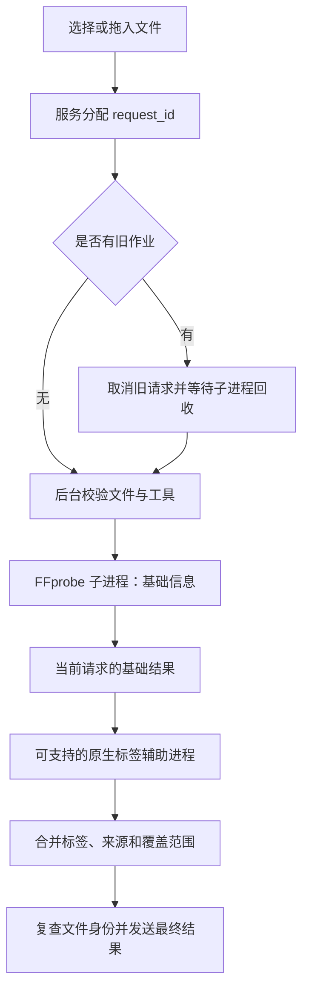

> 2026-09-21 界面修订：原六页签/表格布局已由用户要求的类型卡片替代。当前页面行为以 requirements.md 的 R4 和 implementation.md 的卡片修订为准；下文后台读取/报告合同继续适用。

# 页面与技术设计

设计草案，依据 [需求](requirements.md) 与 [源码研究](research.md)。

## 1. 页面设计规格

**用途**：帮助用户核对本地文件的实际媒体属性与文本标签，解释字段的读取范围、来源和缺失原因。

**视觉方向**：沿用 FluentYTDL 的 Windows Fluent 工具界面，强调可扫描的字段表和音轨选择。不采用网页落地页、装饰性大封面或统计仪表盘布局。

**主题与字体**：使用应用已有主题背景、CardWidget、边框及主题强调色；保持用户可配置的强调色，不新增固定主色。辅助文字遵循项目已有浅色 `#606060` / 深色 `#D2D2D2` 约定。字体继承应用 `Microsoft YaHei UI`，标题使用 SubtitleLabel/StrongBodyLabel，原始读取结果使用系统等宽字体。

本项目既有 Fluent 设计系统优先于通用 Web UI 技能的配色、字体和不对称布局建议；不引入网页字体、Tailwind 或远程视觉资产。

### 导航

在 `ReimaginedMainWindow` 中注册 `MediaInfoPage`，objectName 为 `mediaInfoPage`，中文“媒体信息”，英文“Media Info”，图标采用现有 `FluentIcon.INFO`。位置在“任务”之后，设置继续位于底部。首次打开才创建读取服务，构造页面不启动扫描或组件网络检查。

### 布局草图

```text
┌ 现有侧边栏 ┐ ┌ 媒体信息                              [选择文件] ┐
│ 新建任务   │ │ 拖入一个本地音视频文件，即可查看信息               │
│ ……         │ │                                                  │
│ 任务       │ │ 文件名.webm                          [重新识别]    │
│ 媒体信息 ● │ │ 文件路径（可展开）  大小  时长  读取状态            │
│            │ │                                                  │
│            │ │ 概览 | 视频 | 音频 | 元数据 | 章节与附件 | 原始结果 │
│            │ │                                                  │
│            │ │ 视频流 #0 · VP9                         [切换流]  │
│            │ │ 编码尺寸    3840 × 2160                            │
│            │ │ 平均帧率    23.976 fps（24000/1001）     [来源]    │
│            │ │ 视频码率    —                           未提供    │
│            │ │                                                  │
│            │ │ 作者/艺术家 Red Bull                    [来源]    │
│ 设置       │ │                           [复制摘要] [导出报告]   │
└────────────┘ └──────────────────────────────────────────────────┘
```

图中值引用既有 WebM 调查，仅为布局示意。制作 UI 时全部由结果模型驱动，不能把示例写进运行页面。

顶层采用 ScrollArea；外边距与现有页面协调（建议 24–30 DIP），正文左对齐、占满可用宽度。宽布局概览采用两列字段，内容区低于约 760 DIP 时折为单列。页签使用现有 Fluent Pivot 体系，窄窗口保证可滚动/切换，不能裁掉入口。轨道和原始标签列表使用模型/委托，避免每个值创建一个 QWidget。

空态保留文件按钮和拖放说明；读取中显示阶段和取消按钮；部分成功使用页内提示，不连续弹 InfoBar。无音频/无视频属于正常内容特征，不显示为故障。错误提示可用项目封装的 InfoBar，但原始 stderr 不直接展示。

### 已完成任务右键入口（首版）

在 `UnifiedTaskListPage._on_context_menu()` 的“打开所在文件夹”附近增加 `查看媒体信息 / View media info`。仅单任务作用域且 `effective_state == completed` 时启用；已知仅图片/字幕的任务可以禁用并说明原因，未知媒体类型在后台读取前判断。菜单构建不查库、不探测文件、不改变勾选。已缓存的“文件丢失”不作为永久禁用依据，避免文件恢复后入口仍失效。

```text
已完成任务 → 右键“查看媒体信息”
  → 点击时通过现有 resolve() 取得单行并校验 db_id/完成状态
  → 发出 inspect_media_requested(task_id, recorded_path, task_title)
  → 主窗口切换至 mediaInfoPage，侧边栏同步选中
  → 媒体信息服务后台校验路径并自动读取
  → 显示该成品信息或具体的不可读取原因
```

菜单保存稳定的 db_id，并在触发时与重新解析的行对象比较；不把 proxy 行号长期作为任务身份。任务删除、作用域改变或状态已变为运行中时，取消本次请求并提示，不继续使用菜单创建时的旧路径。信号接收方不再用行号重新定位目标。

成品路径使用 `TaskRow.effective_output_path`（实时有效路径优先，历史快照兜底），只有完成状态才传入。这里不照搬“打开所在文件夹”的目录/全局下载位置回退，不从任务 URL、标题或历史画质信息推测媒体属性。页面中的技术信息始终来自实际文件。

页面顶部可显示“来自任务：标题 · 记录的主成品”，该任务上下文仅保存在当前会话，不混入文件标签。到达页面后立即进入对应请求状态，清除旧文件详情；文件丢失/无路径时显示原因与“选择文件”，无需先弹出路径选择器。手选替代文件后标记为用户选择，不自动把它认作原任务成品，也不回写任务数据库。

返回提供“返回任务列表”，仅切换已有页面实例，不重新创建列表或重置筛选、勾选和滚动位置。多成品任务默认读取目前记录的主成品；完整历史产物枚举不属于本次入口所保证的能力。该入口的连续触发与拖放共用同一个服务、取消机制及 request_id。

## 2. 页签与字段

| 页签 | 内容与交互 |
| --- | --- |
| 概览 | 文件名、大小、容器、时长；所选主要视频/音频的摘要；标题、作者和日期；读取覆盖/部分结果说明 |
| 视频 | 所有非封面视频流：索引、默认标记、编码/profile、编码尺寸、SAR/DAR、旋转、平均/参考帧率、报告帧数、码率、像素格式、位深及色彩参数 |
| 音频 | 每条音轨的索引、语言/名称、默认标记、编码、采样率、声道数/布局、码率；位深只在读取器提供时展示 |
| 元数据 | 标题、作者/艺术家及角色、年份与完整日期分别列示、简介、备注、来源链接、分类/关键词、版权、专辑与剧集字段；展开来源查看原生键与候选值 |
| 章节与附件 | 章节起止时间/标题；字幕流语言、格式、默认/强制标记；封面与附件的类型、数量、大小（可读取时）；首版不解码/预览封面 |
| 原始读取结果 | 作用域/原生键/类型/值的可筛选列表及 FFprobe 结果；指明是读取器输出，不是文件全部原始字节或所有容器元素 |

概览视频选择规则：排除 `attached_pic` 后优先 default 流，否则选最小 stream index；音频同理。用户选择保留至更换文件。仍在文件中的多个主视频、角度或语言不会被概览选择删除。

色彩和空间字段展示“文件报告的参数”。仅凭 10-bit、色域字段或存在空间标签，不能宣称已经验证 HDR/杜比视界/VR 播放兼容性。

## 3. 数值语义

每个值同时保存原值、格式化显示值、单位、来源和可用状态。来源与可信度不同：标签存在只能证明文件声明了这个值，不证明作者身份或日期真实性。

| 字段 | 规则 |
| --- | --- |
| 文件大小 | 文件系统 size；显示 MiB/GiB，同时可展开字节数；不是音视频有效载荷总和 |
| 时长 | 优先展示有效容器时长；缺失时可另列流时长，不能不加说明地替代。负值、NaN、Infinity 不可用 |
| 平均帧率 | 有效 `avg_frame_rate`，保留分数和小数；`0/0` 或非法分母不可用 |
| 参考帧率 | 有效 `r_frame_rate` 独立展示为参考/探测值，不能直接称实际平均帧率 |
| 帧率模式 | 首版为“未分析”，不由上述两个比值猜测 VFR/CFR |
| 总帧数 | 有效 `nb_frames` 显示为“文件报告帧数”；未提供则留空，不用时长乘帧率补齐 |
| 总码率 | `format.bit_rate` 有效时显示“探测总码率”；否则仅在 size 与容器 duration 均有效时计算 `size × 8 / duration`，标为“估算总码率（含封装开销）” |
| 单轨码率 | 有效 `stream.bit_rate` 显示为探测值；BPS 等标签另标“标签声明”。两者均缺失则为未提供；不通过总码率减音频码率反推视频码率 |
| 单位 | bps/kbps/Mbps 使用十进制；Hz/kHz 使用十进制。展示四舍五入不改变导出原值 |
| 日期 | 保留原始字段和精度；上传日、发行日、编码时间、文件修改时间分别显示，不互相当作替代字段 |
| 分辨率 | 编码宽高和旋转/像素宽高比分开；如展示旋转后尺寸必须标识计算条件，不把非方形像素误作方形像素 |

字段可用状态为 `present / absent / unsupported / error / truncated`，字段来源为 `filesystem / probe / native_tag / derived`。冲突是候选值间的关系，不复用“未提供”状态。`absent` 的界面措辞为“本次读取未提供”，避免超出读取覆盖范围。

## 4. 文本标签映射

保留三层数据：FFprobe 的完整受限结果、原生标签枚举、面向页面的逻辑字段。页面逻辑层可以组织同义标签，但不能抹掉原始候选。

- 容器级和流级分开，不默认把音轨标题当成整部视频标题；同名标签在不同轨道仍是不同记录。
- MP4 `©nam/©ART/©day`、ID3 `TIT2/TPE1/TDRC/TYER`、comments 和 Matroska 的 TITLE/ARTIST/DATE 等作为已知映射；原有表只作为映射来源，不能照搬“仅取首值”的回读函数。
- 普通 `artist` 的人名列表保持原多值边界；含逗号的姓名仍是一个值。旧写入中已有的扁平化字符串不能凭空还原。
- FluentYTDL 的 `AUTHORS_JSON`、`AUTHOR_ROLE`、`UPLOAD_DATE`、`RELEASE_DATE`、分类/关键词等扩展按命名空间解析，并注明文件声明；JSON 无效时保留原文本和解析问题，不崩溃。
- 已知原生字段在对应容器的枚举结果可用时作为首要展示候选，FFprobe 值作为交叉读取；差异保留。扩展作者列表可辅助显示，但不能隐藏与 ARTIST 的冲突。
- 备注可能只是普通备注，只有内容是完整有效的 HTTP(S) 页面地址时才作为来源候选；不自动打开链接或补全网页信息。
- 标签内容以纯文本呈现。内嵌 HTML、Markdown 和 URI 不执行、不下载。二进制值不转为巨量 Base64；只显示类型/长度以及省略原因。
- Matroska 首版基于 FFprobe 暴露的容器/流/章节标签；未知嵌套、重复或带 Target/语言结构不宣称无损枚举，报告 `coverage=reader_projection`。

## 5. 模块边界

下面均为计划路径，不代表已有实现。尽量复用只读逻辑，保持下载写入模块行为不变。

| 模块 | 职责 |
| --- | --- |
| `models/media_inspection.py` | InspectionRequest、InspectionResult、MediaStreamInfo、FieldValue、TagEntry、ReaderCoverage；无 Qt/下载依赖 |
| `processing/media_inspector.py` | 校验文件、选择读取器、合并结果、生成明确来源的计算字段；不做标签写入或网络提取 |
| `processing/media_inspection_process.py` | 有界 stdout/stderr、超时、取消、精确子进程登记与清理；与旧写入 runner 分开，减少回归面 |
| `processing/metadata_readers.py`、`metadata_tag_schema.py` | 提取只读原生枚举和映射；写入器通过兼容导入继续使用已有函数，禁止改变写入结果 |
| `processing/media_tags_worker.py` | 原生标签辅助进程入口，只读本次指定文件，生成有界 JSON，无 Qt、账号、日志 sink 或常驻服务初始化 |
| `core/media_inspection_service.py` | QObject 服务、后台 worker、request_id、线程安全取消、当前作业与最后一个待执行请求；不新增全局 singleton |
| `ui/media_info_page.py`、按需要拆出的 `ui/models/media_info_model.py` | 页面状态、字段表、轨道选择、复制与导出意图；通过 Signal 与服务交互 |
| `ui/reimagined_main_window.py` | 导航注册、服务生命周期、正常退出/托盘/更新重启的接线 |
| `ui/unified_task_list_page.py` | 已完成任务右键动作、作用域与稳定身份校验、发出自动导航读取请求；保留现有勾选行为 |
| `main.py` | 在 GUI 与单实例初始化前分流 `--media-tags-worker`；源码模式与 frozen 模式都可运行 |

导出由服务/专门只读报告组件从不可变结果生成，用户选择目的地后才写报告文件；导出前再次拒绝与输入媒体同一文件。媒体读取器没有任何 `save()`、`write_*()` 或 StagingArea 权限。

### 读取顺序



图中取消路径仅在已有作业时执行；新作业必须等旧作业释放后才能启动，防止快速切换积累进程。

FFprobe 基础参数使用 `-show_format -show_streams -show_chapters -of json`；不加 `-show_packets`、`-show_frames`、`-count_frames`、`-show_data` 或全媒体哈希。使用参数数组与绝对路径，不通过 shell 拼接用户输入。读取限定本地普通媒体，拒绝 URL/播放列表/设备；协议约束作为防止误读远程资源的补充，不能只靠扩展名判断内容。

原生补充独立启动辅助进程，输入为小型 JSON 请求（路径、识别的容器类型、读取预算），输出为单份有界 JSON。该进程不再启动 FFprobe，因此父作业始终只管理一个直接子进程。这样取消可以精确停止当前读操作，不使用全局 `taskkill /IM` 或 `QThread.terminate()`。

冻结 GUI 程序的标准输入输出不能直接假定等同于控制台 Python。实现必须为辅助入口显式接通父进程管道并做 frozen 端到端验收，不依赖普通 `print()` 作为已验证协议。若打包模式无法可靠获得这些句柄，先解决通信接线，不以在主线程直接执行原生解析替代。

## 6. 工具与资源预算

读取开始时冻结工具选择：配置了有效自定义 FFmpeg 路径时优先使用相邻 FFprobe；未配置时使用现有 `locate_runtime_tool()`。明确配置却缺少相邻 FFprobe 时提示修复配置，不能悄悄使用其他版本掩盖问题。展示的探测器版本应来自实际执行文件，版本查询本身亦有超时并缓存。

建议初始预算（实现后用大文件/损坏样本校准）：基础探测 60 秒；原生标签补充 15 秒；FFprobe stdout 8 MiB、stderr 64 KiB；辅助进程请求 64 KiB、响应 8 MiB。读取管道要同时排空，超限停止对应子进程，不先无限读取再截断。

原生适配器需先检查可识别的标签区尺寸并约束累计读取量，避免直接载入巨型封面；超出能力时只保留基础结果并标记限制。显示单个长文本预览建议最多 16 KiB，完整已读取值可单独查看/复制；结果本身超过预算时不能声称持有全文。输出限制不等于进程内存硬上限，这一性能边界须通过压力样本验收。

结果保存在当前页面内存中，不写入任务数据库，不自动缓存到磁盘，不保存最近目录列表。文件身份采用规范路径、size、mtime_ns，平台能提供时附文件 ID；读取前后比对只检测常见变化，不是密码学稳定性证明。

## 7. 状态及生命周期

```text
idle → validating → probing → reading_tags → ready / partial
                    └失败→ failed
活动阶段 → cancelling → cancelled
文件身份变化 → changed（提示重新识别）
```

每个结果携带 request_id、file_identity 和 reader 状态。仅服务中当前请求可更新页面；取消、超时、失败、成功只选择一个终态。基础结果可以先显示，但其“标签补充中”状态不能提前变成全部完成。

更换文件立即更新选择状态并清空旧文件详情，正在回收时显示“正在切换文件”。取消信号由服务设置共享 Event，不能排队到正在阻塞读取的 worker 槽而永远得不到执行。子进程登记与取消检查使用同一同步边界，覆盖“取消发生在进程创建前后”的竞争。

切换页签/主页面、最小化到托盘不取消；用户主动取消、清空或真实退出才取消。主窗口 `closeEvent` 的实际退出分支、`quit_app`、更新/语言重启入口均调用统一停止流程；引用保留至 worker finished，不能销毁运行中的 QThread。退出采用异步收尾和有界等待，2 秒取消响应是本地正常 I/O 条件下的验收目标，不承诺失联设备的任意内核 I/O 可即时中止。

日志仅记录读取器、容器、耗时、流数、稳定错误码与匿名作业编号；文件路径和标签正文不进入常规日志。此作业不是下载，不产生下载 `transition/outcome` 或任务徽标变化。

从任务右键进入时，同样不改变该任务的完成状态、数据库或下载计数；右键再次查看相同文件属于一次新的读取请求，不复用可能已经过期的结果。

## 8. 报告协议与验收

JSON 报告版本 `schema_version=1`，包含 file（默认仅 basename/size/mtime）、read_at、reader_versions、status、coverage、container、streams、chapters、fields、issues。可选 raw_reader_output 与绝对路径，二进制始终省略；列表保留多值、语言及作用域。

“识别完成”仅表示请求内的读取步骤按覆盖范围结束，不能当作文件完整性、可播放性或原写入任务成功的证明。报告可以说“读取到 ARTIST”，不能在没有写入日志和前后证据时说“已成功嵌入”。

验收矩阵和顺序见 [任务](tasks.md)。第一阶段交付完整的只读查看；后续逐轨统计必须提供明确的全量/部分扫描标识、扫描时段和取消语义，不能以抽样值伪装全片码率。正式版本的构建与安装验证走线上 CI/Actions，先合入 main 再进入 tag 发布流程。
