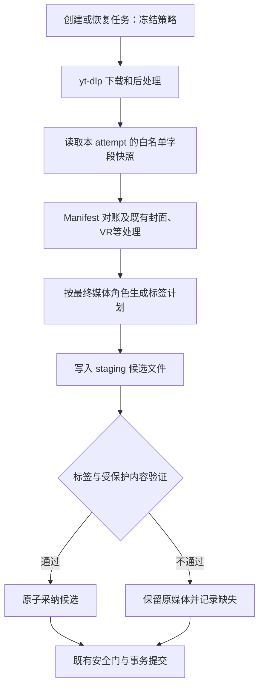

# FluentYTDL 音视频元数据嵌入设计

日期：2026-09-19；2026-09-20 已进入实施。本文保留设计依据，最终实现差异与验收证据见 [implementation.md](implementation.md)。依据：[requirements.md](requirements.md)。

截图来自其他软件，仅参考其属性字段。本设计不要求取得截图中的文件，不以复现其异常为前置条件。

## 1. 核心决策

采用 **任务策略快照 → 本次提取字段快照 → 标准化 → 按容器写入候选 → 回读与保真检查 → 原子采纳**。

- yt-dlp 继续负责下载、合并、提取和既有章节处理；项目统一拥有新增文本元数据的最终写入权，不再依赖其默认作者、流派、日期回退。
- 在既有 Feature 后处理全部结束后，对 Manifest 中实际交付的媒体逐个执行 `MetadataFinalizer`，然后进入原有 staging 安全门和提交。此后不再安排媒体改写。
- `MetadataFeature` 保留在原顺序中，但职责改为准备策略、明确关闭上游文本自动写入；它不提前写文本标签。实现时同步 `docs/RULES_EN.md`、中文版及生成的 AGENTS/架构说明。
- 文本标签不重编码；MP4 使用原生标签工具，常用音频使用标签库，Matroska 使用受约束的流复制。原有封面、字幕、章节、HDR 和 VR 空间数据都是必须保留的内容。
- 同一个逻辑字段只有一个最终写入者。原生 writer 不可用时，不悄悄切回 yt-dlp 默认映射。



## 2. 模块与职责

均为可独立测试的数据类型或服务，不新增 singleton。

| 位置（计划新增/调整） | 职责 |
| --- | --- |
| `models/metadata.py` | MetadataPolicy、MetadataSource、NormalizedMetadata、MetadataPlan、MetadataReport；不依赖 UI |
| `processing/metadata_policy.py` | 在任务边界解析全局默认、显式任务值和旧任务迁移 |
| `processing/metadata_normalizer.py` | 纯字段校验、语义选择、来源追踪，不碰文件、不调用网络 |
| `processing/metadata_writers.py` | 容器能力表及 MP4、ID3/comments、Matroska 适配器 |
| `processing/metadata_verifier.py` | 标签别名规范化、保真检查、按字段返回验证结果 |
| `processing/metadata_finalizer.py` | 计划、候选、验证、采纳的编排；接收 staging，不拥有提交权 |
| `download/download_manager.py` | create_worker 创建前冻结并持久化策略，恢复时一次性迁移 |
| `download/executor.py`、`staging.py` | 本次下载字段的受控 JSONL 通道，按 attempt 隔离 |
| `youtube/yt_dlp_cli.py` | 统一输出三个独立开关：文本元数据、章节、info-json 附件 |
| `download/workers.py`、`features.py` | 调用 finalizer，汇总事实；沿用现有终态生产者 |

概念接口：

```text
freeze_policy(task_opts, defaults, legacy) -> MetadataPolicy
normalize(source, media_role, policy) -> NormalizedMetadata
build_plan(normalized, original_tags, capabilities) -> MetadataPlan
writer.write(source_path, candidate_path, plan, cancellation) -> WriteResult
verify(source_path, candidate_path, plan, protected_content) -> MetadataReport
finalize(staging, sources, policy, cancellation) -> reports_by_artifact
```

## 3. 策略快照与旧任务

在 `create_worker()` 构造 Worker、写入 tasks.ydl_opts_json 之前存储 `__fluentytdl_metadata_policy`。包含 `schema_version=1`、`enabled`、`profile=accurate_v1`、`chapter_enabled`、`sidecar_enabled=false`、来源角色规则版本和迁移来源。冻结的是用户意图，不是易过期的媒体地址。

新任务优先级：已有冻结策略 → 明确任务布尔值 → 当前全局默认。快速面板关闭必须显式传 False，不能靠缺少 FFmpegMetadata 表达。音频预设只提供创建任务时的默认值。

旧任务迁移：旧 `addmetadata` 明确布尔值优先；其次识别旧 FFmpegMetadata PP；都没有时使用当时可获得的全局值并标记 `legacy_default`。无法恢复的历史意图不能假装已经恢复。迁移结果只持久化一次，随后重试/重启均不重算。未知新版 schema 应报告不兼容，不静默按旧版解释。

移除各入口自行追加文本 FFmpegMetadata 的职责。最终 CLI 固定明确输出 `--no-embed-metadata`、`--no-embed-info-json`，章节按冻结策略输出 `--embed-chapters` 或 `--no-embed-chapters`。不能删掉 SponsorBlock 的章节需求，也不能因为文本开关为 False 就删已有章节。兼容迁移时，原先隐含跟随元数据的章节选择在任务创建/迁移时显式冻结；SponsorBlock mark 的章节需求独立合并。

本地 yt-dlp `--help` 已核查这几个独立开关；组合的运行效果仍需测试，不把帮助文本当运行验收。[yt-dlp 参数说明](https://github.com/yt-dlp/yt-dlp#post-processing-options)。

## 4. 来源通道与数据结构

采用与现有 after_move 路径报告相同的 `--print-to-file` 通道，写入 staging.control_dir 下 `metadata.<attempt>.jsonl`。不启用 --dump-json 或全局 --print，不交付原始 info.json。

导出模板使用 yt-dlp 的白名单对象投影和 JSON 编码，例如 `after_move:%(.{id,extractor_key,title,webpage_url,upload_date,release_date,artist,artists,track,album})j`；完整字段集由单一常量生成。此语法来自上游文档，最小 CLI 集成样本必须验证当前 nightly 的行为后方可上线。[模板对象投影](https://github.com/yt-dlp/yt-dlp#output-template)。

- 快照包含：媒体身份、来源语义字段、最终 filepath；字段扩展加入频道、作者、简介、tags/categories/genre、专辑、序号、作品发行年、版权许可、剧集信息。实际技术属性、音轨和最终章节以成品探测为准，不导出全部 formats/HTTP 请求对象。
- attempt、task、staging_id 由宿主控制文件上下文提供，不能信任来源自报值。每条记录校验 extractor+id，路径由 staging 进行范围检查与产物匹配。
- 文件协议为 UTF-8、一行一个 JSON 对象、允许单次流程多次追加。内容换行由 JSON 转义。拒绝不完整记录、未知媒体身份和不在本次产物清单内的路径；不采用“随便读最后一行”。
- `keepvideo` 一源多输出允许共享内容来源，但每个输出按真实音/视频角色生成不同计划。VR supersede 通过父子 artifact 关系传递来源，不靠文件名猜测。
- 建议初始读取上限：单行 2 MiB、单 attempt 8 MiB；超过时报告 `source_snapshot_too_large`，不把截断 JSON 当有效数据。简介单字段嵌入预算为 16 KiB UTF-8，在字符边界截断并记录 omitted/truncated，不伪称全文保存。
- 源快照不可用时，仅允许使用同 extractor+id 的已验证缓存快照；保留 `cached` 来源。没有可信来源则保留媒体并提示元数据未完成，不因此重新下载全部音视频。

`NormalizedMetadata` 中每字段包含 value、source_field、role、validation；日期结构包含 value 和精度（year/date/timestamp），作者和关键词保持列表。空值、删除、缺省是三个不同状态。`MetadataPlan` 列出每个 native tag 的 set/delete/preserve 操作和回读期望。

源数据不完整时，保留已有有效容器标签；只覆盖本次有可信值的自有字段。无值不执行 blanket 清空，尤其不使用 `-map_metadata -1`。后续用户显式清空只作用于该字段拥有的标签。

## 5. 字段语义的确定规则

| 语义 | 默认规则 |
| --- | --- |
| 视频标题 | 始终 title，不因背景音乐 track 改掉视频名 |
| 音频标题 | 已确认音乐作品取 track，否则 title；“导出音频”不能单独触发音乐角色 |
| 音乐角色 | 平台适配器明确的音乐上下文，或用户后续显式指定；未知上下文按普通内容处理，不根据标题猜歌 |
| 显示作者 | 音乐上下文优先 artist(s)；普通内容优先 creator(s)，再 channel、uploader。后者 role=creator/channel/uploader |
| 作者真实性 | 不在名字中添加“频道：”污染标签；自有角色字段和 UI 说明区分，接受 Windows 固定栏目可能仍称“艺术家” |
| 显示年份 | 音乐：有效 release_year → release_date 年 → upload_date 年；普通内容：release_date 年 → upload_date 年。保留各自日期与回退来源 |
| 日期冲突 | 相同语义的 release_year 与 release_date 不一致时不拼接；音乐显示年按前述优先级，并发出 date_conflict，原值分别保留 |
| 备注 | 规范来源页面 URL；不把简介、日志或下载参数塞入备注 |
| 简介 | 原始 description 的有效文本，清 NUL、保留换行；格式受限时报告具体裁剪 |
| 分类、关键词、流派 | categories、tags、genre(s) 分开；有真实流派才写 genre，不以 tags 回退 |
| 专辑、曲目、碟号 | 仅结构化作品字段；不默认映射播放列表标题与列表序号 |
| 语言与章节 | 保留成品实际轨道语言与最终章节；不从初始网页重建已裁剪的时间轴 |
| 星级、编码技术属性 | 不自动生成星级；时长、帧率、码率、分辨率等只读实际媒体 |

多值去重保持顺序及大小写原文，不按逗号拆作者。URL 只允许 http/https 的可验证页面，去除凭证与已知追踪参数但保留识别媒体必需参数；未知签名直链不作为来源标签。许可证与版权所有者分别保存，不能把 uploader 当 copyright owner。

## 6. 容器适配与写入工具

### MP4 / M4A：AtomicParsley

沿用已有打包组件，基于 seed_from 复制出的工作文件写标签。优先原生 atom，不启用全局 mdta，不重封装整个文件作为常规退路。

| 逻辑字段 | 标签目标 |
| --- | --- |
| 标题 / 作者 / 专辑作者 / 专辑 | ©nam / ©ART / aART / ©alb |
| 兼容年份 | ©day 写 YYYY；完整日期另存，避免依赖各读取器解释八位日期 |
| 来源 / 简介 | ©cmt 为页面 URL；desc 为工具支持长度内摘要、ldes 为长简介 |
| 流派 / 曲目 / 碟号 / 作曲者 / 版权 | ©gen / trkn / disk / ©wrt / cprt |
| 精确来源角色、完整日期、分类、关键词 | reverse-DNS 命名空间 `com.fluentytdl` 的 AUTHOR_ROLE、UPLOAD_DATE、RELEASE_DATE、CATEGORIES、KEYWORDS 等 |

扩展字段是应用约定，不保证 Windows 属性页可见；不用 podcastURL/category/keyword 冒充通用来源或分类。多作者显示为可读字符串，扩展 AUTHORS_JSON 保留无歧义数组。扩展格式采用 schema version，限制键集，不将所有原始字段倒入文件。

AtomicParsley 存在字段长度限制，适配器应读取/验证所用版本能力、按 UTF-8 边界执行字段预算。按 Windows 实际转义规则计算整个 argv 长度，预留上限；超限字段标注 unsupported_size，不能悄悄裁掉核心标题再报完整成功。长描述也遵守总预算，不通过多次全文件重写硬凑全文。[AtomicParsley 官方说明](https://github.com/wez/atomicparsley)。

### MP3 / FLAC / OGG / Opus：Mutagen

当前 thumbnail_embedder 动态探测 Mutagen，但 pyproject.toml/uv.lock 尚未声明它。正式采用时加入项目直接依赖、锁版本、验证 PyInstaller 模块收集，不依赖开发机偶然安装。

- MP3：TIT2、TPE1、TPE2、TALB、TRCK、TPOS、TCON、TCOM、TCOP；来源使用有明确描述键的 COMM，简介使用单独 TXXX；自有扩展键加 `FLUENTYTDL_` 前缀，不清空全部 COMM/TXXX。
- 已有 ID3v2.3 / 2.4 尽量保持版本，不能强制降级损失无关帧。新标签默认采用 v2.3 作为 Windows 优先配置；中文使用适用编码，日期以 TYER + 自有完整日期字段表达；v2.4 使用适用的日期帧。v2.3 多值显示编码与完整 AUTHORS_JSON 分开，禁止使用非标准 NUL 技巧。
- FLAC / Vorbis / Opus：TITLE、ARTIST、ALBUMARTIST、ALBUM、DATE、GENRE、TRACKNUMBER、DISCNUMBER、DESCRIPTION 等经验证的 comments，扩展使用 FLUENTYTDL_*；日期可保存 ISO 日期，多个 ARTIST 保持多值。
- 图片块、APIC、章节帧、音量相关原有标签保留。不要调用会重建/清空所有标签的快捷写法。[Mutagen ID3 行为](https://mutagen.readthedocs.io/en/latest/user/id3.html)。

### MKV / MKA / WebM：FFmpeg 能力子集

基于实际读出的容器构建允许矩阵，不仅看后缀。MKV/MKA 采用 FFmpeg stream copy 候选，显式保留所有受支持轨道、附件和章节，不自动转字幕/音视频编码。WebM 单独审核字段和合法流类型。

metadata 文件由已读原标签加本次覆盖生成，转义 `= ; # \\` 和换行；global、stream、chapter metadata 分别处理。禁止用只有新增字段的 `-map_metadata 1` 意外擦掉其他元数据。XML 层级标签、复杂 target 或未知流无法无损表达时，本轮写入能力标记为受限，不丢信息换取成功。

对复杂 Matroska 不默认新增 MKVToolNix 组件；可在后续确有需求时扩展专用 writer。WAV、裸 AAC 等首版报告支持有限，保留原媒体，可在后续用户选择下输出精简 sidecar。[FFmpeg metadata 文件规则](https://ffmpeg.org/ffmpeg-formats.html#Metadata-1)。

## 7. 保真、事务和失败策略

1. 从 Manifest 获取所有 kept 且计划交付的 media；读取最终真实容器、已有标签、流、附件、章节与空间信息，生成基线。无法确认容器则不按扩展名强写。
2. 固定本 artifact 的支持字段与期望计划；工具缺失属于执行失败，不能把能力表改成“不支持”来隐藏失败。
3. 原地型后端使用 reserve_workfile(seed_from=id)，流复制型使用空工作文件。写入服务不得自己提交、删除主媒体或改最终路径。
4. 候选退出码、标签回读、流与受保护内容检查全部通过后才 replace_artifact_content。校验失败保留已完成封面/VR处理的原媒体，不回滚成更早未完成加工的版本。
5. 候选验证区分：字段别名/规范化后的值正确；图片、字幕、附件、章节未丢；MP4 的球面/立体/投影 atom 和 HDR/色彩数据保持。仅 ffprobe 看不到空间 atom 时，补现有 spatialmedia/atom 读取器；能力不足就不宣称保真通过。
6. 日常运行使用结构、标签、关键受保护内容验证；完整媒体包哈希或解码哈希用于离线/发布样本，不默认对大文件每次全量解码。对无法由结构检查保证的特殊结构采用保守能力限制。
7. 对象报告绑定 artifact id 与内容 revision。只有采纳后才登记 verified，候选内容随后又改变则证据失效。终态由原 Worker 输出一次。

无需改 staging 安全门含义。写入失败、缺工具、来源不可用、字段受限通过已有 signal/actual 事件和结果汇总表达；路径逃逸等事务安全异常仍走硬失败。取消检查位于写入前、进程执行中、采纳前，并遵守既有 commit 不可取消边界。子进程有超时及终止机制，库调用至少在副本上执行并于采纳前响应取消。

## 8. 结果契约与界面

每个字段返回 `verified / preserved / missing_source / invalid_source / unsupported / truncated / write_failed / verify_failed`，另有全文件 `source_unavailable / tool_unavailable / cancelled`。报告保存字段名、来源类别、原生标签名、结果码；日志不写隐私正文。

- 关闭：不新增元数据处理状态。
- 全部计划字段已验证：显示“元数据已嵌入”。
- 有明确失败/裁剪：显示“文件已保存，部分元数据未写入”，详情列字段及原因。
- 没有可用来源：显示“文件已保存，未获取到可嵌入的元数据”，不能当完整成功。
- 格式只支持部分字段：在详情说明限制，不对每个缺失字段反复弹窗。

字段期望在取得来源与最终容器、但尚未检查工具执行结果之前形成，保持不变。报告层的 expected − actual 必须覆盖失败；无源/无对应语义不进入写入期望。来源通道失败单独形成未完成事实，不能靠空期望获得“全通过”。现有 emit_expect 在下载前运行，因此实现时应增加具名 metadata 阶段的细化记录和最终汇总输入，不能发第二个模糊的全任务期望覆盖旧记录。

首版 UI 统一“嵌入元数据”标签，说明“写入标题、作者、日期和来源等可用信息”。封面继续独立开关；不新增庞大的字段配置页。频道作为作者的说明属于详情，不向艺术家字符串添加 UI 提示词。

## 9. 实现顺序与验收出口

1. 先建立策略、标准化规则与映射的纯函数测试；修正所有入口的显式 False，完成旧任务迁移。
2. 接入 attempt JSONL 通道及来源/产物关联，用本地已知 info fixture 验证 CLI 不破坏下载进度、中文路径和多输出。
3. 实现 MP4/M4A 与音频原生 writer，补 Mutagen 依赖和打包校验。
4. 接入 finalizer、受保护内容校验、失败保留及现有观测汇总；完成 MKV/WebM 能力子集。
5. 用自主合成媒体覆盖日期、中文、作者多值、长简介、缺字段、章节、封面、多音轨、VR 等；Shell 属性读取仅为 Windows 兼容验收的一层，不是设计前置条件。
6. 检查快速、精细、列表/频道逐项、音频提取并保留原视频、重试/恢复；单独封面和字幕路径保持跳过。
7. 最后执行真实下载与打包 EXE 验收，按“容器标签正确 / Windows 显示 / 播放器 / 保真”分别记录。未过某层不宣称该层已验证。

以上为设计基线；实施情况和未验证边界以 [implementation.md](implementation.md) 为准。
